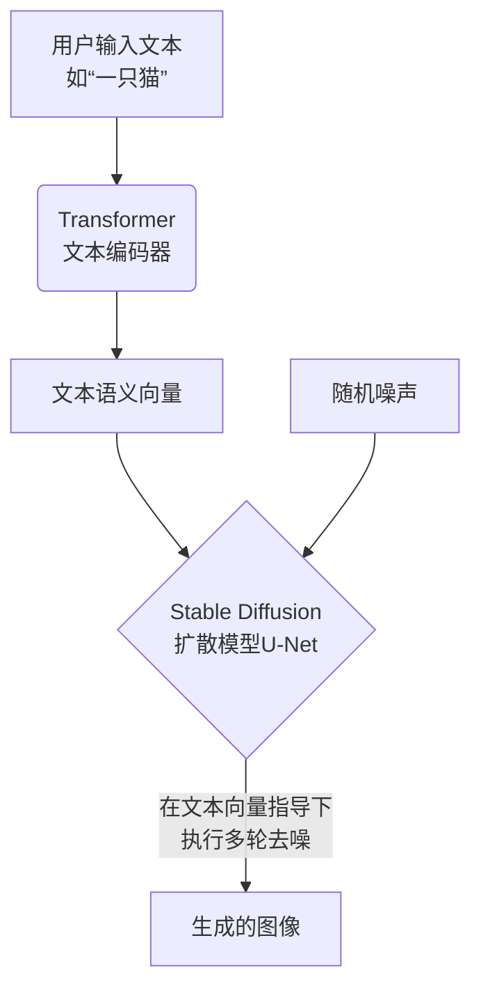

# Stable Diffusion算法原理解析

> 来源: 元宝 (腾讯元宝) · 000-AI大模型

### **AI**

好的，用户问的是Stable Diffusion和U-Net的关系。从对话历史看，用户已经了解了SD的基本原理和与Transformer的关系，现在想深入核心组件。

用户可能是在系统学习AI绘画技术，或者是开发者想理解模型架构。ta连续追问SD的构成部分，说明不是满足于表面了解，而是想搞清内部工作机制。深层需求可能是为了应用、调优或学术研究。

之前我用画家比喻解释了SD整体，用翻译官比喻了Transformer的作用。现在需要解释U-Net这个核心部件，同时要明确它和SD整体的关系——不能让它听起来像两个独立的东西。

U-Net其实是SD最核心的“引擎”，但用户可能误以为它们是并列关系。需要强调U-Net是SD内部的关键算法模块，就像发动机是汽车的一部分。

可以用之前雕塑家的比喻延续下来：如果说SD是整个雕塑工作室，U-Net就是那位具体工作的雕塑家本人。这样既能建立联系，又能突出U-Net的职能。

还要提到U-Net的两个关键设计：下采样-上采样结构（像分析蓝图再雕刻），以及加入时间步和文本指导的交叉注意力（让雕塑家知道进展和客户要求）。这些是它能有效去噪的技术关键。

最后需要总结关系：U-Net是SD的“心脏”，负责执行最核心的去噪计算。这样用户就能明白它们在架构中的层次关系了。

Stable Diffusion 和 U-Net 的关系非常明确：**U-Net 是 Stable Diffusion 模型最核心、最关键的组成部分，是执行“去噪”这一核心任务的“发动机”本身。**

你可以把 Stable Diffusion 想象成一辆功能强大的汽车：

*   **Stable Diffusion** = **整辆汽车**
    *   包含完整的系统：方向盘（你的指令）、变速箱（调度器）、车载电脑（文本编码器）和发动机。
*   **U-Net** = **这辆汽车的“发动机”**
    *   它是动力来源，直接负责将燃料（噪声）转化为驱动力（清晰的图像）。

---

### U-Net 在 Stable Diffusion 中具体做什么？

在“逐步去噪生成图像”的过程中，**U-Net 承担了每一步的“思考和决策”工作**。

1.  **输入**：在生成的每一步，U-Net 都会接收三样东西：
    *   **当前带噪的图片**：一张还比较模糊的中间结果。
    *   **时间步**：一个告诉它“现在是去噪的第几步”的信号，让它知道该去除多少噪声。
    *   **文本嵌入向量**：由Transformer编码器生成的、关于你的提示词的“语义指导”。

2.  **处理**：U-Net 的神经网络会综合以上信息，进行复杂计算，**预测出当前图片中存在的“噪声”**。

3.  **输出**：它输出一个“噪声预测图”。系统然后根据这个预测，从当前图片中减掉这部分噪声，得到一张更清晰的图片。这个过程循环几十次。

**简单说：U-Net 是那个在每一步都仔细看图，并回答“为了符合文字描述，图片里的哪些部分是应该被擦掉的噪点？”的智能模块。**

---

### 为什么是 U-Net？它有什么特殊设计？

U-Net 结构之所以被选中，是因为它的设计非常适合这个任务：

*   **U型结构（先压缩再扩展）**：
    *   **下采样（编码器）**：像漏斗一样，先理解图片的全局信息和高级语义（比如：这是一只“狗”，有一个“冲浪板”）。
    *   **上采样（解码器）**：再像放大镜一样，结合之前理解的全局信息，逐步恢复出精细的局部细节（比如：狗的毛发、海浪的泡沫）。
    *   中间的**跳跃连接**：直接把下采样过程中的细节特征传递给上采样过程，确保最终生成的图像细节丰富、不模糊。

*   **融合外部信息**：U-Net 被巧妙地改造，能够通过**交叉注意力层**接收并融合文本指令，通过**时间步嵌入**感知去噪的进度，从而让每一步的去噪都受到精准控制。

### 总结关系

| 概念 | 角色 | 与对方的关系 |
| :--- | :--- | :--- |
| **U-Net** | **核心预测网络** | 是 **Stable Diffusion 模型的主体架构**，负责执行最关键的噪声预测计算。 |
| **Stable Diffusion** | **完整的生成系统** | **包含并依赖于** U-Net，同时整合了文本编码器、调度器等组件，共同构成工作流。 |

**一句话概括：没有U-Net，就没有Stable Diffusion的图像生成能力；而没有文本编码器、调度器等组件，U-Net也无法根据文字指令生成可控的图像。** 它们是不可分割的整体。

---
### **User**

Stable Diffusion和U-Net

---
### **AI**

好的，用户问的是Stable Diffusion和Transformer的关系。之前已经解释了Stable Diffusion的原理和提出者，现在用户可能想深入理解它的技术架构，特别是和当前主流AI模型Transformer的关联。

用户可能是学习者或开发者，想搞清楚这些热门技术之间的底层联系。深层需求可能是为了学习如何应用或整合这些技术，或者理解AI生成领域的演变脉络。

Stable Diffusion的核心是U-Net和扩散过程，但Transformer确实在其中扮演关键角色。需要明确区分：Transformer不是扩散模型本身，而是处理文本指令的核心组件。

首先，最直接的关系是文本编码器部分，Stable Diffusion用CLIP的文本编码器，而CLIP基于Transformer。这点必须讲清楚，因为这是用户指令理解的关键。

然后，U-Net内部也用了Transformer的注意力机制，特别是交叉注意力，让图像去噪过程能对齐文本描述。这个架构细节很重要，说明Transformer如何影响图像生成质量。

还要提到潜在空间的概念，这是Stable Diffusion高效的关键，但和Transformer关系不大，不过可以简单带过以免混淆。

最后需要总结两者的分工：Transformer负责理解语言，扩散模型负责生成图像，结合后实现文生图。这样用户就能明白它们如何协同工作，而不是竞争关系。

Stable Diffusion 与 Transformer 的关系可以概括为：**Stable Diffusion 是一个以扩散模型为核心骨架的图像生成系统，而 Transformer 是其内部用于理解和关联文本指令的“智能大脑”。**

它们不是替代关系，而是**协同工作**的关系。下图清晰地展示了它们的分工与协作：

具体来说，Transformer 在 Stable Diffusion 中扮演了两个至关重要的角色：

### 1. 文本理解器（核心贡献）
这是最直接、最重要的关系。
*   **作用**：当你输入“一只戴着墨镜的柯基犬”时，Stable Diffusion 本身（U-Net）看不懂这些文字。它需要一个“翻译官”把文字变成它能理解的数学语言（即**文本嵌入向量**）。
*   **实现**：这个“翻译官”通常就是 **CLIP 模型的文本编码器**，而 **CLIP 的文本编码器本身就是一个 Transformer 模型**。它负责将任何复杂的文本描述，编码成一段固定长度的、富含语义的向量，用来指导图像生成的方向。

### 2. U-Net 内部的注意力机制（架构增强）
在 Stable Diffusion 的核心——**U-Net** 去噪网络中，也融入了 Transformer 的精华思想：**注意力机制**，特别是 **交叉注意力**。
*   **作用**：在去噪过程的每一步，U-Net 不仅要看当前模糊的图像，还要时刻“关注”文本指令。交叉注意力层就像一座桥，让图像特征和文本特征进行动态对话。例如，模型在去噪到某个区域时，会通过注意力机制问：“根据‘墨镜’这个文本，我是不是该在这里生成一个深色、反光的矩形？”
*   **效果**：这确保了最终生成的图像细节能与文字描述高度对齐。

### 一个简单的比喻
想象 Stable Diffusion 是一个顶尖的雕塑工作室：
*   **扩散模型（U-Net）** 是那位技艺高超的**雕塑家**，他擅长将一块混沌的石坯（随机噪声）一步步雕琢成精美的塑像。
*   **Transformer** 是站在雕塑家旁边的**艺术指导**。他负责理解客户（你）用语言提出的抽象要求（“要一个充满未来感的骑士”），并将其转化为雕塑家能执行的具体、专业的术语和参考，时刻指导雕塑家每一刀该怎么刻。

### 总结
| 组件 | 角色 | 与对方的关系 |
| :--- | :--- | :--- |
| **Transformer** | **语言理解与关联引擎** | 作为核心组件**嵌入**在 Stable Diffusion 系统中，负责处理文本输入，并将其语义注入到图像生成过程中。 |
| **Stable Diffusion** | **图像生成系统** | 其强大的生成能力**依赖于** Transformer 提供的精准文本理解，才能实现“文生图”的精准控制。 |

简而言之，**Transformer 为 Stable Diffusion 装上了“听懂人话”的耳朵和“思考指令”的大脑**，使其从一个纯粹的图像生成器，进化成了一个能根据人类语言进行创作的AI画家。

---
### **User**

Stable Diffusion与Transformer的关系

---
### **AI**

用户问的是“Stable Diffusion是谁提出来的”，这是一个事实性问题，需要准确的信息。Stable Diffusion是一个知名的AI图像生成模型，它的提出者或开发团队应该是公开信息。不过，为了确保信息的准确性和时效性，最好还是搜索一下。因为这个问题涉及到具体的创造者或团队，属于客观知识，但为了确保无误，还是查一下。用中文搜索“Stable Diffusion 提出者”或“Stable Diffusion 谁发明的”。考虑到用户可能想要最新的信息，但这个问题本身不是时间敏感的，不过还是设置timeliness为0吧。因为Stable Diffusion的提出者信息是固定的，不会频繁变动。那么，开始搜索。

根据搜索结果，Stable Diffusion 的提出者是一个合作团队，并非单一个人。核心信息如下：

1.  **核心技术（Latent Diffusion Model）** 由德国慕尼黑大学（LMU）的 CompVis 实验室与 AI 视频创业公司 Runway 的研究人员共同提出。主要作者包括 Robin Rombach、Andreas Blattmann、Patrick Esser 等，导师是 Björn Ommer 教授[citation:1][citation:2][citation:3]。相关论文于 2021 年底发布在 arXiv 上[citation:4]。

2.  **项目命名与推广**：2022 年，初创公司 Stability AI 的创始人 Emad Mostaque 为该项目提供了大规模计算资源支持，并将该模型以 **“Stable Diffusion”** 的名称正式发布和开源，由 Stability AI 大力推广[citation:3][citation:4]。因此，Stable Diffusion 这个名字与 Stability AI 公司紧密相关。

所以，准确来说：
*   **核心算法的发明者（提出者）** 是德国慕尼黑大学 CompVis 实验室与 Runway 公司的联合研究团队。
*   **将其命名为 “Stable Diffusion” 并推向大众的开源项目发起方** 是 Stability AI 公司。

这个问题的答案需要区分“技术提出者”和“项目命名与发布者”。我需要用清晰、通俗的语言解释这两者的关系，并引用搜索结果中的具体信息。现在可以开始组织答案了。

Stable Diffusion 的“诞生”是一个典型的“学术研究 + 商业推广”相结合的故事，涉及两个核心团队：

### 1. 核心技术的提出者：学术研究团队
Stable Diffusion 所基于的关键技术——**潜在扩散模型**，是由 **德国慕尼黑大学（LMU）的 CompVis 实验室** 与 **AI 视频创业公司 Runway** 的研究人员共同发明的[citation:1][citation:3]。

*   **主要研究人员**：Robin Rombach、Andreas Blattmann、Patrick Esser 等[citation:2][citation:5]。
*   **导师**：Björn Ommer 教授[citation:3]。
*   **时间**：他们在2021年发表了相关论文，提出了这一革命性的图像生成架构[citation:2][citation:4]。

**简单说，是这群科学家和工程师发明了 Stable Diffusion 的“发动机”。**

### 2. 项目的命名与推广者：Stability AI
2022年，初创公司 **Stability AI** 的创始人 Emad Mostaque 为上述研究提供了大规模的计算资源支持[citation:3][citation:4]。随后，该模型被冠以 **“Stable Diffusion”** 这个响亮的名字，由 Stability AI 公司正式发布并彻底开源，从而引爆了全球AI绘画社区[citation:1][citation:4]。

**所以，是 Stability AI 公司给这个强大的“发动机”装上了轮子和外壳，命名为“Stable Diffusion”，并免费送给了全世界。**

### 总结
你可以这样理解：
*   **技术发明**：归功于 **慕尼黑大学 & Runway** 的联合研究团队。
*   **产品化与开源**：归功于 **Stability AI** 公司。

正是这种结合，使得 Stable Diffusion 得以迅速普及，成为开源AI绘画领域的基石[citation:6]。

---
### **User**

Stable Diffusion是谁提出来的

---
### **AI**

好的，用户想让我用通俗易懂的方式讲解Stable Diffusion算法原理。今天是2026年2月12日，用户在香港特别行政区。

嗯，用户可能对AI绘画感兴趣，想了解背后的技术原理，但又不希望听到太专业的术语。深层需求应该是想理解这个流行工具是怎么工作的，以便更好地使用它或者满足好奇心。

这是一个需要详细回答的复杂问题，因为涉及算法原理的科普解释。我不能简单几句话带过，需要确保信息足够充分。

用户明确要求“通俗易懂”，所以我必须避免使用复杂的数学公式和术语，要用生活中的比喻来解释。核心是要讲清楚Stable Diffusion如何从随机噪声一步步生成清晰的图像。

我觉得可以用“画家学画”的比喻来贯穿整个讲解。先讲核心思想，就是去噪的过程，就像画家从模糊的草图慢慢细化成清晰的画作。

然后需要解释三个关键部分：U-Net这个“大脑”如何判断和去除噪声，文本编码器如何理解文字提示并指导绘画，还有调度器如何控制去噪的节奏。

最后可以简单提一下训练过程，就是让AI学会识别各种噪声模式。这样整个流程就完整了。

在回答时，我要把核心原理放在最前面，直接说明Stable Diffusion是通过逐步去噪来生成图像的。然后再展开各个部分的详细解释。

我不能在思考中分析答案内容，这些都要放到正式回答里。现在思路已经清晰了，可以开始组织回答了。

好的，我用一个“画家学画”的比喻，来通俗地讲解 Stable Diffusion 的原理。

**核心思想一句话：它不是一个“画家”，而是一个“去噪专家”。它通过一步步去除图片中的“噪点”（随机噪声），最终“还原”出一张你想要的图像。**

整个过程就像一位画家学画画：

---

### 第一步：学习阶段（训练）
想象你给这位画家看无数张照片（比如猫、狗、风景），但每次看之前，你都先往照片上撒一些“胡椒面”（加入不同程度的随机噪声），让照片变得模糊。

你告诉画家：“看，这张模糊的照片，原本是清晰的小猫。”

经过海量这样的练习，画家的大脑（即AI模型，核心是 **U-Net**）就学会了两个超能力：
1.  **识别噪声**：能一眼看出图片里哪些部分是“胡椒面”（噪声）。
2.  **还原图像**：知道如何把这一小部分“胡椒面”擦掉，让图片变回它原本该有的样子（比如猫的轮廓、毛发）。

**关键点**：它学到的不是“画一只具体的猫”，而是“如何根据任何一张有噪点的图，猜出它没噪点时可能的样子”。这就像一个掌握了万物“去噪逻辑”的专家。

---

### 第二步：创作阶段（推理/生成）
现在，你想让画家为你画一张“戴着墨镜的柯基犬在冲浪”。

1.  **准备一张“纯噪声画布”**：你不是让画家从白纸开始，而是给他一张完全由“胡椒面”组成的、乱七八糟的图片（纯随机噪声）。

2.  **下达指令**：你把“戴着墨镜的柯基犬在冲浪”这段文字，通过一个**文本编码器**（如CLIP）转换成画家能理解的“概念密码”。

3.  **逐步去噪，显影图像**：
    *   **第一轮**：画家看着全是噪点的图，结合你的“概念密码”，大脑（U-Net）判断：“这片噪点，按照‘柯基’和‘冲浪板’的概念，应该往‘黄色短腿’和‘板状物体’的形状去清理。”
    *   他擦掉一部分最不像的噪点，图片稍微清晰了一点点。
    *   **第二轮**：再看稍微清晰的图，结合指令，大脑判断：“哦，这里应该是墨镜的反光，那里应该是海浪的浪花。” 再擦掉一部分噪点。
    *   **重复多轮**：这个过程重复20-50次（步数）。就像一个影像在化学药水中逐渐显影，图片从完全随机的噪点，一步步变得清晰，并越来越符合你的文字描述。

4.  **控制节奏的导演**：**调度器** 就像导演，控制着每一步应该去除多少噪点。节奏快慢会影响画面的细节和创造力。

---

### 总结与比喻

| 组件 | 比喻 | 作用 |
| :--- | :--- | :--- |
| **U-Net** | 画家的“大脑” | 核心算法。根据当前模糊图片和文字指令，判断哪里是噪点并规划如何擦除。 |
| **文本编码器** | “翻译官” | 把你的文字描述（如“柯基犬”）翻译成AI能理解的“概念密码”，用来指导去噪方向。 |
| **调度器** | “节奏导演” | 控制每一步去噪的强度。是猛擦一下，还是轻轻擦拭，影响生成速度和效果。 |
| **去噪过程** | “影像显影” | 从纯噪声开始，多轮迭代，图像逐渐从混沌中浮现并清晰化。 |

**所以，Stable Diffusion 的神奇之处在于：它利用在训练中学到的“去噪逻辑”，在生成时，将一段纯随机噪声，按照文字指令的指引，一步步“去噪”成一张全新的、符合描述的图像。** 它不是在拼接素材库，而是在通过一个严谨的数学过程“计算”出全新的画面。

---
### **User**

用通俗易懂的方式，讲解Stable Diffusion算法原理

---

*Auto-extracted via API from yuanbao.tencent.com*
