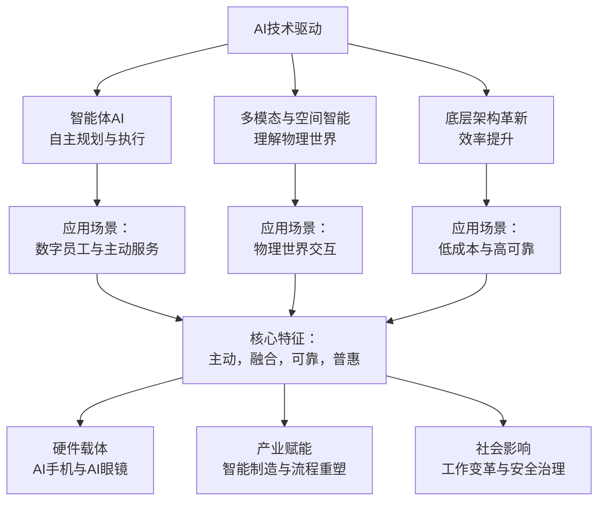

# Computer Use

> 来源: 元宝 (腾讯元宝) · 000-AI大模型

### **AI**

2026年，人工智能在“计算机使用”领域正从辅助工具加速进化为能主动规划、执行复杂任务的协同伙伴。下面这张图可以帮你快速了解这场变革的核心脉络：

接下来，我会详细解读这些趋势如何具体改变我们的计算机使用方式。

### 🧠 技术驱动：从“对话”到“干事”的跨越

AI在计算机使用上的能力飞跃，源于其技术内核的根本性进化。

*   **智能体（AI Agent）成为核心**：传统的AI系统通常是一问一答。而2026年，具备**自主性、长期记忆和举一反三能力**的智能体AI正成为主流[citation:5]。它们能够像人一样理解模糊指令（如“为我们下个季度的新产品做个市场分析方案”），随后**自主设定任务、规划步骤、调用不同软件（如数据库、浏览器、制图工具）来执行，并在遇到错误时进行调整反馈**，最终完成一个复杂目标[citation:5]。
*   **“空间智能”与多模态交互**：AI不再只懂文字。斯坦福大学教授李飞飞指出，**空间智能是AI的下一个前沿**[citation:3][citation:4]。这意味着AI正努力获得对物理世界的语义、几何和物理规律的理解。结合视觉、语音等多模态信息，未来的AI助手不仅能操作电脑软件，还能通过摄像头“看到”现实世界，理解你的手势、环境上下文，实现更自然的交互[citation:3][citation:4]。
*   **底层架构追求“密度”与效率**：行业不再单纯追求模型参数规模，而是更注重在固定计算成本下提升智能的“密度”[citation:5]。通过稀疏注意力机制等算法创新[citation:5]，AI能像关键人物发言一样更高效地处理信息，这意味着未来AI反应更快、更“聪明”，同时对算力的需求也更可持续。

### 🚀 应用变革：计算机成为智能工作站

在上述技术驱动下，计算机的使用体验正发生质变，从被动工具变为主动的生产力伙伴。

*   **从“辅助工具”到“数字员工”**：AI正从辅助工具转变为具备**数字员工属性**的协作伙伴[citation:3][citation:4]。例如，微软Office智能体已能在与操作人员对话后，自动创建电子表格、文档并快速制作演示文稿[citation:3][citation:4]。在专业领域，AI智能体可以根据订单、设备和供应链状态，**实时自主优化工厂的生产计划**[citation:3][citation:4]。
*   **“主动智能”与无缝工作流**：当前的AI助手多是“反应式”的。但当AI能持续运行并深度融入系统时，它将具备 **“主动智能”** [citation:3][citation:4]。想象一下，AI可以提前分析你的日程和邮件内容，在你开会前自动生成会议摘要和待办事项；或持续监控系统状态，在潜在问题发生前预警并提供解决方案，**任务在后台就被默默完成**[citation:3][citation:4]。
*   **突破“最后一公里”的可靠性**：在金融、医疗等高风险领域，AI的可靠性至关重要。2026年的趋势是AI从“模型崇拜”转向 **“经济实用”** [citation:2]。企业更青睐在特定领域表现出色、成本更低的专业模型，并通过多智能体协作等技术，**提升复杂任务的成功率，使AI能可靠地嵌入核心业务流**[citation:2]。

### 🌍 深远影响：重塑生态与规则

这一变革将远远超越工具升级的范畴，深刻影响产业格局和社会规则。

*   **硬件载体与交互入口拓展**：计算机的形态边界正在模糊。**AI手机**在2026年有望成为重要节点，其本质是承载个人智能体的核心设备[citation:1]。同时，经历了2025年“百镜大战”的**AI眼镜**，因能实现更自然的空间交互，可能成为成长性极高的新硬件入口[citation:1]。
*   **产业智能化与能力重构**：对于制造业等实体经济，AI与数字孪生技术结合，正在重塑产品设计、生产调度和供应链管理流程，推动“中国制造”向“中国智造”转型[citation:3][citation:4][citation:5]。对企业而言，AI不仅是降本增效，更深层的价值是**驱动组织形态和竞争逻辑的变革**，使企业具备动态感知、实时交互和智能协作等新能力[citation:3][citation:4]。
*   **社会治理与安全护栏**：随着AI能力增强，全球治理措施在加速落地。欧盟《人工智能法案》大部分规则将于2026年8月生效，中国也通过《关于深入实施“人工智能+”行动的意见》等文件，完善法律法规和伦理准则，推动创新与安全的平衡[citation:3][citation:4]。同时，针对AI生成的虚假信息（“AI垃圾内容”）、数据隐私和算法偏见等风险，**安全护栏建设将趋严趋实**[citation:6]。

希望这份梳理能帮助你更好地把握未来。在这些趋势中，你对哪个方向特别感兴趣，或者担心它可能带来哪些挑战呢？我们可以继续深入探讨。

---
### **User**

2026 AI走向Computer Use

---

*Auto-extracted via API from yuanbao.tencent.com*
