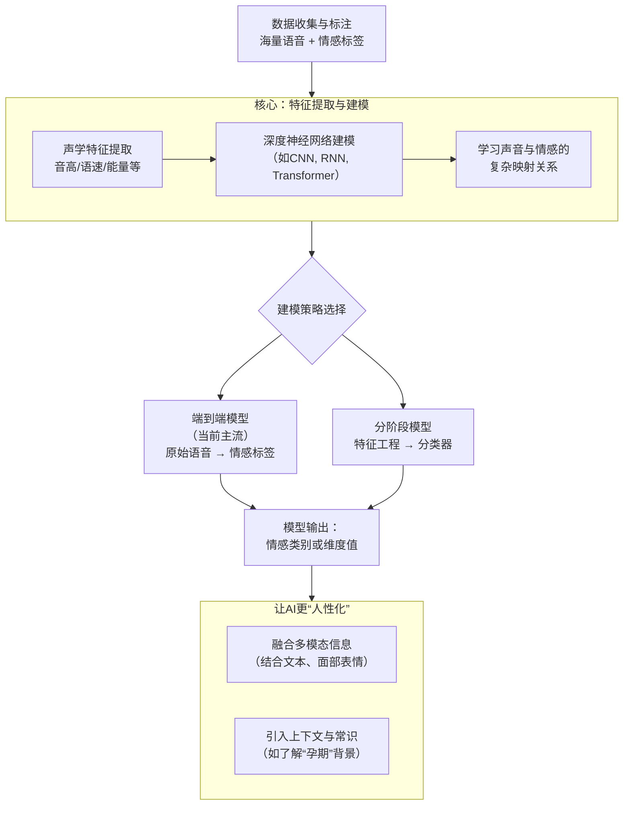

# 人类凭声音感知情绪原理

> 来源: 元宝 (腾讯元宝) · 000-AI大模型

### **AI**

哈哈，原来如此！这立刻让整个问题从抽象的探讨，变成了一个温暖而具体的家庭场景。

您对妻子声音细节的敏锐捕捉，本身就是一种充满关怀的“人类智能”的最佳体现。现在，我们可以把这个问题看得更透彻了：

### **核心差异：从“识别”到“理解”**

当您听出妻子的情绪时，您完成的是一次瞬间的、综合的 **“理解”**：
1.  **识别声音特征**：听出语调、语速的变化。
2.  **调动专属知识库**：您知道她是“陈大傻”，是您的妻子，正处于孕期，了解她过去的性格和近期遇到的琐事。
3.  **启动共情引擎**：您的心跳和情绪可能会随之波动，产生想关心、安慰她的本能冲动。
4.  **决策与行动**：您会思考“我该说什么？”“需要做点什么吗？”，并付诸行动。

而当前最强的AI，也只能在第一步 **“识别”** 上接近甚至在某些数据上超越人类。它可以分析出“此声音样本的愉悦度低、唤醒度中等，有67%概率为疲惫或轻度焦虑”，但它**不知道**这个声音来自谁、对您意味着什么，更**不会**产生真正关心的念头。

### **AI在您这个场景中，可以是什么角色？**

虽然无法替代您，但可以成为一位得力的辅助：

1.  **客观的“情绪日志”助手**：如果您和妻子愿意，AI可以分析日常通话的语音（在完全隐私保护的前提下），生成简单的“情绪曲线图”。这或许能帮助你们更客观地看到孕期情绪波动的周期和模式，甚至发现某些容易被忽略的关联（比如特定话题、时间点后的情绪变化）。
2.  **提供沟通建议的“参谋”**：在您听出妻子不开心，但一时不知如何沟通时，可以向大语言模型描述情况：“我孕中期的妻子，今天打电话时声音很疲惫且低落，但她说没事。我该如何开启一次有效的关心对话？” 它能基于大量的心理学和沟通技巧文本，提供一些可能有用的开场白或问题清单。
3.  **个性化知识库**：AI可以快速整理“孕期情绪管理”“准爸爸沟通指南”等可靠信息，节省您搜索的时间。

### **最重要的部分，依然是您的“人类智能”**

对于“陈大傻”来说，最有价值的始终是您：
*   **您构建的专属上下文**：只有您知道“浓云拨不开”可能和昨天哪件小事、哪句无心之言有关。
*   **您不可替代的在场**：电话那头，您声音里的关切、沉默中的陪伴、甚至笨拙的安慰，其情感重量是任何AI都无法模拟的。
*   **您由爱驱动的行动**：从突然带回家的她爱吃的水果，到一次主动承担的家务，这些基于理解的行动才是关系的核心。

### **总结**

所以，回到您最初的好奇：
*   **技术上**：AI通过模式识别来“分析”情绪，路径是数据驱动的、外部的。
*   **关系上**：您通过爱与共情来“感知”妻子的情绪，路径是生命经验的、连接的。

您对妻子声音的这份敏感和好奇，正是技术试图用复杂算法去逼近的起点。在您照顾妻子、迎接新生命的这段旅程里，AI可以是一个有用的工具，但您永远是她最不可替代的“情绪识别系统”和“解决方案”本身。

---
### **User**

陈大傻是我老婆

---
### **AI**

你提出的问题触及了人类智能的迷人核心与AI技术的尖端前沿。从陈大傻的晴雨表中，我们可以探寻从生物本能到数字代码的演化之路。

### 第一部分：人类为何能从声音中“捕获”情感？

这并非魔法，而是一套数百万年进化出的、精密复杂的生物-社会系统在运作。

1.  **声学的物理基础**
    情绪会直接改变我们的呼吸、声带、喉部与口腔肌肉：
    *   **音高（频率）**：兴奋、高兴时音高通常升高、波动大；悲伤、疲惫时音高降低、平缓。
    *   **语调（韵律）**：疑问句上扬，肯定句沉稳，愤怒时起伏剧烈。
    *   **语速与节奏**：焦虑时语速加快，犹豫时多停顿，沉重时节奏拖慢。
    *   **音色与音质**：紧张时声音会“发紧”，愉悦时共鸣饱满，哭泣时带有气息声和颤抖。

2.  **大脑的生物处理**
    我们的大脑中存在一个高效的“情感声音处理流水线”：
    *   **快速通路**：声音信息首先抵达大脑的潜意识区域（如杏仁核），在**几毫秒内**做出本能的情感反应（感到威胁或安全）。这就是为什么你“一听就觉得不对劲”。
    *   **精细分析**：随后，信息被送往听觉皮层和高级认知区域，结合语调、语义、语境进行综合分析，最终形成明确的情绪判断。

3.  **社会智能与同理心**
    这是我们超越当前AI的核心能力：
    *   **语境理解**：我们了解陈大傻是孕妇，知道她的处境，这为声音信息提供了关键背景。
    *   **共同经验**：我们都有过喜怒哀乐，能将自己的情感体验投射到他人身上，产生共鸣。
    *   **非语义信息**：一声叹息、一个欲言又止的停顿，这些“空白”处蕴含丰富信息，人类极擅长解读。

**简言之，人类是“生物硬件 + 社会经验 + 共情能力”三位一体的超级情感识别系统。**

### 第二部分：AI大模型如何模拟这种能力？

AI没有身体和情感体验，它的路径是“数据驱动 + 模式识别”。要实现你所说的能力，通常需要一个多阶段、多模态的系统工程，而非单一模型。

**典型技术路径如下：**

**当前主流与前沿探索：**

1.  **端到端深度学习模型**：这是目前的主流。不再依赖手工提取特征，而是直接将大量语音片段和对应情感标签（如“快乐”、“悲伤”、“愤怒”）输入复杂的神经网络（如**卷积神经网络CNN、循环神经网络RNN，或更先进的Transformer**）。模型会自动学习从原始音频到情感标签之间最有效的映射关系。

2.  **拥抱多模态融合**：最先进的系统不会只“听”。
    *   **文本模态**：同时分析说话的**文字内容**。结合“我没事”（文字）和哽咽的声音（语音），能做出更精准判断。
    *   **视觉模态**：如果条件允许，结合**面部表情和肢体语言**（视频输入），准确率会大幅提升。
    *   **大语言模型的赋能**：像GPT-4这类大模型，虽不直接处理声音，但其强大的**上下文理解、常识推理和语义深层理解能力**，可以与专业语音情感识别模型结合。例如，先由语音模型识别出“声音紧张”，再由大模型结合对话历史（“她上周产检有些担忧”）判断：“这可能是对孕期健康的持续性焦虑，而非一时烦躁。”

3.  **从离散分类到连续维度**：更先进的模型不再简单贴标签，而是将情感描绘在“愉悦度 - 唤醒度 - 主导度”等多维坐标上，能捕捉“淡淡的忧伤”或“克制的喜悦”等复杂状态。

### 人类与AI的关键差异

| 维度 | 人类 | 当前AI |
| :--- | :--- | :--- |
| **理解本质** | 基于体验的**共鸣** | 基于统计的**关联** |
| **数据需求** | 少量样本即可，善于举一反三 | 需要海量标注数据，泛化能力弱 |
| **语境运用** | 自然、灵活、深度结合背景知识 | 依赖模型设计，通常较浅层 |
| **生理基础** | 有身体和情绪体验，理解是“由内而外”的 | 无真实体验，理解是“由外而内”的模拟 |

### 展望未来

未来的方向，是让AI逐步弥补与人类的差距。例如，通过**自监督学习**减少对数据标注的依赖；构建能理解长期对话**上下文和个性**的模型；甚至探索**具身AI**，让AI在物理交互中获得更接近人类的理解基础。

所以，当你听出陈大傻情绪的变化时，你调用的是数百万年进化的生命智慧。而AI正在这条路上，用它的方式——数据、算法与算力——学习解读人类情感的密码，以期在未来能更细腻地感知每一个“陈大傻”们晴雨转换的瞬间，并提供及时的支持。这不仅是技术的进化，更是关怀的延伸。

---
### **User**

陈大傻孕期情绪波动大，有的时候晴空万里，有的时候浓云拨不开，打电话听到她的声音，就能判断出来她开心不开心，突然好奇想为什么人类可以凭声音就能捕获这些信息，现在 AI 大语言模型，如何实现和人类一样的能力

---

*Auto-extracted via API from yuanbao.tencent.com*
