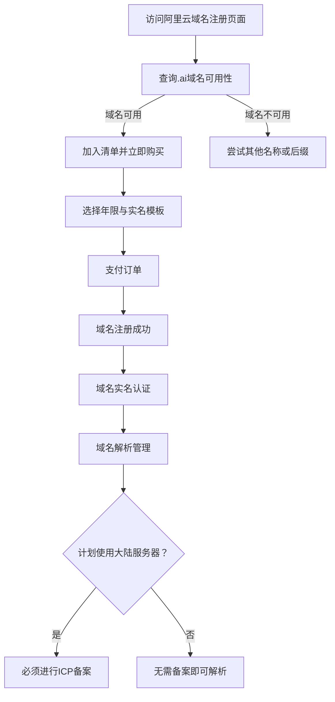

# 申请.ai域名的方法

> 来源: 元宝 (腾讯元宝) · 000-AI大模型

### **AI**

在阿里云上申请 `.ai` 域名的流程与注册其他域名类似，但有一些特别的注意事项。下面我为你梳理了完整的操作指南。

### 📝 申请前的准备工作

在开始注册之前，你需要确保已经完成以下两项核心准备：

1.  **完成阿里云账号实名认证**：这是购买阿里云任何产品的前提。你需要有一个已经完成个人或企业实名认证的阿里云账号[citation:1][citation:3]。
2.  **创建域名信息模板**：这是注册流程中非常关键的一步。你需要提前创建好一个包含详细联系信息（如姓名、地址、电话、邮箱）的模板，并且该模板**必须通过实名认证**[citation:1][citation:3][citation:4]。审核通常需要1个工作日左右[citation:1]。

### 🔍 申请.ai域名的步骤

完成准备后，你可以参照以下流程图了解完整流程，它展示了从查询到最终管理的核心环节：

下面是每个步骤的详细说明[citation:1][citation:2][citation:3][citation:4]：

*   **查询域名**：访问阿里云域名注册页面（如万网官网），在搜索框中输入你想要的域名名称加上 `.ai` 后缀，点击查询，系统会显示该域名是否可用。
*   **加入清单并购买**：如果域名可以注册，点击“加入清单”或“立即注册”，然后进入购物车结算。
*   **确认订单**：在订单页面，选择注册年限（通常1年起），并**关键一步**：在“选择信息模板”处，勾选你已经完成实名的那个模板[citation:1][citation:3]。
*   **支付费用**：确认信息无误后，勾选同意服务条款，点击立即购买并完成支付。

### ⚠️ 注册后的重要事项

域名注册成功只是第一步，接下来还有几件事需要你留意：

| 事项 | 描述 | 重要性 |
| :--- | :--- | :--- |
| **域名实名认证** | 根据注册局政策，.ai域名注册后可能需要进行实名认证。你可以在域名控制台提交资料，审核通常需要1-5个工作日[citation:1]。 | **必须完成** |
| **域名解析** | 只有设置了域名解析，才能将域名指向你的服务器或网站。你可以在阿里云的“云解析DNS”服务中为域名添加解析记录[citation:5][citation:8]。 | 搭建网站必备 |
| **网站备案（ICP）** | **这一点非常关键**：如果您的网站服务器在中国大陆，则必须进行ICP备案，域名才能正常访问[citation:6][citation:7]。备案前提是域名已完成实名认证3天以上[citation:1][citation:6]。 | **使用大陆服务器必备** |
| **服务器位置选择** | 如果你的网站主要面向海外用户，或者希望**免去备案流程**，可以选择中国香港或海外的服务器，这样域名无需备案即可解析使用[citation:7]。 | 影响访问速度与备案需求 |

### 💎 总结与提醒

总的来说，在阿里云申请 `.ai` 域名流程清晰，核心在于**提前准备好实名认证的账号和信息模板**。请特别注意，如果计划建站且面向国内用户，**务必预留出备案时间**；如果希望快速上线，香港或海外服务器是免备案的有效方案[citation:7]。

希望这份指南能帮助你顺利注册心仪的.ai域名！如果你在具体操作中遇到问题，比如不知道如何创建信息模板，可以随时追问。

---
### **User**

如何在阿里云申请.ai域名

---
### **AI**

关于您提到的“.ai”域名注册问题，根据我查到的信息，**阿里云实际上是可以申请注册“.ai”域名的**。这可能是一个新近的变化，所以容易产生误解。

下面我为您梳理一下关键信息：

### 🌐 阿里云已上线.ai域名注册

阿里云在2024年8月对其域名服务进行了一次重要升级，其中就包括**正式上线了“.ai”域名的注册服务**[citation:1][citation:2][citation:4]。这次升级后，阿里云新增了40多个热门域名后缀，“.ai”正在其中[citation:6][citation:7][citation:8]。有报道还特别指出，**在当时，阿里云是国内唯一提供“.ai”域名注册的服务商**[citation:4]。

### 💡 如何在阿里云申请.ai域名

1.  **智能起名**：升级后的阿里云万网平台整合了AI工具。您只需要在阿里云域名注册页面，**输入您的品牌名称、公司名称或所属行业**，系统基于通义大模型可以批量生成创意域名建议，并自动完成可用性筛查，大大提升了查找心仪域名的效率[citation:1][citation:2][citation:7]。
2.  **直接查询**：您也可以直接在阿里云官网的域名注册页面**搜索您想要的特定“.ai”域名**，查询其是否可注册。

### ⚠️ 注册注意事项

*   **价格与优惠**：“.ai”域名属于国别域名，其注册和续费价格通常会高于常见的“.com”或“.cn”域名。不过，阿里云时常会推出一些促销活动，例如在新规上线时曾推出过针对新用户的优惠，不妨多关注官方活动[citation:3][citation:7]。
*   **实名认证与备案**：注册成功后，根据注册局要求，可能需要完成实名认证。另外需要了解的是，**.ai域名目前无法在中国大陆进行工信部ICP备案**。如果计划建站，需要搭配中国香港或海外的服务器使用[citation:1]。

希望这些信息能帮助您顺利在阿里云注册到心仪的“.ai”域名！如果您在具体操作过程中遇到其他问题，可以随时再来问我。

---
### **User**

阿里云好像不能申请后缀为.ai的域名

---
### **AI**

注册国际域名和国内域名确实是建站的第一步，选择合适的服务商能让后续管理省心不少。下面这个表格汇总了针对不同需求的主流服务商，方便你快速了解。

| 域名类型/需求侧重 | 推荐服务商 | 核心优势 |
| :--- | :--- | :--- |
| **国际域名 (.com/.io等)** | **Namecheap** | 性价比高，提供免费的WHOIS隐私保护，用户界面友好，适合新手 [citation:1][citation:2][citation:10]。 |
| **性价比与易用性** | **Porkbun** | 注册和续费价格极具竞争力，同样提供免费隐私保护，在海外用户中口碑很好 [citation:1][citation:2]。 |
| **国际域名 (.com/.io等)** | **Cloudflare Registrar** | 以成本价销售域名，续费透明，技术实力强，非常适合技术背景用户 [citation:1][citation:9]。 |
| **技术背景与透明定价** | **NameSilo** | 价格稳定透明，续费不涨价，免费提供隐私保护，支持支付宝 [citation:1][citation:3][citation:11]。 |
| **国内域名 (.cn等)** | **阿里云 (万网)** | 国内市场份额大，生态完善（集成云服务器、备案等），服务稳定，适合企业用户 [citation:6][citation:7][citation:8]。 |
| **一站式服务与备案** | **腾讯云 (DNSPod)** | 与阿里云类似，提供完整的云产品生态和备案服务，解析服务稳定 [citation:6][citation:11][citation:12]。 |
| **国内域名 (.cn等)** | **西部数码** | 老牌域名注册商，域名管理与抢注功能专业，价格常有优惠 [citation:2][citation:7][citation:8]。 |
| **专业管理与优惠** | **聚名网** | 域名交易和抢注功能突出，价格通常有竞争力，尤其受域名投资者关注 [citation:7][citation:12]。 |

### 💡 如何选择服务商

除了参考表格，在做决定时还可以考虑以下几点：

*   **明确主要用途**：你是要建立**品牌官网**、**个人博客**，还是主要用于**域名投资交易**？前者更适合选择阿里云、腾讯云这样生态完善的服务商（便于后续备案和部署），后者则可以关注西部数码、聚名网、Gname等在域名交易方面有特长的平台 [citation:7][citation:11][citation:12]。
*   **关注总拥有成本**：对于国际域名，要特别留意**续费价格**。有些服务商首年注册价很低，但续费时会大幅上涨 [citation:1][citation:9]。同时，确认是否**免费提供WHOIS隐私保护**，这项服务能隐藏你的个人联系信息，避免被公开查询和骚扰，否则可能需要额外付费 [citation:1]。
*   **了解支付与管理便利性**：如果你习惯使用支付宝或微信支付，注册国际域名时需确认服务商是否支持 [citation:1][citation:11]。同时，一个清晰、易用的域名管理后台也能提升日常操作效率。
*   **注意合规要求**：注册以`.cn`为代表的国内域名，根据规定需要进行**实名认证**。如果网站服务器在中国大陆，则必须完成**ICP备案**后才能正常访问。国内服务商通常提供完整的备案支持 [citation:6][citation:7]。

### 💎 总结与提醒

简单来说，选择服务商可以遵循这个思路：
*   **注册国际域名（如.com）**：若追求**性价比和易用性**，可重点考虑 **Namecheap** 或 **Porkbun**；若是**技术爱好者或追求极致透明定价**，**Cloudflare Registrar** 和 **NameSilo** 是很棒的选择。
*   **注册国内域名（如.cn）**：若需要**一站式建站和备案**，**阿里云**、**腾讯云** 是稳妥之选；若更看重**专业域名管理和优惠价格**，可以看看 **西部数码** 和 **聚名网**。

希望这些信息能帮你缩小范围，做出合适的选择。如果你能分享一下你计划用这个域名具体做什么，或者比较看重价格、服务还是生态集成，或许我能给出更具体的建议。

---
### **User**

注册国际域名（如.com/.io）和国内域名（如.cn）分别推荐哪家服务商？

---
### **AI**

挑选域名注册商确实很重要，它就像是您在线资产的“管家”。下面我为您梳理了国内主流的域名注册商，并用一个表格汇总了它们的主要特点，方便您快速比较。

| 服务商名称 | 核心优势 / 特点 | 特别适合的用户群体 |
| :--- | :--- | :--- |
| **阿里云** | 阿里巴巴集团旗下，国内云计算领军者，生态整合度高（云服务器、数据库等）[citation:1][citation:2][citation:3]。 | 已在使用或计划使用阿里云全线产品的企业，追求服务稳定性与品牌保障。 |
| **腾讯云 (DNSPod)** | 腾讯集团旗下，以强大的DNS解析服务起家，域名相关服务体验流畅[citation:2][citation:3][citation:6]。 | 注重域名解析稳定性，同时是腾讯云生态的用户。 |
| **西部数码** | 老牌服务商，以高性价比著称，尤其在新顶级域名方面常有促销活动[citation:1][citation:5]。 | 对价格敏感，希望低成本注册多种后缀域名的个人用户或中小企业。 |
| **新网 (Xinnet)** | 历史悠久，拥有ICANN和CNNIC双重认证，渠道网络广泛，企业客户基础扎实[citation:1][citation:2][citation:4]。 | 注重服务商资质和线下渠道支持的传统企业。 |
| **易名 (eName)** | 在域名投资（域名交易、抢注等）垂直领域非常专业，是许多域名投资者的首选平台[citation:2][citation:3]。 | 主要从事域名交易、投资或需要抢注域名的用户。 |

### 💡 如何选择适合的注册商
表格提供了概览，但您的具体需求才是决策的关键。可以从以下几个方面考虑：

- **明确核心用途**：您是**个人博客展示、初创企业品牌官网，还是用于投资交易**？如果是前者，阿里云、腾讯云等综合平台更省心；如果是后者，易名这类专业交易平台功能更强[citation:2][citation:3]。
- **关注成本与优惠**：除了首次注册费用，**续费价格**往往更关键。一些注册商首年价格很低，但续费较贵。同时可以留意像西部数码等平台不时推出的促销活动[citation:1]。
- **考察管理体验**：一个好的域名管理后台应该清晰、易用。您可以提前了解一下各家的控制面板，是否支持批量管理、域名转移是否方便等。
- **核实服务资质**：确保选择的注册商是经过**ICANN（互联网名称与数字地址分配机构）** 和 **CNNIC（中国互联网络信息中心）** 认证的正规服务商，这关系到域名的安全和稳定[citation:1][citation:4]。

希望这些信息能帮助您做出明智的选择。如果您能分享一下您注册域名的主要用途或预算范围，或许我可以给出更具体的建议。

---
### **User**

国内最好的域名注册商

---
### **AI**

申请 `.ai` 域名是进入人工智能领域一个很棒的标志性步骤。下面为你梳理了完整的申请流程、重要注意事项以及一些实用建议，希望能帮助你顺利完成注册。

### 🔍 理解 .ai 域名

`.ai` 域名本质上是安圭拉岛的国家顶级域名，但由于其缩写“AI”与“人工智能”完全一致，已成为全球人工智能行业项目的热门选择[citation:1][citation:5]。这意味着它既有特定域名的独特性，又蕴含着巨大的行业潜力[citation:5]。

### 📝 注册流程与步骤

注册 `.ai` 域名的过程与注册其他域名类似，但有几个关键点需要特别注意。整个流程可以概括为以下几个步骤：

| 步骤 | 操作要点 | 关键说明 |
| :--- | :--- | :--- |
| **1. 选择注册商** | 选择如 **Gname**、**Namecheap**、**NameSilo** 等支持注册.ai域名的海外平台[citation:1][citation:3]。 | 因.ai域名属于海外域名，通常需要在海外或香港的注册商平台进行注册[citation:2]。 |
| **2. 查询域名** | 在注册商网站搜索心仪的域名，检查是否可用。 | 域名需满足**2至63个字符**，可包含英文字母、数字和连词符，且连词符不能用于开头或结尾[citation:2][citation:5]。 |
| **3. 创建账户** | 在选定的注册商网站创建用户账户。 | - |
| **4. 加入购物车并填写信息** | 将可用域名加入购物车，准备**至少注册2年**[citation:2]，并准确填写注册人信息（姓名、地址、邮箱等）。 | 这是最重要的步骤之一，信息需真实有效。 |
| **5. 支付费用** | 完成支付。 | 费用通常较高，例如在NameSilo注册首年费用约为$71.98[citation:3]。 |
| **6. 验证并管理** | 支付成功后，检查邮箱中的确认邮件，随后可在注册商后台管理域名。 | 需留意，.ai域名目前无法在中国大陆进行备案，若建站需使用海外或香港的服务器主机[citation:2]。 |

### ⚠️ 重要注意事项

*   **注册年限与费用**：注册 `.ai` 域名有最低年限要求，通常需要**至少注册2年**，最多可注册10年，续费时同样需以2年为单位进行[citation:2][citation:5]。其价格也普遍高于常见的.com域名，每年费用可能在几十到上百美元不等[citation:1][citation:3]。
*   **备案与服务器选择**：需要注意的是，`.ai` 域名目前**无法在中国大陆进行网站备案**。因此，如果你计划建立网站，需要购买海外或中国香港等地区的服务器空间，以确保全球用户能够正常访问[citation:2]。
*   **品牌保护策略**：对于企业而言，注册 `.ai` 域名是保护数字资产的重要一环。可以考虑将企业名称的全拼/缩写、主要产品名称的英文或拼音等与 `.ai` 组合注册，以防他人抢注，并强化品牌在AI领域的形象[citation:4]。

### 💎 总结
总的来说，注册一个 `.ai` 域名是迈向AI领域明确而酷炫的一步。只要找到可靠的注册商，了解清楚相关规则，整个过程并不会太复杂。

希望这些信息对你有帮助！如果你在选择具体的域名或注册商时有更细致的问题，我很乐意提供进一步的分析。

---
### **User**

如何申请后缀为 ai的域名

---

*Auto-extracted via API from yuanbao.tencent.com*
