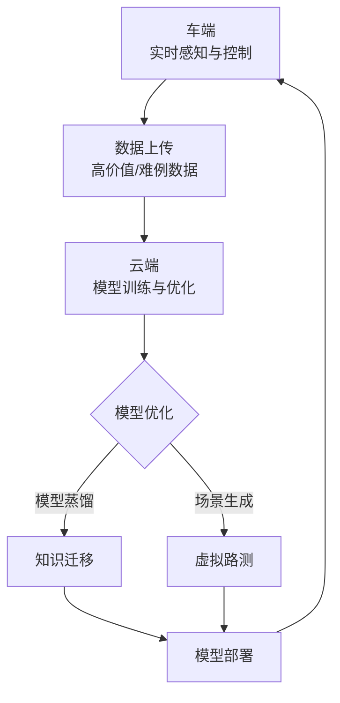

# 华为乾崑智驾采用混合模型架构

> 来源: 元宝 (腾讯元宝) · 000-AI大模型

### **AI**

云端大模型与车端小模型的协同工作，是现代智能驾驶系统高效运行的核心。下面这张图清晰地展示了这套机制的整体工作流程，你可以结合后续的详细说明来理解。

### 🔄 协同工作流程

云端大模型和车端小模型根据其特性，在智能驾驶系统中扮演着不同的角色，并形成一个高效的闭环系统。

-   **车端：实时感知与高效执行**
    在车辆上运行的是经过精心优化的小模型。它的优势在于**体积小、速度快、能耗低**，能够利用车机芯片的有限算力，对传感器采集的数据进行毫秒级的实时处理，直接完成环境感知、决策规划等任务，确保行车的即时性和安全性[citation:5][citation:6]。这意味着即使在网络信号不佳或完全离线的环境下，车辆也能具备基础的自动驾驶能力[citation:4][citation:5]。

-   **云端：持续学习与核心优化**
    云端大模型拥有巨大的参数和强大的计算能力，是整个系统的大脑和“教练”。它并不直接控制车辆，而是承担两项核心任务：
    1.  **处理复杂问题**：当车端遇到无法理解的极端场景（Corner Case）或需要深度推理的任务时，可以将相关数据上传至云端，由大模型进行分析处理[citation:1][citation:7]。
    2.  **训练和优化车端模型**：这是云端更重要的职责。它利用从海量车辆汇集的数据，不断进行模型训练和算法迭代。随后，通过“知识蒸馏”等技术，将大模型学习到的“经验”提炼并迁移到车端小模型上，让车端模型变得越来越聪明[citation:1][citation:6]。

### 📡 数据传输与同步机制

要实现上述协同，安全高效的数据传输与同步机制是关键。

-   **数据上传：有针对性的筛选**
    并非所有车端数据都会上传。系统会通过预设置的规则或模型自动判断，**只筛选并上传那些具有高价值的数据**，例如系统不确定的驾驶场景、罕见的“难例”数据以及人为触发的重要案例[citation:7]。这极大地减少了数据传输量和云端存储压力。这些数据在上传前会进行严格的**匿名化和脱敏处理**，移除可识别个人身份的信息，以保护用户隐私[citation:7]。

-   **模型下发：安全高效的部署**
    云端训练优化的新模型，会通过**安全加密的通道**以OTA升级的方式分发到车端[citation:7]。为了确保升级过程稳定可靠，通常会选择在车辆停放或网络条件良好时进行。华为云等方案提供商还会建立**分布式汽车专区**，将算力节点部署在靠近用户的地方，有效降低数据传输的时延，提升同步效率[citation:2][citation:6]。

### 💎 总结与优势

这种“云脑端身”的架构，巧妙地结合了双方的优势：云端提供近乎无限的算力用于模型迭代，车端则保证行车的实时性与可靠性。

它核心解决了自动驾驶发展中的两大难题：一是通过云端大模型处理**海量数据和复杂算法**，二是通过车端小模型满足行车决策的**实时性要求**[citation:1][citation:2][citation:6]。华为等公司采用的 **“世界模型”** 路线，通过在云端生成大量逼真的虚拟场景来训练和验证算法，进一步减少对实采数据的依赖，加速迭代进程[citation:6]。

希望以上解释能帮助你清晰地理解云端大模型与车端小模型是如何协同工作的。如果你对某个具体技术细节或特定厂商的方案有进一步的兴趣，我们可以继续探讨。

---
### **User**

云端大模型和车端小模型具体是如何协同工作的？数据传输和同步机制是怎样的？

---
### **AI**

华为乾崑智驾（特别是在其最新的ADS 4.0系统中）采用的是一种创新的 **“云端大模型 + 车端小模型”混合架构**，即WEWA架构。这套架构的精妙之处在于，它并非简单地选择“大”或“小”，而是让不同规模的模型在云端和车端各司其职，协同工作，以实现安全与效率的最佳平衡[citation:1][citation:3][citation:4]。

下面的表格清晰地展示了这套架构中云端和车端模型的分工与合作。

| 组件 | 模型类型 | 核心功能 | 关键实现与技术特点 |
| :--- | :--- | :--- | :--- |
| **世界引擎 (WE)** | **云端大模型** | **“AI驾校”**：在云端生成海量、尤其是极端和罕见的驾驶场景数据，用于训练和优化驾驶算法[citation:1][citation:4]。 | 使用扩散生成模型，将难例场景的密度提升至真实世界的1000倍；通过“安全优先”的强化学习机制训练AI；已完成超过6亿公里的高速L3场景仿真验证[citation:3][citation:4]。 |
| **世界行为模型 (WA)** | **车端“小”模型** | **“AI老司机”**：在车辆上实时处理传感器数据，进行环境感知、推理决策和车辆控制[citation:1][citation:4]。 | **原生基模型**：专为驾驶任务从零训练，非通用大模型改造，空间推理能力更强[citation:1][citation:4]。**MoE架构**：采用“混合专家”系统，根据场景动态调用 specialized 的“专家网络”，实现大模型能力、小模型效率[citation:3][citation:4]。 |

### 为何选择混合架构？

这种架构设计的根本目的是为了解决智能驾驶中的核心挑战：**如何既拥有处理无限复杂场景的强大能力，又能满足车端实时决策的严苛低延时要求**[citation:1][citation:4]。

*   **应对“长尾问题”**：现实驾驶中存在大量罕见但危险的极端场景（Corner Case）。仅依靠真实路采数据，既昂贵又难以穷尽。云端大模型（WE）的价值就在于能低成本、高效率地“制造”出这些难题来训练系统，使其变得更聪明、更稳健[citation:1]。
*   **确保实时安全**：车辆行驶过程中，决策必须在毫秒间完成。直接在车端运行参数量巨大的通用大模型，可能因算力需求高、响应慢而带来安全隐患。华为乾崑的WA模型通过专用的、高效的设计，摒弃了依赖语言作为中介的VLA路径，实现了从感知信号到控制指令的最短路径，响应更快[citation:1][citation:3][citation:4]。

### 与行业其他路线的区别

华为乾崑的WEWA架构体现出与行业其他主流技术路线的明显差异化[citation:4]：

*   **区别于纯端到端模型（如特斯拉FSD V12）**：华为的路径不只是从人类驾驶数据中“模仿”和“拟合”，更强调通过世界模型让AI理解物理规律，进行推理和“思考”，目标是超越人类平均水平，成为“超人”司机[citation:1][citation:4]。
*   **区别于视觉语言模型（VLA）路径**：华为明确表示不会走向VLA路径，认为语言模型虽擅长文本推理，但缺乏对三维空间、距离和速度的精确感知能力。因此，WA模型选择绕过“语言”环节，直接从视觉等多模态信号生成驾驶行为，使决策更精准[citation:1][citation:3]。

总而言之，华为乾崑智驾通过云端大模型与车端高效模型的协同，巧妙地兼顾了模型能力的广度与行车响应的实时性，这使其在当前智能驾驶的技术竞争中形成了独特的优势[citation:1][citation:4]。

希望以上解释能帮助你理解华为乾崑智驾的技术架构。如果你对某个具体技术点或车型上的应用有进一步兴趣，我们可以继续探讨。

---
### **User**

华为乾坤智驾用的是大模型还是小模型

---

*Auto-extracted via API from yuanbao.tencent.com*
