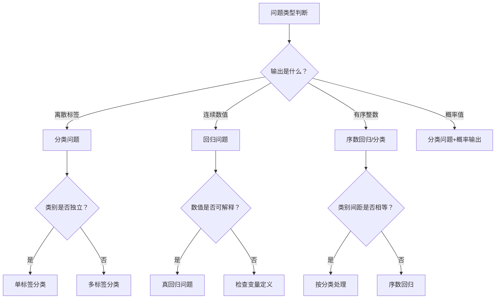

# 常见深度学习算法介绍

> 来源: 元宝 (腾讯元宝) · 000-AI大模型

### **AI**

神经网络与傅里叶分析在数学本质上均属于函数逼近方法，但二者在实现原理、应用场景和计算特性上存在显著差异与互补性。以下从数学关联、技术融合及实际应用三个维度展开分析：

---

### 一、数学本质的关联性
1. **函数逼近的共性**  
   - **傅里叶分析**：通过正交基函数（正弦/余弦）的线性组合逼近周期或非周期函数，其核心是频域分解。公式表示为：  
     $$f(x) = a_0 + \sum_{n=1}^{\infty} \left( a_n \cos \frac{2\pi nx}{T} + b_n \sin \frac{2\pi nx}{T} \right)$$  
     系数 $a_n, b_n$ 由积分求解，实现全局频率提取[^1][^6]。  
   - **神经网络**：通过非线性激活函数（如ReLU）的层级嵌套拟合任意函数，如多层感知机（MLP）的复合函数形式：  
     $$f(x) = W_k \cdot \sigma(W_{k-1} \cdots \sigma(W_1 x + b_1) + b_{k-1})$$  
     权重 $W_i$ 经梯度下降优化，实现局部特征抽象[^3][^4]。

2. **卷积运算的等价性**  
   卷积神经网络（CNN）的时域卷积等价于频域乘法：  
   $$h[n] = y[n] * g[n] \quad \Leftrightarrow \quad H[w] = \mathcal{F}(y) \cdot \mathcal{F}(g)$$  
   其中 $\mathcal{F}$ 为傅里叶变换。此性质被用于加速CNN计算——将卷积核与输入转换至频域相乘，再逆变换回时域，降低计算复杂度（尤其对大尺寸卷积核）[^1][^10]。

---

### 二、技术融合：神经网络中的傅里叶方法
1. **傅里叶神经算子（FNO）**  
   直接学习频域映射，避免时域卷积的高开销。例如，在求解偏微分方程（PDE）时，FNO对输入做FFT，在频域学习权重矩阵，再通过IFFT输出解函数，比传统PDE求解器快百倍[^6]。

2. **频谱偏置（Spectral Bias）**  
   神经网络天然倾向于学习低频特征。ReLU网络的输出函数高频分量衰减速率与网络深度呈指数关系（$\sim e^{-d}$），导致其对高频信号（如尖锐边缘）拟合困难，需更多训练迭代[^4]。这一特性反而提升了模型抗噪能力，但限制了高频细节重建。

3. **周期性任务的专用设计**  
   使用正弦激活函数构建傅里叶神经网络：  
   ```julia
   Q = 20; ann = Chain(Dense(1, Q, sin), Dense(Q, 1))  # Julia代码示例
   ```  
   固定首层权重为整数（如 $W_j = j$），使网络退化为傅里叶级数，高效逼近周期函数（如风能数据中的季节性波动）[^2]。

---

### 三、核心差异与互补应用
| **维度**         | **傅里叶分析**                | **神经网络**                  |
|------------------|------------------------------|-----------------------------|
| **特征提取**     | 全局频谱分解（如音频FFT）     | 层级局部抽象（如CNN边缘→语义） |
| **可解释性**     | 系数对应物理频率              | 黑箱特征表示                  |
| **维度适应性**   | 高维数据计算效率低（组合爆炸） | 高效处理高维数据（如图像）    |
| **数据假设**     | 需平滑性假设，否则出现吉布斯现象 | 对非平滑数据鲁棒性强          |

**典型场景分工**：  
- **傅里叶主导**：信号降噪（MRI重建）[^9]、语音识别（MFCC特征）[^7]、低功耗传感器（雷达频移检测）[^9]。  
- **神经网络主导**：图像分类（ResNet）、自然语言生成（Transformer）、实时目标检测（YOLO）[^9]。  
- **协同案例**：自动驾驶中，傅里叶压缩激光雷达点云→神经网络识别障碍物[^9]；AI语音助手先用FFT转换声波为梅尔谱，再输入CNN分类指令[^9]。

---

### 四、为什么傅里叶未取代神经网络？
1. **维度灾难限制**：傅里叶级数的交叉项随维度指数增长（$n$ 维 $k$ 阶项数 $\sim O(n^k)$），而神经网络参数量仅多项式增长（$\sim O(n^2)$），更适合图像、文本等高维数据[^6]。  
2. **局部特征缺失**：傅里叶变换的全局性使其难以捕捉局部模式（如图像中猫耳纹理），而CNN的局部感知域更适配此类任务[^6][^8]。  
3. **动态学习优势**：傅里叶基函数需预设，神经网络则通过数据驱动自动学习最优特征（如AlexNet首层卷积核涌现边缘检测器）[^4][^9]。

---

### 结论：融合为未来趋势
傅里叶分析提供可解释的频域工具，适合信号预处理与物理约束建模；神经网络则以数据驱动的黑箱方式解决复杂模式识别。现代混合架构（如**FNO**、**傅里叶特征位置编码**）正逐渐融合二者优势，在科学计算（如NeRF神经辐射场）[^9]、医疗影像等领域突破传统瓶颈。未来方向包括：  
- 设计**频域正则化项**约束神经网络高频噪声；  
- 开发**自适应基函数网络**替代固定傅里叶基[^5][^6]。  

> 注：数学公式的LaTeX代码可直接用于Markdown渲染，部分应用案例代码（如Julia）需结合具体框架实现。

---
### **User**

神经网络和傅里叶分析

---
### **AI**

在实际项目中区分分类与回归问题需抓住**输出本质**与**业务目标**两大核心，同时警惕连续性、有序性和概率预测三类模糊地带。以下是系统判断方法和典型误判案例分析：

---

### 🔍 **一、核心判断标准**
#### **1. 输出类型本质**
- **分类问题**：输出**离散标签**（有限个类别）  
  **示例**：  
  - 医疗诊断：肿瘤“良性/恶性” [citation:1][citation:8]  
  - 文本分类：新闻归属“体育/娱乐/科技” [citation:1]  
  **关键特征**：预测结果无中间状态（如“猫”与“狗”无渐变关系）[citation:3]。

- **回归问题**：输出**连续数值**（无限可能值）  
  **示例**：  
  - 房价预测：输出125.3万元而非“高价/低价”标签 [citation:1][citation:4]  
  - 温度预测：23.7°C（可无限接近真实值）[citation:3]  
  **关键特征**：误差可量化（如预测误差±0.5°C）[citation:4]。

#### **2. 业务目标导向**
| **问题类型** | **业务目标**                | **模型行为**               | **评估指标**               |  
|--------------|----------------------------|---------------------------|---------------------------|  
| 分类         | 决策边界（如是否放贷）      | 划分区域+判定类别          | 准确率、F1、AUC [citation:7] |  
| 回归         | 最优拟合（如预期销售额）    | 逼近真实值曲线             | MSE、MAE、R² [citation:1]    |

#### **3. 算法与输出层设计**
- **分类模型**：输出层用**Softmax**（多分类）或**Sigmoid**（二分类）  
  **例**：CNN图像分类输出“猫：0.92，狗：0.08”[citation:6]。
- **回归模型**：输出层为**线性激活**（无约束数值）  
  **例**：LSTM股价预测直接输出325.6元[citation:4]。

---

### ⚠️ **二、典型误判案例解析**
#### **案例1：连续变量强制离散化（错误归类为分类）**  
**场景**：将癫痫知识问卷评分（连续）按四分位数硬分为4级，使用有序Logistic回归[citation:8]。  
**问题**：  
- 信息损失：80分与81分差异被忽略，而79分与80分被强制划为不同类别；  
- 模型失效：分割点无医学依据，导致结论不可解释。  
**正确做法**：采用中位数回归或非线性变换处理非正态分布数据[citation:8]。

#### **案例2：序数变量当连续值处理（错误归类为回归）**  
**场景**：预测电影评分（1~5星），直接用线性回归输出2.37[citation:5]。  
**问题**：  
- 数值无意义：2.37星无法对应实际评价标准；  
- 误差扭曲：预测3.8星与真实4星的差距≠预测1.2星与真实2星的差距。  
**正确做法**：采用**序数回归**（Ordinal Regression）或分类模型（保留有序性）[citation:5]。

#### **案例3：概率预测误判为回归问题**  
**场景**：预测用户点击率（CTR=0.85），误用MAE指标优化[citation:1]。  
**本质**：CTR是二分类（点击/未点击）的概率估计，属分类范畴。  
**后果**：  
- 模型混淆：回归损失函数无视概率边界（如输出-0.2或1.5）；  
- 业务误导：CTR=0.85与0.95的业务意义差异被均方误差掩盖。  
**纠正方案**：使用**逻辑回归+交叉熵损失**，输出概率后根据阈值分类[citation:5][citation:7]。

#### **案例4：多标签分类误判为多分类**  
**场景**：图像中多物体识别（如“猫+椅子”），误用单标签分类（输出唯一类别）[citation:6]。  
**关键差异**：  
- 多分类：一张图只能属于1个类别（如“猫”或“狗”）；  
- 多标签：一张图可同时含多个标签（需独立判断每个标签）。  
**解决方案**：对每个标签独立训练二分类器（如目标检测中的YOLO）[citation:6]。

---

### 💎 **三、实战判断流程图**


---

### 🛡️ **四、避坑指南**
1. **警惕“伪连续”变量**：  
   - 如学历编码（1=高中, 2=本科, 3=硕士）实为有序分类，不可计算平均学历“1.87”[citation:8]。
2. **业务目标优先于数学形式**：  
   - 需区分“预测值本身”（回归）与“基于预测值的决策”（分类），如信用评分连续值可分段为风险等级[citation:5]。
3. **数据分布验证**：  
   - 回归问题需检查残差是否符合正态分布；分类问题需确认类别平衡性[citation:7][citation:8]。

> 最终准则：**若输出需精确量化误差用回归，若输出需判定类别用分类**。模糊地带优先选择可解释性更强的方案（如序数问题用分类模型+顺序损失函数）[citation:5][citation:8]。

---
### **User**

在实际项目中，如何判断一个问题是分类问题还是回归问题？有哪些典型的误判案例？

---
### **AI**

分类（Classification）与回归（Regression）是机器学习中两类核心的监督学习任务，其本质区别在于**输出类型**和**问题目标**。以下是两者的详细对比：

---

### 🔍 **一、输出本质：离散标签 vs 连续数值**  
1. **分类任务**  
   - **输出**：离散的类别标签（如“是/否”“猫/狗/鸟”）。  
   - **数学本质**：输出空间为**非度量空间**，只有“正确”或“错误”之分，错误时不同类别的错误无程度差异（例如将猫误判为狗或鸟均计为1次错误）[citation:5][citation:8]。  
   - **示例**：  
     - 垃圾邮件检测（二分类：垃圾/非垃圾）[citation:2][citation:6]  
     - 手写数字识别（多分类：0~9）[citation:8]  

2. **回归任务**  
   - **输出**：连续的实数值（如房价、温度）。  
   - **数学本质**：输出空间为**度量空间**，预测值与真实值的误差可量化（如预测房价误差1万元 vs 10万元）[citation:5][citation:9]。  
   - **示例**：  
     - 房价预测（输出连续价格）[citation:1][citation:10]  
     - 股票价格趋势预测[citation:4]  

---

### 🎯 **二、目标差异：决策边界 vs 最优拟合**  
- **分类目标**：寻找**决策边界**，最大化不同类别的分离度（如SVM寻找最大间隔超平面）[citation:2][citation:8]。  
  - 逻辑回归虽名含“回归”，实为分类算法：通过Sigmoid函数将连续输出映射为概率（0~1），再根据阈值划分类别[citation:3][citation:5]。  
- **回归目标**：寻找**最优拟合线/曲线**，最小化预测值与真实值的误差（如线性回归最小化均方误差）[citation:1][citation:9]。  

---

### ⚙️ **三、算法与模型差异**  
| **任务类型** | **常见算法**                               | **模型输出特点**                  |  
|--------------|-------------------------------------------|----------------------------------|  
| **分类**     | 逻辑回归、决策树、SVM、随机森林、KNN      | 输出离散标签或概率分布（如Softmax） |  
| **回归**     | 线性回归、多项式回归、决策树回归、SVR     | 输出连续数值（无概率映射）         |  

> **特殊算法说明**：  
> - **决策树**：分类任务输出类别标签，回归任务输出叶节点均值[citation:4][citation:8]。  
> - **神经网络**：可通过输出层设计（Softmax用于分类，线性激活用于回归）适配两类任务[citation:5]。  

---

### 📊 **四、评估指标对比**  
| **任务类型** | **评估指标**                              | **核心逻辑**                     |  
|--------------|------------------------------------------|----------------------------------|  
| **分类**     | 准确率、精确率、召回率、F1值、AUC-ROC     | 关注**类别判别的正确性**（混淆矩阵分析） |  
| **回归**     | 均方误差（MSE）、平均绝对误差（MAE）、R² | 关注**数值预测的接近程度**（误差量化）   |  

> **示例**：  
> - 分类任务中，召回率（Recall）衡量模型捕捉正例的能力（如疾病诊断避免漏诊）[citation:3][citation:8]。  
> - 回归任务中，R²分数解释模型对目标变量波动的拟合程度（如房价预测模型解释80%波动）[citation:9][citation:10]。  

---

### 🌐 **五、典型应用场景**  
| **任务类型** | **应用场景**                              | **案例说明**                     |  
|--------------|------------------------------------------|----------------------------------|  
| **分类**     | 图像识别、情感分析、医疗诊断、欺诈检测    | 根据病理影像判断肿瘤良恶性（离散标签）[citation:6][citation:8] |  
| **回归**     | 房价预测、销量预估、气温预报、股票趋势    | 根据历史数据预测明日气温（连续数值）[citation:1][citation:10] |  

---

### 🔄 **六、任务转换与边界场景**  
1. **分类 → 回归**：  
   - 将离散标签赋予连续度量（如信用评分0~100分替代“好/坏”标签），再用回归模型预测[citation:5]。  
2. **回归 → 分类**：  
   - 将连续值分段为离散区间（如年龄预测 → 青年/中年/老年分类）[citation:8]。  
3. **混合任务**：  
   - **序数回归**（Ordinal Regression）：处理有序类别（如电影评分1~5星），结合回归的排序能力和分类的离散输出[citation:4][citation:5]。  

---

### 💎 **总结：核心区别与选择指南**  
- **核心区别**：分类输出**离散标签**，回归输出**连续数值**；前者重决策边界，后者重误差最小化[citation:1][citation:5][citation:8]。  
- **选择依据**：  
  - 需判断“是什么”→ **分类**（如疾病诊断、图像分类）。  
  - 需预测“有多少”→ **回归**（如房价、温度预测）。  
> 实际应用中，算法选择需结合**数据特性**（离散/连续）和**业务目标**（类别判断/数值预测）[citation:4][citation:10]。

---
### **User**

分类和回归的区别

---
### **AI**

传统机器学习算法（如逻辑回归、决策树、随机森林、SVM等）与神经网络本质上是**并列的算法范式**，而非后者作为前者的“容器”。神经网络只是机器学习的一种特定模型架构，而传统算法有各自独立的数学基础和实现方式。以下是具体分析：

---

### ⚙️ **1. 传统算法的独立实现机制**
传统机器学习算法**不依赖神经网络结构**，而是基于统计学、优化理论或规则系统构建：
- **逻辑回归**：通过Sigmoid函数将线性组合映射为概率，使用最大似然估计优化参数[citation:1][citation:8]。
- **决策树**：基于信息增益或基尼指数递归划分特征空间，形成树形结构[citation:9]。
- **随机森林**：集成多棵决策树，通过投票或平均提升泛化能力[citation:9]。
- **SVM**：寻找最大化分类间隔的超平面，通过核函数处理非线性问题[citation:6]。

> **关键区别**：这些算法无需多层神经元结构，而是直接通过数学公式或规则进行预测。

---

### 🔍 **2. 神经网络与传统算法的本质差异**
| **维度**         | **传统机器学习算法**                     | **神经网络**                          |
|------------------|----------------------------------------|--------------------------------------|
| **模型结构**      | 简单结构（如线性方程、树结构）            | 多层神经元组成的非线性映射               |
| **特征处理**      | 依赖人工特征工程（如PCA、特征选择）       | 自动学习分层特征表示（如CNN的卷积层）     |
| **数据需求**      | 小样本即可有效训练                       | 需大量数据避免过拟合                    |
| **可解释性**      | 高（如决策树规则、逻辑回归系数）          | 低（黑箱模型）                         |
| **计算开销**      | 低（如SVM在小数据集高效）                | 高（需GPU加速深层网络）                 |

> **例证**：  
> - 逻辑回归用权重解释特征重要性[citation:8]，而神经网络中特征分散在多层连接中难以追溯[citation:5]。  
> - 决策树通过路径提供明确分类逻辑，而神经网络依赖梯度下降优化隐层参数[citation:9]。

---

### 🧩 **3. 传统算法为何不使用神经网络作为“容器”？**
- **数学原理不兼容**：  
  决策树的“信息熵分割”与神经网络的“梯度反向传播”本质是两种不同的优化范式[citation:9][citation:6]。
- **效率与可解释性要求**：  
  医疗或金融领域需明确规则（如“年龄>60且血压>140→高风险”），决策树可直接提供此类规则，而神经网络难以生成可解释路径[citation:5][citation:9]。
- **数据规模限制**：  
  传统算法在样本少时仍有效（如SVM支持小样本分类），而神经网络易过拟合[citation:6]。

---

### 🤝 **4. 融合场景：传统算法与神经网络的协同**
尽管实现机制独立，两者可通过**组合或改造**互补：
1. **特征工程协作**  
   - 传统方法预处理数据 → 输入神经网络：  
     例如用PCA降维后的特征训练CNN，减少计算量[citation:3]。
2. **神经网络的变体模拟传统算法**  
   - **神经决策树**：用神经网络模拟树结构的分裂决策，但训练仍基于梯度下降[citation:7]。
   - **深度森林**：用多层森林结构替代神经网络，增强非神经网络的深度学习能力[citation:9]。
3. **集成方法**  
   - 将随机森林与神经网络预测结果加权融合，提升鲁棒性（如Kaggle竞赛常见方案）。

---

### 💎 **总结：算法选择的本质是“匹配问题”而非“容器嵌套”**
神经网络的“万能”体现在其**通用函数逼近能力**，但传统算法因**效率、可解释性、小样本优势**仍是不可替代的独立范式。实际应用需根据问题特点选择：
- **选传统算法**：数据量小、需透明规则（如金融风控、医疗诊断）[citation:9]。
- **选神经网络**：数据量大、特征复杂（如图像识别、自然语言处理）[citation:1][citation:5]。  
- **协同方案**：特征工程阶段用传统方法，复杂模式学习用神经网络[citation:3]。

> 正如[citation:2]的比喻：机器学习是“工具箱”，神经网络是其中一把功能强大的“电钻”，而逻辑回归、决策树等则是“锤子”“螺丝刀”——各有专属场景，而非相互嵌套。

---
### **User**

虽然神经网络是万能容器，但也不是适合所有学习范式吧，比如传统机器学习中的分类、回归算法下面的逻辑回归、随机森林、决策树、SVM等算法，也使用神经网络作为容器吗

---
### **AI**

神经网络被称为“万能容器”，主要源于其**数学本质的通用近似能力**（Universal Approximation Theorem）和**结构设计的灵活性**，使其能适应多种任务和数据类型。然而，这种特性既带来显著优势，也伴随固有局限。以下从技术原理、优势与局限三方面展开分析：

---

### ⚙️ 一、**“万能容器”的技术本质**
1. **数学基础：通用近似定理**  
   神经网络的万能性源于数学定理的支持：**只要包含一个足够宽的隐藏层，神经网络就能以任意精度逼近任何连续函数**[citation:2][citation:5]。这意味着理论上，神经网络可以表示几乎所有统计模型或复杂函数关系，成为非线性问题的通用求解工具[citation:4][citation:9]。

2. **结构灵活性**  
   - **分层特征提取**：输入层→隐藏层→输出层的层级结构，模拟人脑信息处理过程。例如：  
     - 图像识别中，底层学习边缘（如猫耳朵轮廓），中层组合形状（如猫脸），高层识别完整对象[citation:3][citation:4]。  
   - **模块化适配**：通过调整网络结构适配不同任务：  
     - **CNN**（卷积网络）捕捉空间特征（如图像局部纹理）[citation:6][citation:11]；  
     - **RNN/LSTM** 处理序列依赖（如语言上下文）[citation:4][citation:8]；  
     - **Transformer** 通过注意力机制关联全局信息（如ChatGPT的文本生成）[citation:4][citation:11]。

---

### ✅ 二、**优势：为何“万能”成为技术革命的核心**
1. **非线性建模能力**  
   - 激活函数（如ReLU、Sigmoid）引入非线性变换，使网络能拟合复杂决策边界（例如区分猫狗的复杂图像特征）[citation:2][citation:7]。  
   - 传统线性模型（如线性回归）无法处理此类问题[citation:6]。

2. **端到端学习：减少人工干预**  
   - 直接从原始数据学习，省去特征工程步骤。例如：  
     - 语音识别中，输入声波信号→输出文本，无需手动提取声学特征[citation:3][citation:8]。

3. **自动特征提取与泛化能力**  
   - 从海量数据中自动学习抽象特征（如医学影像中肿瘤的微小纹理），并泛化至新样本[citation:7][citation:8]。  
   - 对比传统方法需人工设计特征规则（如早期图像识别需编写“边缘检测”代码）。

4. **跨领域通用性**  
   | **领域**       | **应用案例**                                                                 |  
   |----------------|-----------------------------------------------------------------------------|  
   | 医疗诊断       | CNN分析CT影像，辅助识别早期肿瘤（如IBM Watson Oncology）[citation:3][citation:13] |  
   | 金融风控       | 神经网络实时检测交易欺诈（如Visa系统拦截260亿美元欺诈）[citation:3][citation:12] |  
   | 自动驾驶       | CNN识别路标+RNN预测车辆轨迹，实现环境感知[citation:11][citation:12]           |  

5. **并行计算与硬件加速**  
   - 矩阵运算与GPU/TPU架构天然契合，支持大规模数据训练（如AlphaGo在数百万棋局中学习）[citation:7][citation:12]。

---

### ⚠️ 三、**局限：万能不能突破的边界**
1. **数据依赖性强**  
   - **数据质量敏感**：噪声或偏差数据导致模型失效（如医疗数据标注错误引发误诊）[citation:8][citation:10]。  
   - **标注成本高**：监督学习需大量标注样本，医疗影像标注需专业医生耗时完成[citation:10]。

2. **计算资源与能效瓶颈**  
   - 训练深层网络（如GPT-3）耗电量堪比小型城市，限制普及性[citation:9][citation:12]。

3. **可解释性缺失（黑箱问题）**  
   - 决策逻辑不可追溯，引发伦理风险。例如：  
     - 金融风控中拒绝贷款申请，无法解释具体原因[citation:8][citation:10]。  
   - 可解释工具（如LIME）仅提供局部近似，全局逻辑仍不透明[citation:10]。

4. **优化困境与泛化不确定性**  
   - **梯度消失/爆炸**：深层网络训练不稳定（LSTM部分缓解但未根治）[citation:9]。  
   - **过拟合风险**：复杂模型过度拟合训练数据，泛化能力下降（如对抗样本攻击：轻微扰动欺骗图像分类）[citation:5][citation:8]。

5. **动态环境适应性不足**  
   - RNN处理长序列时存在遗忘问题，Transformer计算复杂度高（O(n²)），难以实时响应[citation:10]。  
   - 例如自动驾驶中突发障碍物，模型延迟可能导致事故。

---

### 💎 四、**总结：万能的本质是“有条件的适配”**
- **优势核心**：神经网络的万能性源于**数学可证明的逼近能力** + **结构可重构的灵活性**，使其成为当前最接近通用人工智能的载体[citation:4][citation:9]。  
- **局限根源**：其能力高度依赖**高质量数据**、**充足算力**和**场景容错率**，在资源受限或高安全性领域（如医疗、司法）需谨慎使用[citation:10]。  

> 🔮 **未来方向**：突破局限需结合：  
> - **轻量化设计**（如MobileNet压缩模型）适配边缘设备；  
> - **神经符号系统**（Neural-Symbolic AI）融合规则推理与数据学习，提升可解释性[citation:10]；  
> - **联邦学习**解决数据隐私与孤岛问题[citation:12]。  

神经网络如同“可塑性强但需精心养护的容器”——万能≠无条件完美，而是**在数据、算力与场景约束下，实现复杂问题的最优解工具**。

---
### **User**

为什么说神经网络是'万能容器'？这种特性带来了哪些优势和局限？

---
### **AI**

你的观察很敏锐！神经网络并不是独立于监督学习、无监督学习和强化学习之外的“第四类”学习范式，而是一种**通用的模型架构**，能够被灵活应用在上述所有学习范式中。我们可以这样理解二者的关系：

---

### 🧠 一、神经网络是“工具”，学习范式是“使用方式”
1. **神经网络（Neural Networks, NN）**  
   - **本质**：一种由多层神经元连接而成的计算模型，通过调整权重和偏置来学习数据的内在规律[citation:1][citation:3]。  
   - **核心能力**：强大的非线性拟合能力，适用于处理图像、文本、语音等高维复杂数据[citation:1][citation:2]。

2. **学习范式（监督/无监督/强化学习）**  
   - 定义了**训练目标**和**数据使用方式**：  
     - **监督学习**：用带标签的数据训练模型，学习输入到输出的映射（如分类、回归）[citation:1][citation:3]。  
     - **无监督学习**：从未标记数据中发现隐藏结构（如聚类、降维）[citation:6][citation:7]。  
     - **强化学习**：通过与环境的交互学习最优决策策略，最大化累积奖励[citation:9][citation:11]。

---

### 🔧 二、神经网络如何融入三大学习范式？
| **学习范式**       | **神经网络的典型角色**                  | **常见网络结构**                     | **应用案例**                          |  
|--------------------|----------------------------------------|--------------------------------------|---------------------------------------|  
| **监督学习**       | 学习输入到标签的映射函数               | CNN（图像）、RNN（文本）、MLP（通用）| 图像分类、机器翻译、房价预测[citation:1][citation:3][citation:5] |  
| **无监督学习**     | 自动提取数据特征或生成新数据           | 自编码器（降维）、GAN（生成）        | 图像去噪、数据压缩、异常检测[citation:6][citation:7] |  
| **强化学习**       | 近似策略函数或价值函数                 | DQN（Q值近似）、策略网络（动作概率） | 游戏AI、机器人控制、自动驾驶[citation:10][citation:11] |  

#### 具体说明：
1. **监督学习中的神经网络**  
   - **任务**：输入图像→输出类别标签（如ResNet分类ImageNet）[citation:1]。  
   - **训练方式**：通过反向传播最小化预测误差（如交叉熵损失）[citation:1][citation:5]。

2. **无监督学习中的神经网络**  
   - **自编码器**：压缩输入为低维编码，再重构原始数据，用于特征提取[citation:6][citation:7]。  
   - **GAN**：生成器与判别器对抗训练，生成逼真数据（如合成人脸）[citation:7][citation:8]。

3. **强化学习中的神经网络**  
   - **DQN**：用神经网络替代Q表，处理高维状态（如Atari游戏像素输入）[citation:10][citation:11]。  
   - **策略梯度**：直接输出动作概率分布（如机械臂抓取控制）[citation:11]。

---

### 💡 三、为什么容易混淆？
1. **术语重叠**：  
   - 深度学习（Deep Learning）常被等同于“深度神经网络”，但它本质是神经网络的深化版本[citation:1][citation:3]。  
2. **任务导向的命名**：  
   - 例如“卷积神经网络（CNN）”强调结构（卷积层），但实际用于监督（图像分类）或无监督（图像生成）任务[citation:2][citation:7]。

---

### 🚀 四、总结：神经网络与学习范式的关系
- **神经网络是“万能容器”**：可承载监督、无监督、强化学习的各种任务。  
- **学习范式是“填充内容”**：决定容器内装的是什么（标签、结构、奖励）。  
- **实际应用需匹配**：  
  - 选学习范式 → 定义任务目标（如预测、生成、决策）[citation:1][citation:9]。  
  - 选网络结构 → 匹配数据类型（如CNN处理图像，RNN处理序列）[citation:2][citation:11]。

> 💎 **一句话厘清**：神经网络是“画笔”，监督/无监督/强化学习是“绘画方式”（写实、抽象、动态），共同创作出AI的“画作”。

---
### **User**

上面的监督学习，无监督学习，强化学习分类中，似乎没有神经网络算法？

---
### **AI**

以下是机器学习中常见算法的系统分类与解析，涵盖监督学习、无监督学习及强化学习三大范式，结合原理与应用场景进行说明：

---

### 🔍 **一、监督学习算法（需带标签数据训练）**
监督学习通过已知输入-输出对训练模型，目标是对新数据预测标签或数值。核心任务包括**分类**与**回归**。

#### **1. 分类算法**
- **逻辑回归（Logistic Regression）**  
  **原理**：利用Sigmoid函数将线性组合映射到(0,1)区间，输出概率值用于二分类（如预测用户是否购买）。  
  **应用**：信用评分、广告点击率预测[citation:4][citation:7]。

- **决策树（Decision Tree）**  
  **原理**：基于特征值递归划分数据，形成树形结构（如年龄>30且收入>50k→高消费群体）。  
  **应用**：医疗诊断规则生成、客户分群[citation:5][citation:8]。

- **支持向量机（SVM）**  
  **原理**：寻找最大化类别间隔的超平面，可处理线性/非线性数据（通过核函数）。  
  **应用**：图像分类、文本情感分析[citation:1][citation:4]。

- **朴素贝叶斯（Naive Bayes）**  
  **原理**：基于贝叶斯定理与特征条件独立假设，计算后验概率分类（如垃圾邮件识别）。  
  **应用**：新闻分类、情感分析[citation:1][citation:6]。

- **K近邻（KNN）**  
  **原理**：根据样本在特征空间的k个最近邻标签投票决定类别（如手写数字识别）。  
  **应用**：推荐系统、异常检测[citation:4][citation:5]。

#### **2. 回归算法**
- **线性回归（Linear Regression）**  
  **原理**：拟合特征与连续目标间的线性关系（如房价=面积×权重+偏置）。  
  **应用**：销售额预测、经济趋势分析[citation:4][citation:8]。

- **随机森林（Random Forest）**  
  **原理**：集成多棵决策树，通过投票或平均提升泛化能力（降低过拟合）。  
  **应用**：股票价格预测、疾病风险建模[citation:5][citation:7]。

#### **监督学习算法对比**
| **算法**         | **任务类型** | **优势**                  | **典型场景**               |  
|------------------|--------------|--------------------------|---------------------------|  
| 逻辑回归         | 分类         | 计算高效，可解释性强      | 金融风控                  |  
| 决策树           | 分类/回归    | 直观易理解，支持非线性    | 医疗诊断规则              |  
| SVM              | 分类         | 高维数据表现好，鲁棒性强  | 图像识别                  |  
| 随机森林         | 分类/回归    | 抗噪声，高精度            | 复杂预测任务              |  

---

### 📊 **二、无监督学习算法（无标签数据探索结构）**
无监督学习旨在发现数据内在模式，核心任务包括**聚类**与**降维**。

#### **1. 聚类算法**
- **K均值（K-Means）**  
  **原理**：迭代优化将样本划分为K个簇，最小化簇内平方和（如用户行为分组）。  
  **应用**：客户细分、图像压缩[citation:1][citation:10]。

- **层次聚类（Hierarchical Clustering）**  
  **原理**：生成树状结构（系统树图），通过凝聚（自底向上）或分裂（自顶向下）构建簇层级。  
  **应用**：基因序列分析、文档主题分层[citation:9][citation:11]。

- **DBSCAN**  
  **原理**：基于密度划分簇，可发现任意形状簇并排除噪声点（如地理热点区域识别）。  
  **应用**：异常检测、社交网络分析[citation:10][citation:11]。

#### **2. 降维算法**
- **主成分分析（PCA）**  
  **原理**：通过正交变换将相关变量转为线性无关主成分，保留最大方差（如人脸特征压缩）。  
  **应用**：数据可视化、特征提取[citation:1][citation:3]。

- **自编码器（Autoencoder）**  
  **原理**：神经网络压缩输入至低维编码再重构，学习高效表示（如图像去噪）。  
  **应用**：异常检测、推荐系统[citation:3][citation:10]。

#### **无监督学习算法对比**
| **算法**    | **任务类型** | **优势**                  | **典型场景**           |  
|-------------|--------------|--------------------------|-----------------------|  
| K-Means     | 聚类         | 简单高效，适用于大样本    | 用户分群              |  
| DBSCAN      | 聚类         | 抗噪声，识别不规则簇      | 异常点检测            |  
| PCA         | 降维         | 计算快，保留全局结构      | 数据预处理            |  
| 自编码器    | 降维         | 非线性处理能力强          | 复杂数据重构          |  

---

### ⚙️ **三、强化学习算法（基于环境反馈决策）**
强化学习通过试错学习最优策略，以最大化累积奖励。

#### **核心算法**
- **Q学习（Q-Learning）**  
  **原理**：构建Q表存储状态-动作价值，通过贝尔曼方程迭代更新（如机器人路径规划）。  
  **应用**：游戏AI、自动化控制[citation:3][citation:4]。

- **深度Q网络（DQN）**  
  **原理**：用神经网络替代Q表，处理高维状态（如Atari游戏像素输入）。  
  **应用**：自动驾驶决策、实时博弈[citation:3][citation:4]。

- **策略梯度（Policy Gradient）**  
  **原理**：直接优化策略函数（如神经网络），输出动作概率分布（如机械臂抓取）。  
  **应用**：机器人控制、资源调度[citation:3]。

---

### **四、算法选择指南**
| **问题类型**               | **推荐算法**                              | **关键考量因素**                     |  
|----------------------------|-------------------------------------------|--------------------------------------|  
| 分类任务（结构化数据）     | 逻辑回归、随机森林、SVM                   | 数据量、特征线性性、可解释性需求     |  
| 回归任务（连续值预测）      | 线性回归、梯度提升树（如XGBoost）         | 特征相关性、噪声水平                 |  
| 聚类分析（无标签数据）      | K-Means、DBSCAN                           | 簇形状、噪声容忍度、样本规模         |  
| 高维数据可视化/压缩        | PCA、t-SNE                                | 线性假设有效性、可视化需求           |  
| 序列决策（动态环境）        | DQN、策略梯度                             | 状态空间复杂度、实时性要求           |  

---

### 💎 **总结**
- **监督学习**：依赖标注数据，解决预测类问题（如房价、类别），需平衡偏差与方差[citation:6][citation:7]。  
- **无监督学习**：挖掘数据内在结构（如用户分群、特征压缩），适用于标注成本高的场景[citation:9][citation:10]。  
- **强化学习**：动态环境中的序贯决策（如游戏、机器人），依赖奖励机制设计[citation:3][citation:4]。  

实际应用中常采用**集成方法**（如随机森林）或**深度学习模型**（如CNN、Transformer）处理复杂任务。算法选择需结合数据特性、计算资源及业务目标综合评估。

---
### **User**

请介绍常见机器学习算法

---
### **AI**

人工智能（AI）、深度学习（DL）和神经网络（NN）之间存在清晰的层级关系和技术依赖，以下是其核心逻辑的梳理：

---

### 🔍 **1. 层级关系：从广义到具体**
- **人工智能（AI）**  
  最广泛的概念，目标是让机器模拟人类智能（如推理、决策、感知）[citation:1][citation:2][citation:4]。  
  **包含范围**：规则系统、专家系统、机器学习等非学习型方法[citation:6]。

- **机器学习（ML）**  
  **AI的核心子领域**，通过数据驱动的方式让机器从经验中学习规律，无需显式编程[citation:2][citation:4]。  
  **典型方法**：监督学习（如决策树）、无监督学习（如聚类）、强化学习[citation:6]。

- **深度学习（DL）**  
  **机器学习的子集**，核心是使用多层神经网络自动提取数据特征，解决复杂任务（如图像识别、自然语言处理）[citation:1][citation:4][citation:6]。  
  **与传统ML的区别**：无需人工设计特征，直接处理原始数据[citation:3]。

- **神经网络（NN）**  
  **实现深度学习的技术基础**，模拟生物神经元结构，由输入层、隐藏层和输出层组成，通过权重调整学习数据模式[citation:5][citation:6]。  
  **典型结构**：前馈神经网络（FNN）、卷积神经网络（CNN）、循环神经网络（RNN）[citation:1][citation:5]。

> **关系总结**：  
> `AI ⊃ ML ⊃ DL`，而 `神经网络` 是 `DL` 的底层架构[citation:2][citation:4]。

---

### ⚙️ **2. 技术特点与交互关系**
#### **神经网络如何支撑深度学习？**
- **多层结构**：通过堆叠隐藏层逐步抽象数据特征（如从像素→边缘→物体部件→完整物体）[citation:5]。  
- **自动特征学习**：替代传统机器学习中繁琐的特征工程，适应图像、语音等高维数据[citation:3][citation:6]。  
- **典型算法**：  
  - **CNN**：专精图像处理，通过卷积核提取空间特征[citation:1][citation:5]。  
  - **RNN/LSTM**：处理序列数据（如文本、时间序列），保留时间依赖性[citation:6]。  
  - **Transformer**：基于自注意力机制，突破序列处理瓶颈（如BERT、GPT）[citation:1]。

#### **深度学习如何推动AI发展？**
- **处理复杂任务**：在计算机视觉（如医学影像分析）、自然语言处理（如机器翻译）等领域达到人类水平精度[citation:6]。  
- **依赖大数据与算力**：需海量标注数据和GPU/TPU等硬件支持，计算成本高[citation:3][citation:6]。

---

### 📊 **3. 三者的功能对比**
| **概念**       | **定位**               | **核心能力**                     | **典型应用**                     |
|----------------|------------------------|----------------------------------|----------------------------------|
| **人工智能（AI）** | 宏观目标               | 模拟人类智能行为                 | 自动驾驶、智能助手[citation:4]  |
| **深度学习（DL）** | AI的尖端实现手段       | 自动特征提取、处理高维数据       | 图像识别、语音合成[citation:6]   |
| **神经网络（NN）** | DL的底层技术载体       | 通过多层结构学习数据表示         | CNN分类图像、RNN生成文本[citation:5] |

---

### 💡 **4. 实际案例中的协同作用**
- **图像识别系统**：  
  **数据层**（大数据）→ **模型层**（CNN神经网络）→ **任务层**（AI决策）[citation:3]。  
  例如：医学影像诊断中，CNN自动识别肿瘤，辅助医生决策[citation:6]。

- **自然语言处理系统**：  
  结合 **深度学习模型**（如Transformer生成语义表示）、**机器学习模型**（任务优化）、**规则引擎**（后处理纠错），形成混合智能[citation:3][citation:6]。

---

### 🚀 **5. 未来趋势：融合与突破**
- **轻量化**：压缩模型适应移动端（如MobileNet）[citation:1]。  
- **可解释性**：解决DL的“黑箱”问题，提升医疗、金融等领域的可信度[citation:6]。  
- **跨模态学习**：整合文本、图像、语音，实现多模态理解（如CLIP模型）[citation:1]。

---

### 💎 **总结**  
人工智能是目标，机器学习是路径，深度学习是当前最有效的路径分支，而神经网络则是支撑这条路径的基石。三者如同“大脑（AI）→学习能力（ML）→高效学习策略（DL）→神经元网络（NN）”的递进体系[citation:2][citation:4]。理解这一关系，是把握AI技术演进的关键。

---
### **User**

请介绍下人工智能，深度学习，神经网络的关系

---
### **AI**

以下是深度学习领域常见的算法及其核心特点、应用场景的梳理，结合架构分类与典型应用进行说明：

---

### **一、按网络架构分类的核心算法**
1. **卷积神经网络（CNN）**  
   - **原理**：通过卷积层提取局部特征（如图像边缘、纹理），池化层降维，全连接层分类/回归。  
   - **典型结构**：LeNet（手写识别）、AlexNet（ImageNet突破）、ResNet（残差连接解决梯度消失）[citation:1][citation:8][citation:11]。  
   - **应用场景**：图像分类（CNN）、目标检测（YOLO）、医学影像分割（U-Net）[citation:7][citation:10]。

2. **循环神经网络（RNN）及变体**  
   - **基础RNN**：处理序列数据（如时间步依赖），但存在梯度消失问题[citation:1][citation:5]。  
   - **LSTM/GRU**：引入门控机制（输入门、遗忘门等），解决长期依赖问题。GRU结构更简单，计算效率更高[citation:3][citation:11]。  
   - **应用场景**：机器翻译（LSTM）、语音识别（双向RNN）、股票预测（时间序列）[citation:2][citation:10]。

3. **Transformer**  
   - **原理**：基于自注意力机制（Self-Attention），并行处理序列数据，替代RNN的循环结构[citation:1][citation:5]。  
   - **代表模型**：BERT（双向语言模型）、GPT（生成式预训练）[citation:10]。  
   - **应用场景**：文本生成、机器翻译、情感分析[citation:5][citation:10]。

---

### **二、按学习范式分类的算法**
1. **生成对抗网络（GAN）**  
   - **原理**：生成器（Generator）与判别器（Discriminator）对抗训练，生成逼真数据[citation:1][citation:6]。  
   - **变体**：  
     - **DCGAN**：卷积结构提升图像生成质量[citation:11]。  
     - **CycleGAN**：无配对图像风格转换（如照片→油画）[citation:11]。  
   - **应用场景**：图像生成、数据增强、超分辨率重建[citation:6][citation:11]。

2. **自编码器（Autoencoder）**  
   - **原理**：编码器压缩数据为低维表示，解码器重构原始输入，属于无监督学习[citation:1][citation:6]。  
   - **应用场景**：数据降维、异常检测（如信用卡欺诈）、图像去噪[citation:2][citation:8]。

3. **强化学习（RL）结合深度学习**  
   - **深度Q网络（DQN）**：用神经网络逼近Q值函数，处理高维状态空间[citation:5][citation:9]。  
   - **应用场景**：游戏AI（AlphaGo）、机器人控制、自动驾驶决策[citation:9][citation:10]。

---

### **三、其他关键算法与技术**
1. **优化算法**  
   - **梯度下降变体**：SGD（随机梯度下降）、Adam（自适应学习率）、RMSprop（解决震荡）[citation:1][citation:11]。  
   - **正则化技术**：Dropout（随机失活防过拟合）、Batch Normalization（加速训练）[citation:8][citation:11]。

2. **迁移学习（Transfer Learning）**  
   - **原理**：复用预训练模型（如ImageNet上的CNN）到新任务，减少数据需求[citation:6][citation:9]。  
   - **应用场景**：小样本图像分类、跨领域文本分析[citation:9]。

---

### **四、算法选择建议**
| **任务类型**         | **推荐算法**                          | **典型案例**                     |
|----------------------|---------------------------------------|----------------------------------|
| 图像识别/分类        | CNN（ResNet, VGG）                   | 人脸识别、医学影像诊断[citation:7][citation:10] |
| 序列数据（文本/语音） | RNN/LSTM/Transformer                 | 机器翻译、语音合成[citation:10][citation:11] |
| 数据生成             | GAN（DCGAN, CycleGAN）               | 虚拟场景生成、艺术创作[citation:6][citation:11] |
| 无监督特征学习       | 自编码器                             | 异常检测、降维[citation:2][citation:8]      |
| 决策控制             | 深度强化学习（DQN）                  | 游戏AI、机器人路径规划[citation:9][citation:10] |

---

### **核心挑战与趋势**
- **挑战**：数据依赖性强（需大量标注）、计算资源要求高、模型可解释性弱[citation:9][citation:10]。  
- **趋势**：  
  - **轻量化**：MobileNet等移动端适配模型。  
  - **多模态融合**：文本+图像+语音联合建模（如CLIP）。  
  - **自监督学习**：减少对标注数据的依赖[citation:6][citation:9]。

如需进一步了解某类算法的代码实现（如用TensorFlow构建CNN）或领域应用细节（如GAN在医疗成像中的进展），可参考具体文献或开源项目资源。

---
### **User**

请介绍下常见的深度学习算法

---

*Auto-extracted via API from yuanbao.tencent.com*
