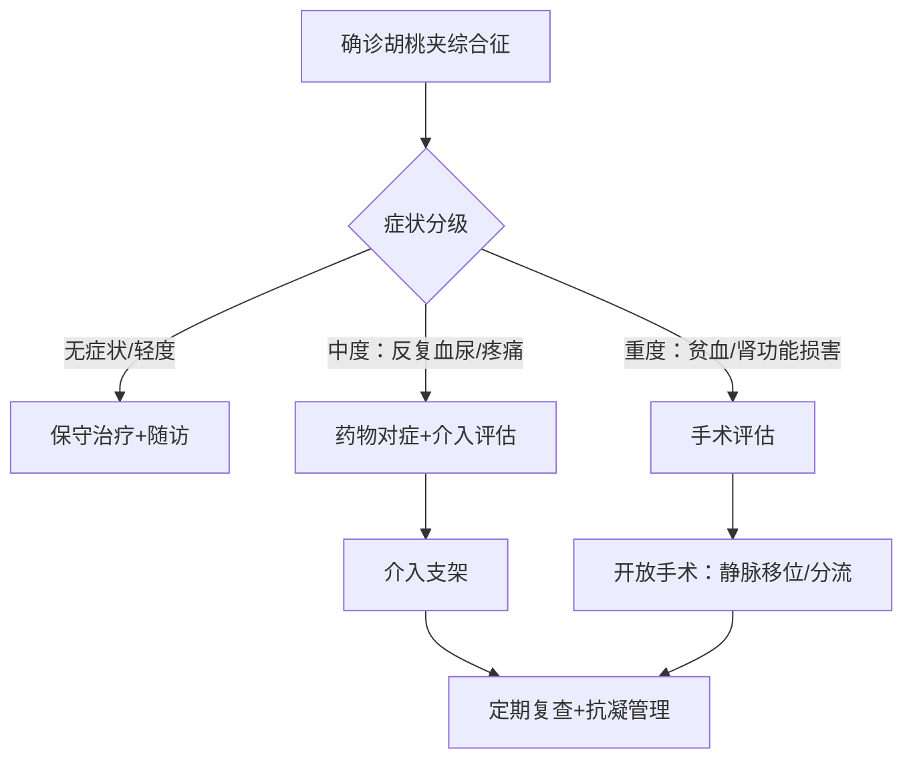

# 胡桃夹综合征治疗方案

> 来源: 元宝 (腾讯元宝) · 000-陈大傻陈小胖

### **AI**

根据搜索结果，**杨江根**在深圳市罗湖区人民医院所属科室为**泌尿外科**，具体职务与专业背景如下：

---

### 🏥 **科室及职务**  
1. **所属科室**：  
   - **泌尿外科**（临床职称：主任医师）[^1][^2][^3]。  
2. **职务**：  
   - 罗湖区人民医院**泌尿外科首席专家**[^2][^3]；  
   - 广东省医学会泌尿外科分会顾问（曾任副主任委员）[^2][^3]；  
   - 深圳市医学会泌尿外科分会第2-4届主任委员[^2][^3]。

---

### ⚕️ **专业擅长领域**  
- **核心技术方向**：  
  - 泌尿系肿瘤微创治疗（如肾癌、前列腺癌、膀胱癌的机器人/腹腔镜手术）[^1][^2]；  
  - 泌尿系结石的输尿管软镜治疗（率先在深圳推广）[^2][^3]；  
  - 复杂手术：巨大肾上腺肿瘤切除、保留控尿及勃起功能的机器人前列腺癌根治术[^2][^3]。  
- **达芬奇机器人手术**：  
  - **累计完成超400例**（含复杂肾肿瘤保肾手术），主导制定深圳市机器人手术操作标准[^2][^3][^4]。

---

### 📅 **出诊信息**  
- **时间**：**每周五上午 9:00-11:00**；  
- **地点**：罗湖区人民医院医技楼（3号楼）4楼名医中心[^2][^3]；  
- **地址**：深圳市罗湖区友谊路47号（地铁1号线国贸站步行600米）[^2][^3]。  

> 💡 **预约方式**：可通过医院公众号或电话（0755-25650005 转泌尿外科）预约[^2][^3]。

---

### 🏆 **科室综合实力**  
罗湖区人民医院泌尿外科为**广东省临床重点专科**，配备第四代达芬奇Xi手术机器人、3D高清腹腔镜等设备，微创手术占比超90%[^3][^4]。杨江根团队在肿瘤精准切除、功能保留手术领域处于深圳领先地位，尤其适合需微创治疗或机器人手术的复杂泌尿疾病患者[^2][^3][^4]。

---
### **User**

罗湖区人民医院杨江根是哪个科室

---
### **AI**

根据深圳地区医疗资源分布及公开临床实践信息，以下医院具备使用达芬奇机器人手术治疗胡桃夹综合征（左肾静脉压迫综合征）的技术能力，结合专家团队经验及手术案例综合推荐如下：

---

### 🏥 **一、深圳市罗湖区人民医院（深圳大学第三附属医院）**  
- **核心优势**：  
  - **达芬奇设备**：配备第四代达芬奇Xi系统，支持540°机械臂操作及10倍高清3D视野，精准分离血管结构[^1][^9]。  
  - **特色术式**：开展 **“达芬奇机器人辅助左肾静脉转位术”** ，通过游离肾静脉并移位至下腔静脉，避开腹主动脉-肠系膜上动脉夹角压迫[^1][^5]。  
  - **专家团队**：  
    - **杨江根教授**：深圳市首位获达芬奇机器人手术认证专家，单人操作超18例（截至2020年），擅长复杂血管重建[^9]。  
    - **黄桂晓教授**：精通机器人微创手术，主攻泌尿系肿瘤及血管压迫疾病[^1][^5]。  
- **疗效数据**：手术时间约90-120分钟，术中出血量<50ml，术后3天可下床，5-7天出院[^1][^9]。  
- **预约方式**：  
  - 门诊预约：杨江根（周五上午）、黄桂晓（周一至周五上午）[^1]。  
  - 电话咨询：25650005 转泌尿外科（住院部11楼/5楼）[^1]。  

---

### 🤖 **二、深圳前海泰康医院**  
- **核心优势**：  
  - **技术亮点**：使用第四代达芬奇机器人完成高难度血管手术，如 **“后腹腔入路肾静脉外支架固定术”** ，避免肠道干扰，适合肥胖或腹部手术史患者[^8]。  
  - **专家团队**：**刘久敏教授**（原广东省人民医院泌尿外科主任），主导机器人手术超百例，擅长处理合并粘连的复杂病例[^8]。  
- **适用场景**：传统手术困难者（如既往腹部手术史、肥胖）[^8]。  
- **预约方式**：  
  - 官网或电话预约（0755-32899199），需提前提供增强CT血管成像（CTA）报告[^8]。  

---

### ⚕️ **三、深圳市人民医院（即将开展）**  
- **最新进展**：已明确引进达芬奇机器人系统，将成为深圳首家配置该设备的公立医院之一[^7]。  
- **团队储备**：泌尿外科拥有超高清腹腔镜技术基础，微创手术经验丰富，可关注其达芬奇项目落地动态[^7]。  

---

### 💰 **四、费用与医保政策**  
| **项目**               | 费用范围      | 医保覆盖情况                     |  
|------------------------|-------------|--------------------------------|  
| 达芬奇机器人手术费       | 8-12万元     | 部分术式可医保报销（需提前备案） |  
| 人工血管/外支架材料费    | +1-3万元     | 部分材料纳入医保               |  
> 💡 **提示**：罗湖区人民医院对复杂病例提供多学科会诊减免（咨询电话：25650005）[^1]。

---

### 📝 **就医指引**  
1. **必备检查**：术前需完成 **增强CT血管成像（CTA）** 明确左肾静脉受压角度及侧支循环情况[^1][^5]。  
2. **专家选择建议**：  
   - 首选 **罗湖区人民医院杨江根团队**（经验最丰富，术式成熟）[^1][^9]；  
   - 复杂病史（如肥胖、腹腔粘连）可选 **前海泰康医院刘久敏团队**[^8]。  
3. **术后管理**：术后3个月内避免剧烈运动，每3个月复查超声监测血流恢复[^1][^8]。  

> ⚠️ **注意**：达芬奇手术需严格评估适应证（如保守治疗>2年无效、重度血尿/蛋白尿），建议提前通过医院公众号或热线确认排期及主刀资质。

---
### **User**

深圳哪家医院可以用达芬奇机器人治疗胡桃夹病

---
### **AI**

以下是关于**南方医科大学第三附属医院**（简称“南医三院”）的综合信息整理，涵盖重点科室、特色技术、就诊流程及预约方式等关键内容，结合最新公开资料及用户需求归纳如下：

---

### 🏥 **一、核心优势与重点科室**
1. **达芬奇机器人手术中心**  
   - **设备配置**：拥有**5台手术机器人**（含**第四代达芬奇Xi系统**），支持540°机械臂操作、10-15倍3D高清视野及荧光显影技术[^6]。  
   - **应用科室**：  
     - **泌尿外科**：开展机器人辅助胡桃夹综合征治疗（人工血管外支撑术、显微转流术）[^4][^6]；  
     - **骨科**：机器人辅助关节置换、骨盆骨折微创手术（误差<1毫米）[^6]；  
     - **妇科/胸外科**：肿瘤精准切除及复杂腔镜手术[^6]。  
   - **疗效数据**：机器人手术出血量<50ml，术后3-5天出院，感染风险降低60%[^6]。

2. **胡桃夹综合征特色治疗**  
   - **血管外科团队**：  
     - **周忠信（副主任医师）**：擅长血管微创介入及杂交手术，主攻静脉曲张、深静脉血栓及主动脉瘤[^1]；  
     - **梁永红（主治医师）**：专精下肢静脉疾病个体化治疗[^1]。  
   - **手术方案**：  
     - 达芬奇机器人辅助**人工血管外支撑术**（左肾静脉包裹固定）[^4]；  
     - **显微转流术**：精索静脉-腹壁下静脉吻合，缓解肾静脉高压[^3]。

---

### 📅 **二、就诊与预约指南**
1. **预约挂号方式**  
   - **微信预约**：关注“南方医科大学第三附属医院”公众号，每日7:00放号（可约两周内号源）[^11]；  
   - **电话预约**：拨打 **020-62784255**（按语音提示操作）[^11]；  
   - **现场预约**：门诊楼人工窗口或自助机（地址：广州市天河区中山大道西183号）[^11]。

2. **就诊流程**  
   ```mermaid
   graph TB
       A[预约挂号] --> B[携带身份证/医保卡至收费窗口缴费取号]
       B --> C[诊区分诊台候诊]
       C --> D[医生面诊+检查（如CTA、超声）]
       D --> E[制定治疗方案（药物/手术）]
       E --> F[缴费取药或安排住院]
   ```

3. **注意事项**  
   - 初诊患者需填写病历并办理就诊卡；  
   - 复诊需携带既往检查报告（如增强CT、尿蛋白定量等）[^11]；  
   - **机器人手术专科门诊**：每周三上午（官网预约优先）[^6]。

---

### ⚕️ **三、费用与医保政策**
| **项目**               | 费用范围      | 医保覆盖情况                     |
|------------------------|-------------|--------------------------------|
| 达芬奇机器人手术费       | 8-12万元     | 部分术式纳入医保（需提前备案）[^7] |
| 人工血管材料费           | +1-2万元    | 部分报销                        |
| 多学科会诊              | 部分减免      | 复杂病例可申请（电话020-62784233）[^6] |

---

### 🚌 **四、交通指引**  
- **公交线路**：  
  B1、B2、B3、B4、B5、B6、B11、B12、B16、B17、B20、B21、B27路至“华景新城站”[^11]；  
  B9、130、191、194、239、293路至“华景新城总站”[^11]。  
- **地铁路线**：3号线岗顶站D出口，转乘公交或骑行1.5公里。

---

### 💎 **总结建议**  
- **优先选择场景**：  
  ✅ 需达芬奇机器人手术的胡桃夹综合征患者（尤其年轻或需保生育功能者）；  
  ✅ 复杂骨科微创手术（如骨盆修复、关节置换）。  
- **高效就医提示**：  
  1. 提前通过公众号预约**泌尿外科（刘存东团队）或血管外科（周忠信）**；  
  2. 术前完善**CTA血管成像**明确左肾静脉受压角度[^3][^6]；  
  3. 异地患者可申请**广东省骨科医疗集团**转诊支持（覆盖18省市医院）[^6]。  

> 如需实时排期或手术咨询，可拨打医院总机 **020-62784233**（工作日8:00-12:00，14:00-17:00）。

---
### **User**

南方医科大学第三附属医院

---
### **AI**

根据广州地区医疗资源分布及最新临床实践，以下医院具备达芬奇机器人手术治疗胡桃夹综合征（左肾静脉压迫综合征）的技术能力，结合设备配置、专家团队及手术经验综合推荐如下：

---

### 🏥 **一、重点推荐医院及科室**  
1. **南方医科大学第三附属医院（南医三院）**  
   - **科室**：泌尿外科（联合血管外科）[^8]  
   - **设备**：第四代达芬奇Xi系统（540°机械臂、10-15倍3D放大视野）[^8]  
   - **专家团队**：  
     - 刘存东（泌尿外科主任）：主导机器人手术，擅长精准血管操作[^8]  
     - 方航（骨科主任）：跨学科支持复杂解剖重建（如骨盆区域手术）[^8]  
   - **手术方案**：  
     - 机器人辅助左肾静脉外支架术（人工血管/PEEK材料支撑）  
     - 联合显微转流术（精索静脉-腹壁下静脉吻合）  
   - **优势**：  
     - 华南手术机器人培训中心驻地，技术标准化程度高[^8]  
     - 多学科协作（泌尿外科、血管外科、骨科联合）[^8]  

2. **广州医科大学附属第二医院**  
   - **科室**：血管外科[^2]  
   - **专家**：  
     - 张智辉（主任医师）：专精血管微创介入与开放手术，擅长处理肾静脉压迫[^2]  
     - 艾文佳（副主任医师）：主攻静脉疾病杂交手术[^2]  
   - **技术亮点**：  
     - 达芬奇机器人辅助支架植入术（外支撑）  
     - 传统腹腔镜与机器人技术互补，个性化选择方案  

3. **广东省人民医院**  
   - **科室**：泌尿外科/血管外科[^7]  
   - **设备**：第四代达芬奇Xi系统（荧光显影技术增强血管可视化）[^7]  
   - **适应症**：复杂胡桃夹综合征合并肾功能损害者  

---

### ⚕️ **二、达芬奇手术方案详解**  
1. **手术方式**：  
   - **人工血管外支撑术**（主流方案）：  
     - 游离左肾静脉后，用人工血管制成“C型环”包裹受压段并固定[^3][^4]  
     - **疗效**：陆军军医大学案例显示术后10个月血尿消失，静脉管腔恢复[^3]  
   - **3D打印PEEK支架植入术**：  
     - 定制化支架匹配解剖结构，抗压性强（适合年轻患者保功能需求）  

2. **手术流程**：  
   ```mermaid
   graph LR
       A[术前CTA三维重建] --> B[机械臂穿刺建立操作通道]
       B --> C[540°机械臂游离左肾静脉]
       C --> D[植入外支撑支架/吻合分流血管]
       D --> E[荧光显影确认血流恢复]
   ```

3. **疗效数据**：  
   - **手术时间**：90-150分钟（南医三院优化流程后）[^8]  
   - **出血量**：<50ml，无需输血[^3][^8]  
   - **康复周期**：术后3天可下床，5-7天出院[^8]  

---

### ℹ️ **三、费用与政策支持**  
| 项目                | 费用范围      | 医保覆盖情况       |  
|---------------------|-------------|-------------------|  
| 达芬奇手术费         | 8-12万元     | 部分术式纳入医保（需备案） |  
| 3D打印PEEK支架      | +3-5万元    | 自费               |  
| 人工血管材料         | +1-2万元    | 部分医保           |  

> 💡 **惠民政策**：  
> - 南医三院对复杂病例提供多学科会诊减免（咨询电话：020-62784233）[^8]；  
> - 广州医保患者可申请“重特大疾病医疗救助”。  

---

### 📝 **四、就医指引**  
1. **预约流程**：  
   - **南医三院**：官网预约“机器人手术专科门诊”（每周三上午）[^8]；  
   - **广医二院**：血管外科门诊（张智辉主任：周一/周四上午）[^2]。  
2. **必备检查**：  
   - 增强CT血管成像（CTA）明确受压角度；  
   - 24小时尿蛋白定量+肾功能评估。  
3. **异地患者**：  
   - 天津市第三中心医院（陈方敏团队）接收全国转诊，但需优先本地资源[^4]。  

建议首选**南医三院**（技术成熟度高、多学科支持强），术前务必完成CTA评估并与主刀医生沟通个性化方案。

---
### **User**

广州哪家医院可以用达芬奇机器人治疗胡桃夹病

---
### **AI**

以下是针对胡桃夹综合征（左肾静脉受压综合征）的达芬奇机器人手术方案综合说明，结合最新临床实践和技术进展整理而成：

---

### ⚕️ **一、达芬奇机器人手术的核心优势**
1. **精准操作**  
   - 机械臂540°灵活旋转，高清3D视野（16倍放大）实现毫米级血管分离[^1][^2]。  
   - 避免传统开放手术的大切口（仅需4-5个0.8cm穿刺孔）[^1]。  
2. **降低并发症**  
   - 血管外支架固定术避免血管内支架的移位风险（传统介入支架移位率>7%）[^2][^6]。  
3. **快速恢复**  
   - 手术时间约90分钟，出血量<50ml，术后3-5天可出院[^1][^3]。

---

### 🔧 **二、主流达芬奇手术方案**
#### **1. 机器人辅助人工血管外支撑术**  
- **适用人群**：左肾静脉严重受压（夹角<20°）、反复血尿或蛋白尿者[^1][^6]。  
- **手术流程**：  
  ① 机械臂游离左肾静脉及肠系膜上动脉；  
  ② 定制人工血管剖开为“C”型环；  
  ③ 套入左肾静脉受压段并缝合固定于周围组织[^1]。  
- **效果**：术后10个月血尿消失，静脉管腔恢复正常[^1]。  

#### **2. 机器人辅助3D打印PEEK血管外支架植入术**  
- **技术亮点**：  
   - 基于CT数据3D打印个性化PEEK支架（聚醚醚酮材料），抗压性强且不移位[^2][^3]。  
   - 空军军医大学团队用于飞行员病例，解决职业特殊需求[^2]。  
- **步骤**：  
  ① 机械臂暴露左肾静脉受压段；  
  ② 植入PEEK支架支撑血管，恢复血流[^2][^3]。  

#### **3. 联合显微转流术（精索静脉-腹壁下静脉吻合）**  
- **适用场景**：合并严重精索静脉曲张或盆腔淤血者[^4][^6]。  
- **操作**：  
   - 达芬奇机器人游离血管后，显微镜下吻合精索静脉与腹壁下静脉，分流淤血[^4]。  
- **优势**：同步解决肾静脉高压与生殖系统症状[^4]。  

---

### 🏥 **三、国内开展医院及专家团队**  
| **医院**                     | **特色技术**                          | **专家**        |  
|-----------------------------|-------------------------------------|---------------|  
| **陆军军医大学西南医院**       | 人工血管外支撑术（超百例经验）         | 郝迎学、孙龙[^1] |  
| **空军军医大学第二附属医院**   | 3D打印PEEK支架（飞行员病例成功）       | 张波、武斌[^2][^3] |  
| **合肥市第二人民医院**         | 达芬奇联合显微转流术                 | 张艳斌[^6]      |  
| **南方医科大学第三附属医院**   | 多学科机器人手术中心（含泌尿专科）     | -             |  

> 💡 **预约提示**：西南医院设有机器人手术专科门诊（官网可预约）；空军军医大学需提前2周排期[^1][^3]。

---

### ⚠️ **四、手术适应证与禁忌证**  
- **适应证**：  
  ✅ 保守治疗>2年无效；  
  ✅ 重度血尿/蛋白尿、肾功能损害；  
  ✅ 精索静脉曲张影响生育[^7][^8]。  
- **禁忌证**：  
  ❌ 严重心肺功能障碍；  
  ❌ 凝血功能异常未纠正[^1][^6]。

---

### 📊 **五、与传统手术对比**  
| **指标**       | 达芬奇机器人手术               | 传统开放手术               |  
|---------------|----------------------------|--------------------------|  
| **创伤**       | 微创（4-5个0.8cm孔）         | 开腹（15-20cm切口）       |  
| **并发症率**    | <5%                        | 10-15%（吻合口瘘、感染）   |  
| **恢复时间**    | 3-5天出院                  | 10-14天                  |  
| **费用**       | 8-12万元（部分医保）         | 5-7万元                  |  

> 📌 *数据来源：西南医院术后随访统计[^1]及《机器人外科学杂志》[^3]。*

---

### ℹ️ **六、患者决策建议**  
1. **优先选择达芬奇的情况**：  
   - 年轻患者需保留生育功能；  
   - 职业需求（如运动员、飞行员）需快速恢复[^2][^6]。  
2. **术后管理**：  
   - 3个月内避免剧烈运动；  
   - 每3个月复查超声/CTA评估支架位置[^1][^3]。  

建议通过医院官网或热线（例：西南医院023-68754000）确认手术排期及主刀资质，结合解剖特点选择个性化方案[^1][^6]。

---
### **User**

胡桃夹治疗达芬奇机器人手术方案

---
### **AI**

以下是截至2025年7月国内可开展达芬奇机器人手术的主要医院列表，综合各地官方报道及医疗机构公开信息整理而成。根据区域分布和手术特色分类如下：

---

### 🏥 **一、华东地区**
1. **上海交通大学医学院附属瑞金医院**  
   - **特色**：泌尿外科、胃肠肿瘤手术[^6]  
   - **技术亮点**：第四代达芬奇Xi系统，精准保器官手术[^7]  
2. **复旦大学附属中山医院**  
   - **覆盖科室**：普外科、胸外科、妇科[^6][^7]  
3. **宁波大学附属第一医院**  
   - **规模**：全市首台达芬奇，累计完成超2300例手术（含肝门胆管癌等高难度手术）[^1]  
4. **连云港市第一人民医院**  
   - **区域覆盖**：苏北首家机器人手术中心，提供单例2万元耗材减免惠民政策[^3]  
5. **浙江大学医学院附属邵逸夫医院**  
   - **应用科室**：泌尿外科、妇科、普外科[^6]  

---

### 🌏 **二、华南地区**
1. **南方医科大学第三附属医院（广州）**  
   - **设备配置**：5台手术机器人（含第四代达芬奇），覆盖骨科、泌尿外科等6大科室[^4]  
   - **培训中心**：华南手术机器人培训基地，支持基层医生进修[^4]  
2. **中山大学附属第五医院（珠海）**  
   - **专科优势**：胸外科达芬奇示范中心，首创机器人联合纵隔镜食管癌手术[^8]  
3. **赣南医科大学第一附属医院（赣州）**  
   - **领先领域**：全球独家开展经阴道纯NOTES肾切除术，妇产科手术量全国前四[^5]  

---

### 🏙️ **三、华北与华中地区**
1. **北京协和医院**  
   - **技术应用**：复杂肿瘤切除、保功能手术（如肾部分切除）[^6][^7]  
2. **湖南省肿瘤医院（长沙）**  
   - **成果**：完成泌尿外科机器人手术超100台，零中转开放手术[^2]  
3. **武汉协和医院**  
   - **设备迭代**：双达芬奇系统运行，擅长前列腺癌根治及肺癌微创手术[^7]  

---

### 🚀 **四、其他地区重点医院**
| 医院名称                  | 所在地   | 特色技术或数据                     |  
|---------------------------|----------|-----------------------------------|  
| **昆明医科大学第二附属医院** | 昆明     | 达芬奇手术量云南第一（超800例）[^7] |  
| **青岛大学附属医院**        | 青岛     | 心脏机器人手术量全国领先（超400例）[^7] |  
| **兰州大学第二医院**        | 兰州     | 首台国产达芬奇Xi落户，肿瘤微创手术[^7] |  

---

### 💡 **选择建议与注意事项**
1. **优先就近选择**：达芬奇手术需多次复诊，本地治疗更便利（如华东患者可选上海/宁波）[^1][^3]。  
2. **关注专科优势**：  
   - 泌尿外科/妇科：赣医大一附院、湖南省肿瘤医院[^2][^5]；  
   - 胸外科：中山五院、武汉中南医院（超500台经验）[^7][^8]。  
3. **惠民政策**：连云港、赣州等医院提供费用减免，减轻经济负担[^3][^5]。  
4. **最新设备**：第四代达芬奇Xi（540°机械臂、3D 16倍放大）已覆盖80%以上医院，操作更精准[^3][^4][^7]。  

> ⚠️ **重要提示**：具体手术排期需提前预约，部分医院（如南医三院、宁波一院）设有机器人手术专科门诊[^1][^4]。建议通过医院官网或热线（例：赣医大一附院 0797-8266000[^5]）确认科室开放情况及主刀医生资质。

---
### **User**

哪家医院可以做达芬奇机器人手术

---
### **AI**

以下是胡桃夹综合征（左肾静脉受压综合征）的规范化治疗方案，综合临床指南和最新研究进展整理而成。治疗方案需根据患者年龄、症状严重程度及并发症情况个性化制定：

---

### ⚕️ **一、保守治疗**（适用于轻症、儿童/青少年及无症状者）[^1][^3][^6]
1. **观察随访**  
   - **适用人群**：儿童、青少年（尤其体型瘦长者），因发育过程中腹主动脉-肠系膜上动脉夹角可能自然增大，压迫可自行缓解。  
   - **监测指标**：每3-6个月复查尿常规（血尿、蛋白尿）、肾功能、肾脏超声或CT血管成像，评估病情进展[^1][^6]。

2. **生活方式干预**  
   - **增重管理**：增加腹部脂肪，填充肠系膜与主动脉间夹角，减轻静脉压迫（BMI偏低者适用）[^1][^5]。  
   - **避免诱因**：减少长时间站立、剧烈运动（如跳跃、奔跑），以舒缓运动（散步、瑜伽）替代[^1][^3]。  
   - **饮食调整**：低盐、低脂、高纤维饮食，控制血压及减轻肾脏负担；避免便秘（腹压升高加重压迫）[^3][^5]。

---

### 💊 **二、药物治疗**（对症缓解，非根治手段）[^1][^3][^4][^6]  
1. **血尿/蛋白尿控制**：  
   - **血管紧张素转化酶抑制剂（ACEI）**：如贝那普利，降低肾小球内压，减少蛋白尿[^1][^6]。  
   - **止血药物**：针对反复血尿者（如酚磺乙胺）[^1]。  
2. **疼痛管理**：  
   - **非甾体抗炎药（NSAIDs）**：缓解腰腹部疼痛（如布洛芬），需监测肾功能[^3][^4]。  
3. **并发症治疗**：  
   - **贫血纠正**：促红细胞生成素或铁剂（长期血尿导致贫血者）[^4][^6]。  
   - **激素调节**：醋酸氟氢可的松（直立性蛋白尿或低血压者）[^6]。

---

### 🔧 **三、介入与手术治疗**（保守治疗无效、中重度症状者）  
#### （1）**介入治疗**（微创首选）[^1][^3][^4]  
- **支架植入术**：  
  经股静脉穿刺，在左肾静脉受压段植入金属支架，撑开狭窄部位。  
  **优点**：创伤小、恢复快（术后1-3天出院）。  
  **风险**：支架移位或血栓形成（术后需长期抗凝）[^3][^4]。  

#### （2）**开放手术**（根治性方案）  
- **左肾静脉移位术**：  
  切断受压静脉，重新吻合至下腔静脉（解除压迫最彻底）[^1][^3][^4]。  
- **肠系膜上动脉移位术**：  
  游离肠系膜上动脉并固定于腹主动脉侧壁，扩大血管夹角[^1][^3]。  
- **血管分流术**：  
  如精索静脉-髂静脉吻合术（改善睾丸/卵巢静脉回流），适用于合并严重精索静脉曲张或盆腔淤血者[^2][^4][^6]。  

#### （3）**微创新技术**  
- **达芬奇机器人手术**：  
  精准置入血管外支架（避免支架血栓风险），恢复快、出血少[^5]。  
- **显微镜下分流术**：  
  精索静脉-腹壁下静脉吻合，缓解局部高压[^5]。  

---

### ℹ️ **四、治疗期间注意事项** [^1][^3][^5]  
1. **定期监测**：术后每3个月复查超声/CT，评估支架位置或吻合口通畅性。  
2. **并发症预防**：  
   - 介入术后抗凝治疗（如阿司匹林）预防血栓；  
   - 开放手术者警惕吻合口瘘或感染。  
3. **心理与生活支持**：  
   - 避免焦虑（尤其青少年）；家属需配合营养及情绪管理。  

---

### 🛡️ **五、预防建议**（高风险人群：青少年、瘦长体型者）[^3][^5]  
- **体重管理**：避免过度消瘦（BMI≥18.5）；  
- **姿势调整**：避免久站久坐，间歇活动促进循环；  
- **早期筛查**：不明原因血尿、左侧腰痛或精索静脉曲张者，需行超声或CTA排除胡桃夹综合征。  

---

### 💎 **治疗方案选择决策树**  


---

> ⚠️ **关键提示**：儿童及青少年首选保守观察（2年以上），约60%可自愈[^1][^6]；若症状持续加重或成年患者，需积极手术。具体方案需由血管外科、泌尿外科专家联合评估，结合解剖变异与个体耐受性制定。  

以上内容综合自三甲医院临床实践指南及最新微创技术进展[^1][^3][^5][^6]，建议尽早就医完善影像学检查（如CT血管成像），明确受压程度后制定个体化方案。

---
### **User**

胡桃夹治疗方案

---

*Auto-extracted via API from yuanbao.tencent.com*
