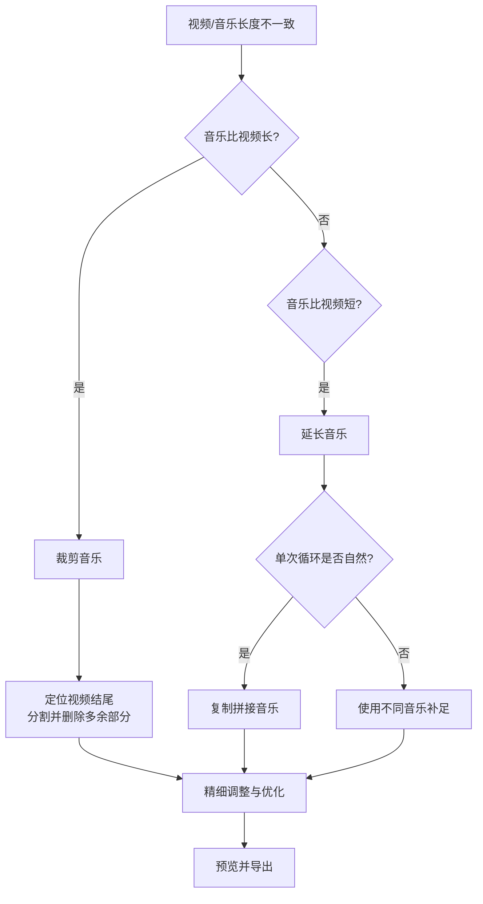

# 剪映视频音乐长度不同处理方法

> 来源: 元宝 (腾讯元宝) · 001-文化与创作

### **AI**

在剪映中处理视频和音乐长度不一致的问题，主要通过裁剪、延长或调整音乐来实现同步。下面这张流程图可以帮你快速梳理整体的解决思路。

接下来，我们详细看看每个环节的具体操作。

### 🎵 调整音乐长度

**当音乐长于视频时**，最直接的方法是裁剪掉视频内容结束后的多余部分。
1.  **定位结尾**：在时间轴上，将白色的播放指示线（时间轴）精准拖动到视频轨道的结束位置[citation:1][citation:2]。
2.  **分割音乐**：点击选中音频轨道（轨道会呈现白框），然后点击下方工具栏中的“**分割**”按钮。这样音乐就会在指示线位置被切成前后两段[citation:1][citation:2][citation:5]。
3.  **删除多余部分**：点击刚刚分割出来的、视频内容之后的那段多余音乐，再选择“**删除**”即可[citation:1][citation:2]。这样音乐和视频就一样长了。

**当音乐短于视频时**，有几种方法可以补足时长：
*   **复制拼接**：如果音乐本身可以循环使用且衔接自然，这是最方便的方法。选中音频轨道，点击工具栏中的“**复制**”，即可将音乐重复拼接在后面，直到填满视频时长[citation:1]。
*   **开启循环播放**：对于纯音乐或节奏感不强的背景音，可以试试音乐的“循环”功能。点击音乐轨道上的相应按钮，音乐便会自动重复播放直至视频结束，通常能实现无缝衔接[citation:4]。
*   **补接其他音乐**：如果循环复制后衔接不自然，可以考虑从剪映音乐库或其他来源找一首风格、节奏或调性相似的音乐拼接在后面，营造一种背景音乐延续的感觉。

### ✨ 进行精细优化

简单的长度匹配后，一些细节处理能让作品更专业。

*   **添加淡入淡出**：为了避免音乐突然开始或猛然结束带来的突兀感，强烈建议使用淡入淡出效果。选中音乐轨道，在工具栏中找到“淡入淡出”或类似选项（通常通过音轨两端的小三角图标设置），为音乐的开头和结尾添加短暂的音量渐变[citation:4][citation:9][citation:10]。
*   **尝试变速处理**：如果音乐比视频长或短得不多，可以尝试“变速”功能。选中音乐轨道，点击“变速”，然后微调播放速度。稍微加快可以缩短音乐，稍微放慢则可以延长音乐。注意调整幅度不要太大，以免造成音调失真[citation:4][citation:10][citation:11]。
*   **巧用卡点技巧**：如果视频节奏感较强，可以利用剪映的“自动踩点”或手动查看音波图（波峰通常是节奏点）功能，将视频画面的切换、重点动作与音乐节拍对齐，能极大提升视频的观赏性[citation:4]。

### ⚠️ 留意常见误区

在操作过程中，有两点需要特别留意：
*   **避免过度裁剪视频**：不要为了迎合音乐长度而将视频剪得支离破碎，破坏其本身的连贯性和叙事节奏。内容本身的流畅永远是第一位的[citation:8]。
*   **注意音乐版权**：如果你准备将视频用于商业用途或发布到大型平台，务必确保所使用的音乐拥有合法版权。尽量使用剪映APP内自带音乐库中明确可商用的音乐，以避免潜在的版权纠纷[citation:4]。

### 🔍 关键操作提示
*   **放大时间轴**：在进行精确分割或删除时，建议用双指在时间轴上向外滑动，将时间轴放大。这样操作会更精准，更容易对齐视频的结尾点[citation:5]。
*   **务必预览**：在最终导出前，**一定要从头到尾完整预览一遍**，仔细检查音画是否同步，音乐衔接处是否自然流畅，音量大小是否合适[citation:8]。

希望这些详细的步骤和技巧能帮助你高效地解决音画时长匹配的烦恼。如果你在操作中遇到更具体的情况，比如需要处理一段特别长的视频或一首很短的音乐，欢迎随时告诉我，我们可以继续探讨更优化的方案。

---
### **User**

用剪映拼接视频和音乐时，视频和音乐长度不一致，如何处理

---

*Auto-extracted via API from yuanbao.tencent.com*
