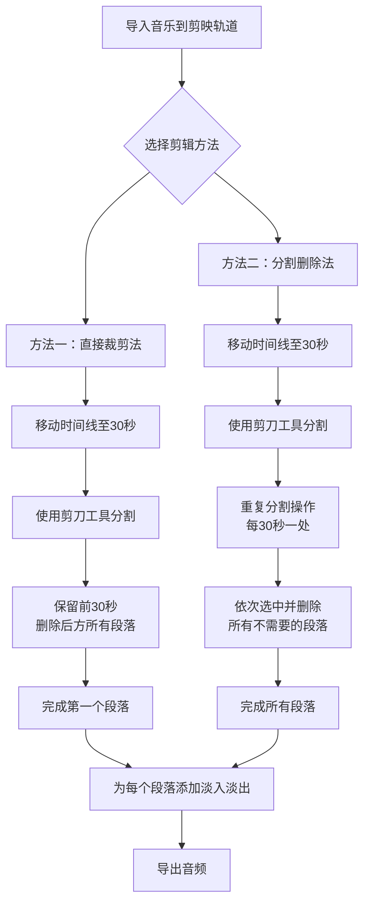

# 剪映分割歌曲为30秒段

> 来源: 元宝 (腾讯元宝) · 001-文化与创作

### **AI**

用剪映将一首长歌曲分割成多个30秒的小段落，操作上很直接。下面的流程图总结了核心步骤和两种方法，你可以先快速了解全貌。

下面，我们具体看看每个环节的操作细节。

### 🎵 导入音乐与基础准备

首先，你需要将音乐素材导入剪映并做好前期准备。

*   **导入音乐**：在剪映中点击“开始创作”，导入视频或音频文件。如果你只有音频文件，在剪映中也可以直接导入。如果是视频中的音乐，可以右键点击轨道上的视频，选择“**分离音频**”，这样音频就会独立显示在轨道上，方便后续操作[citation:7]。
*   **放大时间线**：为了更好地定位30秒的时间点，建议使用时间线缩放功能（如快捷键或缩放滑块**放大时间线**）。这样可以进行更精确的定位，确保分割点准确无误[citation:5]。
*   **开启时间码显示**：在时间线上方找到并开启时间码或帧数的显示，以便精确观察和定位到具体的秒数。

### ✂️ 核心剪辑操作

准备工作完成后，就可以参考流程图中的两种方法进行剪辑了。这两种方法的核心操作都依赖于“**分割**”功能。

*   **定位与分割**：在音频轨道上，将时间线（通常是一条竖线）拖动到你想要分割的位置，比如 **00:30**, **01:00** 等处[citation:2][citation:4]。然后选中音频轨道，点击下方工具栏或右键菜单中的“**分割**”按钮（快捷键 `Ctrl+B` / `Cmd+B` 在电脑端效率很高），音频就会被切成两段[citation:6][citation:8]。重复此操作，直至整首歌曲被按30秒间隔标记好。
*   **删除与整理**：分割完成后，点击选中那些你不需要的音频段落（例如，每个30秒段落之后到下一个30秒之前的部分），然后按键盘上的`Delete`键或点击“删除”图标即可将其移除[citation:1][citation:2]。这样就得到了多个独立的30秒音频片段。

### 🎨 优化与导出

所有段落分割完毕后，进行一些简单的优化处理可以让效果更好。

*   **添加淡入淡出**：为了避免每个30秒段落的开头和结尾听起来太突兀，可以为它们添加轻微的“淡入淡出”效果。选中一个音频段落，在调整面板中找到“淡化”选项，适当设置“淡入时长”和“淡出时长”（如0.5秒），这样音乐的开始和结束就会变得自然平滑[citation:1]。对其他段落重复此操作。
*   **导出音频**：处理完成后，点击右上角的“导出”按钮。在导出设置中，除了选择视频格式，如果你只想保留音频，可以选择纯音频格式（如MP3）。确保分辨率、码率等参数符合你的需求，然后点击确认导出即可[citation:7]。

### 💡 实用操作技巧

掌握一些操作技巧能显著提升效率。

*   **快速复制轨道**：如果你需要生成多个相同的30秒段落用于不同项目，在删除多余部分前，可以先复制整个音频轨道。这样你就拥有了一份原始音乐的副本，避免重复操作。
*   **精准定位技巧**：除了拖动时间线，你还可以使用键盘上的左右方向键进行逐帧微调，以便将分割点定位在非常精确的位置。
*   **手机端操作**：手机剪映App的操作逻辑与电脑版基本一致。同样是导入音频后，移动时间线到指定位置，点击“分割”按钮，再删除多余部分即可[citation:2][citation:6]。触屏操作时，稍微放大时间轴可以更精准。

希望这些步骤和技巧能帮助你顺利地将长音乐分割成需要的段落。如果在实际操作中遇到更具体的问题，比如如何为不同段落设置不同的音量，欢迎随时再问我。

---
### **User**

如何用剪映将一首 4 分钟的歌曲，分割成 30s 一个的小段落

---

*Auto-extracted via API from yuanbao.tencent.com*
