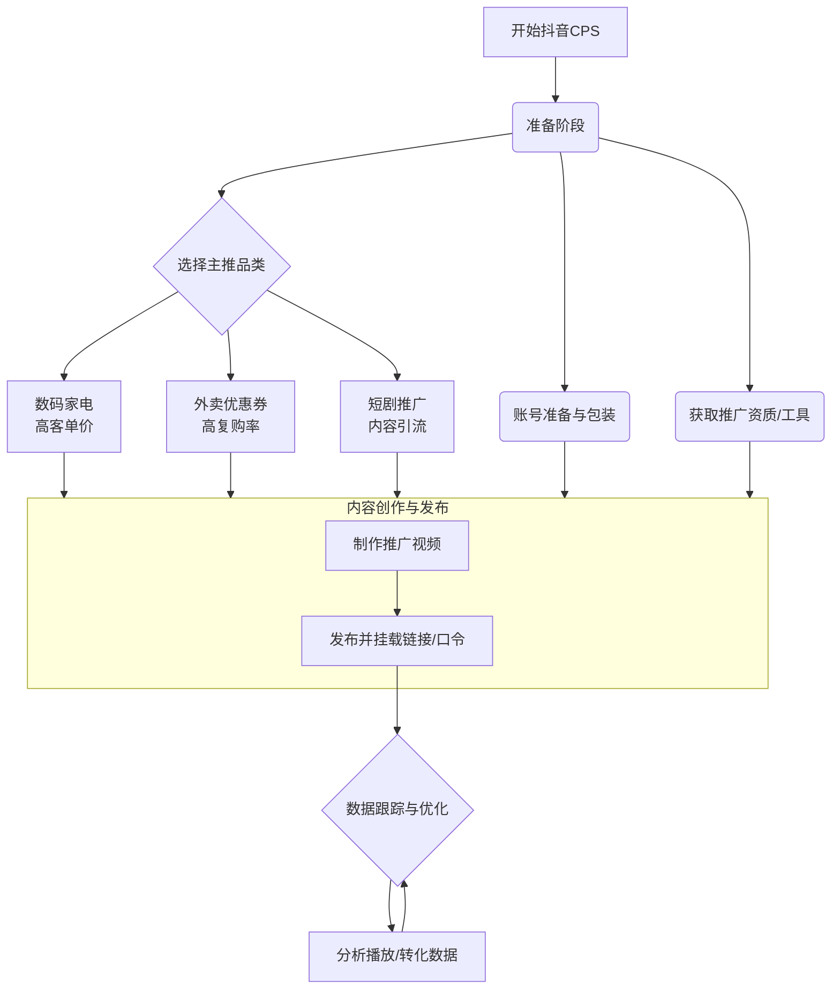

# 如何做CPS赚钱

> 来源: 元宝 (腾讯元宝) · 001-经济与投资

### **AI**

对于普通人来说，通过抖音从事CPS（按销售付费）是一项不错的副业选择，它**门槛相对较低，无需囤货或大量粉丝**，核心是利用内容促成交易以赚取佣金[citation:2][citation:3]。其基本逻辑是：你创作内容吸引用户，他们通过你的专属链接或口令下单后，你便能获得分成[citation:2][citation:6]。

下面这个流程图可以帮你快速了解整体操作路径与关键环节：

### 🛠️ 实操指南：从准备到发布

#### **1. 选择适合的推广品类**
新手建议从以下方向入手：
-   **数码家电 + 国补**：像iPhone、大家电这类商品**客单价高，单笔佣金可观**（几十到几百元），但转化周期可能稍长[citation:2]。
-   **外卖优惠券**：如美团、京东外卖红包，虽然**单笔佣金不高（几毛到几元）**，但用户**复购率高，容易出单**，适合新手快速建立信心[citation:2]。
-   **短剧推广**：通过剪辑精彩片段，吸引用户观看完整短剧或充值。通常需要先获取短剧的推广授权[citation:3][citation:5]。

#### **2. 账号准备与包装**
-   **账号选择**：使用正常的个人抖音号即可，新号最好先发几条生活随拍“养号”，确保自然流量正常（播放量≥100）[citation:2]。
-   **账号包装**：让账号看起来更专业，能提升信任感。
    -   **昵称**：可取名如“XX攻略”、“XX省钱日记”[citation:2]。
    -   **个性签名**：简要说明你的价值，如“3年数码从业者，专注性价比好物”[citation:2]。
-   **注意事项**：避免使用被限流的账号，操作时尽量使用流量，避免多个账号在同一Wi-Fi下关联[citation:2]。

#### **3. 获取推广资质与工具**
-   **通过“精选联盟”**：这是抖音官方的CPS平台。如果你有抖音小店，可以作为商家入驻设置佣金；如果作为推广者，可以通过“精选联盟”挑选商品，在视频或直播中挂载商品链接[citation:6][citation:7]。
-   **利用第三方推广平台**：例如注册“万单宝”等平台，获取专属的“**密令词**”（如“苹果红包666”）。用户在其他电商平台搜索你的密令词并下单，你就能获得佣金[citation:2]。
-   **获取短剧授权**：推广短剧通常需先获取授权，一些平台提供免费授权[citation:3][citation:5]。

#### **4. 内容创作与发布**
-   **视频形式选择**：
    -   **不露脸类（曼波视频）**：使用表情包、素材图片加上文字配音合成，适合新手快速上手[citation:2]。
    -   **口播类**：真人出镜讲解，**信任感更强，转化率通常更高**，适合表达能力强的人[citation:2][citation:4]。
-   **内容要点**：
    -   **黄金3秒**：视频开头必须抓住眼球，用强吸引力信息留住用户，例如“所有人停止买手机！iPhone17双十二狂降1200！”[citation:2]。
    -   **清晰引导**：在视频中明确告知用户如何操作，比如“打开京东，搜索‘XXX密令词’，就能领到优惠券”[citation:1][citation:2]。
    -   **挂载链接/口令**：发布视频时，记得挂载商品链接或清晰说明你的专属密令词[citation:2][citation:5]。

### 💰 收益与结算
你的收益直接来自实际成交。佣金比例因商品而异，数码家电可能**5%-30%**甚至更高[citation:6]，而外卖红包等佣金较低但靠量[citation:2]。结算通常在下单确认收货后，通过平台进行，平台可能会扣除一定比例的技术服务费[citation:6]。

### ⚠️ 关键注意事项
-   **避免违规行为**：不要直接在评论区发密令词或引导私信，标题避免直接出现“京东”“美团”等平台名，可用“东哥”“某团”替代，以免被判定为营销限流[citation:2]。
-   **坚持与优化**：前期收益可能不多，需要**保持更新频率**（如日更或每周3-5条），并关注视频数据（如2秒跳出率、完播率），持续优化内容[citation:2][citation:4]。
-   **警惕高风险承诺**：远离任何要求提前交费或下载不明软件的项目[citation:1]。

希望这份指南对你有帮助！如果你对某个特定品类（比如数码、外卖还是短剧）更感兴趣，我可以提供更具体的建议。

---
### **User**

普通人如何通过抖音做CPS

---
### **AI**

CPS（按销售付费）和CPA（按行动付费）是效果营销中两种常见的计费模式，它们核心的区别在于**广告主为怎样的“结果”付费**。

下面这个表格能帮你快速把握它们的主要不同点。

| 对比维度 | **CPS（Cost Per Sale，按销售付费）** | **CPA（Cost Per Action，按行动付费）** |
| :--- | :--- | :--- |
| **计费基础** | 基于**实际产生的销售额或销售订单**付费[citation:3][citation:5]。 | 基于用户的**特定行动**付费，如注册、下载、填写表单等[citation:2][citation:10]。 |
| **风险高低** | 对广告主而言**风险最低**，只在产生真实销售后支付佣金[citation:5]。 | 对广告主而言**风险较低**，用户完成指定行动才需付费，但行动本身不直接带来收入[citation:10]。 |
| **核心关注点** | **最终的销售转化结果**。 | **达成预设的中间目标**（即“行动”），这些行动是最终销售的前置步骤[citation:2]。 |
| **适用场景** | 电商销售、直播带货、联盟营销（如淘宝客）等直接以销售为导向的场景[citation:3][citation:5]。 | 应用下载、会员注册、线索收集、品牌推广等需要引导用户完成特定步骤的场景[citation:2]。 |
| **对广告主的好处** | 投入产出比（ROI）清晰可见，营销风险得到有效控制[citation:5]。 | 效果衡量明确，有助于获取用户或提升品牌互动数据，降低广告费用风险[citation:10]。 |
| **对推广方/媒体的挑战** | 结算周期可能较长，需要可靠的数据追踪系统来确认销售[citation:5]。 | 行动的定义需双方明确共识，若获取用户的成本过高，媒体可能收益有限[citation:10]。 |

### 💡 如何选择适合你的模式？

选择CPS还是CPA，主要取决于你的**营销目标**和**产品特性**：

-   **追求直接销售效果**：如果你的核心目标是提升商品销量，并且产品已经比较成熟，那么**CPS**模式能让你直接将广告投入与销售收入挂钩，实现风险最低化[citation:3][citation:5]。
-   **关注用户增长或潜在客户收集**：如果你的目标是扩大用户基数（如推广新APP）、收集销售线索（如获取试用申请）或提升品牌互动，**CPA**模式更为合适。它能让你为“注册成功”、“下载完成”这样的有效结果付费，而不是为泛泛的点击或展示付费[citation:2]。

简单来说，**CPS可以看作是CPA的一种特殊形式，它将“行动”（Action）明确地定义为“销售”（Sale）**[citation:7]。对于广告主，从风险控制角度排序，一般是：CPS < CPA < CPC（按点击付费） < CPM（按展示付费）。

希望这些解释能帮助你更好地理解这两种模式。如果你能分享一下你具体推广的产品或服务类型，或许我可以提供更具体的分析。

---
### **User**

CPS和CPA

---

*Auto-extracted via API from yuanbao.tencent.com*
