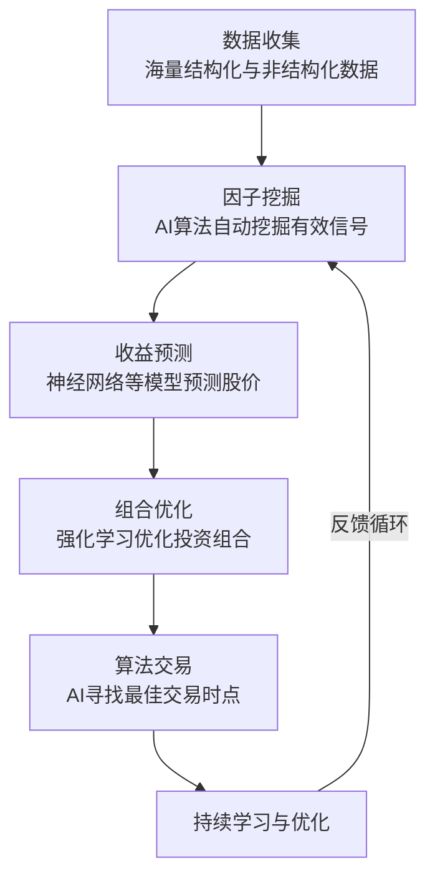

# AI量化交易系统介绍

> 来源: 元宝 (腾讯元宝) · 001-经济与投资

### **AI**

AI量化交易是人工智能技术与量化投资深度融合的领域，它通过算法和数学模型自动进行交易决策与执行，正重塑着投资管理的面貌[citation:9]。下面这张图可以帮你快速了解一个典型的AI量化交易系统是如何运作的。

### 🚀 AI如何赋能量化交易

AI的引入使得量化投资从传统方法迈向智能化，其核心优势体现在数据处理、模型进化等多个层面[citation:4][citation:9]。

- **强大的数据处理能力**：AI技术，特别是自然语言处理（NLP）和图像识别，能够高效分析海量的**非结构化数据**（如新闻、社交媒体文本、财报），挖掘出传统方法难以捕捉的信息[citation:2]。路博迈基金的量化3.5模型甚至将选股调整频率从传统的月度提升至**周度**，能更灵活地捕捉市场机会[citation:2]。
- **从线性到非线性的模型进化**：传统多因子模型主要捕捉线性关系。AI模型（如深度学习神经网络）能够学习和预测数据中复杂的**非线性关系**和相互作用。例如，瑞士百达的AI模型可以同时分析约400个信号，学习它们之间的条件关系，从而做出更精准的判断[citation:6]。
- **自动化与效率的提升**：自动化AI（Automated AI）技术正将传统手工建模转变为“**AI创造AI**”的自动化工作流程，大大提升了策略研发的效率[citation:4]。

### ⚠️ 当前的主要挑战与局限

尽管前景广阔，但AI量化交易在实践中也面临一些显著挑战。

- **模型“黑盒”与可解释性难题**：AI模型内部决策过程不透明，导致其输出结果**可解释性较弱**。这对于需要清晰归因和风险控制的金融场景而言是一个核心障碍[citation:2][citation:3][citation:5]。
- **过拟合与市场适应风险**：金融市场数据噪音多，AI模型容易过度拟合历史数据中的偶然规律，导致在实盘交易中表现不佳。此外，模型在训练时可能未充分经历极端市场条件，在面对“黑天鹅”事件时容易失效[citation:1][citation:2]。
- **策略同质化与算力需求**：随着AI量化技术的普及，相似的模型和数据可能导致策略趋同，引发“拥挤交易”，使得超额收益衰减[citation:1]。同时，处理海量数据对算力提出极高要求，算力资源的分配与稳定性成为关键[citation:2][citation:5]。

### 💡 主流平台与工具概览

对于想要尝试的个人或机构，选择合适的平台是第一步。下表列举了一些国内外主流的AI量化交易平台或工具供你参考[citation:7][citation:8][citation:9]。

| 平台名称 | 主要特点 | 适合人群 |
| :--- | :--- | :--- |
| **迅投QMT** | 支持Python等多种编程语言，策略运行在本地，安全性高[citation:7][citation:8]。 | 有一定编程基础，对执行效率和安全有要求的投资者。 |
| **恒生Ptrade** | 由恒生电子开发，界面友好，易于上手，提供丰富的交易函数库[citation:7]。 | 初学者或希望快速上手的用户。 |
| **聚宽（JoinQuant）** | 在线平台，提供丰富的金融数据和社区资源，学习氛围较好[citation:8][citation:9]。 | 个人投资者和量化初学者。 |
| **BigQuant** | 以AI为核心，集成了机器学习、深度学习等先进算法，适合进行AI策略研究[citation:8][citation:9]。 | 对AI量化研究有深度需求的用户。 |
| **开源平台（如QuantConnect）** | 开源、灵活，支持C#和Python，适合喜欢自己搭建系统的开发者[citation:9]。 | 有较强技术能力的开发者和研究机构。 |

### 🔮 未来趋势：人机结合

面对挑战，行业的共识是，纯粹的AI驱动并非终点。未来的趋势更倾向于 **“人机结合”（Human-in-the-Loop）** 的模式[citation:1][citation:3]。

在这种模式下，AI作为强大的工具，负责处理海量数据、挖掘复杂模式；而人类专家则专注于定义投资目标、设定模型约束、注入经济逻辑先验知识，并最终对投资决策负责。这种结合可以兼顾机器的效率与人类的智慧，更好地应对市场的复杂多变[citation:1]。

希望这份梳理能帮助你更好地理解AI量化交易。如果你对某个具体的平台或策略方向有更深入的兴趣，我们可以继续探讨。

---
### **User**

AI量化交易

---

*Auto-extracted via API from yuanbao.tencent.com*
