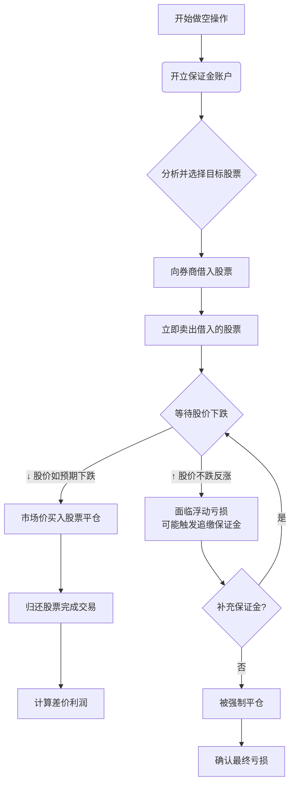

# 股票市场做空方法

> 来源: 元宝 (腾讯元宝) · 001-经济与投资

### **AI**

在美股市场，做空个股是一项常见但规则严格、风险较高的专业操作。其核心是**“先借后买，高卖低买”**：你预期某支股票价格会下跌，于是向券商借入股票卖出；待股价真的下跌后，再低价买回等量股票归还券商，赚取其中的差价[citation:1][citation:4]。

下图清晰地展示了做空一支美股的标准流程和关键决策点。

下面，我们重点看看这个流程中的关键环节、需要遵守的规则以及必须警惕的风险。

### 🎯 关键步骤与规则

要实现图表中的流程，你需要满足一些前提条件并遵守特定规则。

*   **账户与资格**：你需要在券商处开立一个**保证金账户**，而不是普通的现金账户[citation:6]。开户时，券商通常会对你的资金和风险承受能力有要求。并非所有股票都能做空，你需要确认目标股票在券商的**可借券池**内[citation:5][citation:6]。
*   **核心规则**：美国证监会（SEC）的**SHO条例**是卖空交易的核心监管框架[citation:11]。你需要特别注意两点：一是 **“定位要求”** ，禁止券商在未事先借入股票或确认可以借到的情况下接受你的卖空指令，这基本杜绝了“裸卖空”[citation:8][citation:11]。二是 **“价格测试熔断机制”** ，当某只股票价格在单日跌幅超过10%时，会在当天剩余时间和下一个交易日触发熔断，此后只允许在价格高于当前全国最佳出价时进行卖空，以防止在急速下跌的市场中恶意打压股价[citation:10][citation:11]。

### ⚠️ 主要风险与额外成本

做空的风险收益特征与常规买入（做多）截然不同，需要高度重视。

| 特性 | **做空 (Short Selling)** | **做多 (Long Buying)** |
| :--- | :--- | :--- |
| **核心逻辑** | 先高价卖出，再低价买入（预期股价下跌） | 先低价买入，再高价卖出（预期股价上涨） |
| **盈利空间** | 理论最高收益为100%（股价跌至近0时） | 理论收益无限（股价上涨无上限） |
| **亏损空间** | **理论上无限**（股价上涨无上限）[citation:3][citation:9] | 有限（最大亏损为全部本金） |
| **市场环境** | 适用于下跌或震荡市 | 适用于上涨市 |

除了上述理论上的无限风险，还需考虑以下成本和风险：
*   **融券利息**：借股票不是免费的，你需要按日支付**融券利息**给券商。利率因股票的热门和稀缺程度而异，有时会非常高[citation:6][citation:10]。
*   **强制平仓风险**：做空是保证金交易。如果股价上涨，你的账户净值会下降。当低于券商要求的**维持保证金**水平时，你会收到追缴通知。若无法及时补足资金，券商有权**强制平仓**你的空头头寸，导致损失被锁定甚至扩大[citation:3][citation:6]。
*   **股息支付**：如果在做空期间公司派发股息，这部分股息需要由你（借入方）支付给股票出借方[citation:6]。
*   **逼空风险**：如果大量做空者同时平仓，会推动股价进一步快速上涨，导致损失加剧。2021年的“游戏驿站（GameStop）事件”就是一个经典的逼空案例[citation:2]。

### 🔄 其他做空途径与注意事项

除了直接融券卖空，还有更间接或更适合普通投资者的方式。

*   **买入看跌期权**：这给了你一种权利，而非义务：在约定到期日前，以约定价格卖出标的股票。如果股价下跌，你可以行权获利；如果判断失误股价上涨，你的最大亏损也仅限于购买期权时支付的权利金。这种方式**风险是已知且有限的**[citation:4]。
*   **投资反向ETF**：有些ETF的设计目标是追求某个指数或行业日收益的**反向表现**。如果你看空整个科技板块，可以买入做空纳斯达克指数的ETF。这种方式像买卖普通股票一样简单，但通常更适合短期波段操作，长期持有可能因基金结构原因产生偏差[citation:4][citation:9]。

### 💎 总结与建议

总而言之，在美股市场做空个股是一项高度专业化且伴随高风险的交易策略。在行动前，请务必明确以下几点：
1.  **风险第一**：深刻理解其**理论亏损无上限**的特点，确保自身的风险承受能力与之匹配。
2.  **规则至上**：完全了解并遵守**保证金要求**和**监管规则**（如SHO条例），避免违规操作。
3.  **知识储备**：充分学习，或咨询专业的投资顾问。
4.  **谨慎选择工具**：对于大多数非专业投资者，通过**看跌期权**或**反向ETF**来间接实现做空意图，可能是风险更可控的选择[citation:4]。

希望这些信息能帮助你更全面地审视美股做空策略。如果你对看跌期权或反向ETF的具体操作细节感兴趣，我可以为你提供更深入的介绍。

---
### **User**

美股股票市场如何做空一支股票

---
### **AI**

在股票市场中，做空是一种先卖出后买入，从股价下跌中获利的交易策略。下面这个表格清晰地展示了做空的核心逻辑，以及与更常见的做多策略的对比。

| 特性 | **做空** | **做多** |
| :--- | :--- | :--- |
| **核心逻辑** | **先高价卖出，再低价买入**（预期股价下跌） | **先低价买入，再高价卖出**（预期股价上涨） |
| **市场环境** | 适用于下跌或震荡市 | 适用于上涨市 |
| **盈利来源** | 卖出和买入之间的价差 | 买入和卖出之间的价差 |
| **最大风险** | **理论上无限**（股价上涨空间无限） | **有限**（最大亏损为全部本金） |

### 🎯 主要的做空操作方法

在A股等市场中，投资者不能直接卖出手中没有的股票，需要通过一些特定的金融工具来实现做空。以下是几种常见的方法：

| 方法 | **核心机制** | **主要门槛/特点** | **适用对象** |
| :--- | :--- | :--- | :--- |
| **融券 (Margin Short Selling)** | 向券商借入股票卖出，股价下跌后买入归还，赚取差价[citation:1][citation:2]。 | 20个交易日日均资产不低于50万，交易经验不少于6个月[citation:2][citation:3]。 | 资金量较大、能承受个股下跌反向风险的投资者。 |
| **股指期货 (Stock Index Futures)** | 卖出以股票指数为标的的期货合约，从指数下跌中获利[citation:3][citation:5]。 | 资金门槛（通常50万）、知识测试、交易经验[citation:3][citation:5]。 | 对市场大势有判断，希望对冲系统风险或进行杠杆交易的投资者。 |
| **期权（认沽期权）(Options)** | 买入“认沽期权”，获得在未来以约定价格卖出标的资产的权利[citation:3][citation:9]。 | 资金门槛、通过知识测试[citation:9]。 | 熟悉衍生品交易，希望风险可控（最大亏损为权利金）的投资者。 |

除了上述三种主要方式，有持仓的投资者还可以采用**底仓做空**[citation:4]的策略。例如，当你判断股价短期会回调但中长期依然看好时，可以在高位卖出一部分股票，等股价回落后再买回。这样在保持底仓不变的同时，还能赚取波段差价，降低持股成本[citation:4]。

### ⚠️ 做空的重要风险与监管限制

做空虽然能在市场下跌时提供盈利机会，但其风险显著高于常规的买入持有。

-   **理论风险无限**：由于股价上涨理论上是没有上限的，如果做空后股价不跌反涨，你的亏损可能会非常巨大[citation:6][citation:8]。
-   **成本与强制平仓风险**：融券需要支付利息[citation:2][citation:10]，且需要向券商缴纳保证金。如果股价上涨导致保证金不足，可能会被**强制平仓**，损失会被锁定甚至扩大[citation:10]。
-   **严格的监管限制**：监管机构对做空行为有严格规定。例如，A股市场只能做空**融资融券标的证券池**内的股票，并非所有股票都可做空[citation:10]。此外，监管层严打“恶意做空”以维护市场稳定[citation:7]。

### 💎 总结与建议

做空是一项专业且高风险的操作。在行动之前，请务必明确以下几点：

1.  **评估自身条件**：首要的是检查自己是否满足**资金门槛**（如50万）和交易经验的要求[citation:2][citation:3]。
2.  **知识储备先行**：充分学习融券、期货、期权等衍生品知识，理解其规则和巨大风险[citation:9]。
3.  **严格进行风险控制**：做空绝非赌博，必须有自己的交易纪律，设置明确的**止损位**，并严格控制仓位[citation:5][citation:8]。
4.  **选择适合的工具**：对于绝大多数普通投资者而言，做空（尤其是融券和期货）门槛过高、风险过大。相比之下，**持有现金观望**或通过**卖出部分持仓**来规避风险，是更稳妥的风控方式。

希望这些信息能帮助你更全面地理解做空。如果你对某种具体工具（如融券或股指期货）的细节更感兴趣，我可以为你提供更深入的介绍。

---
### **User**

股票市场如何做空一支股票

---

*Auto-extracted via API from yuanbao.tencent.com*
