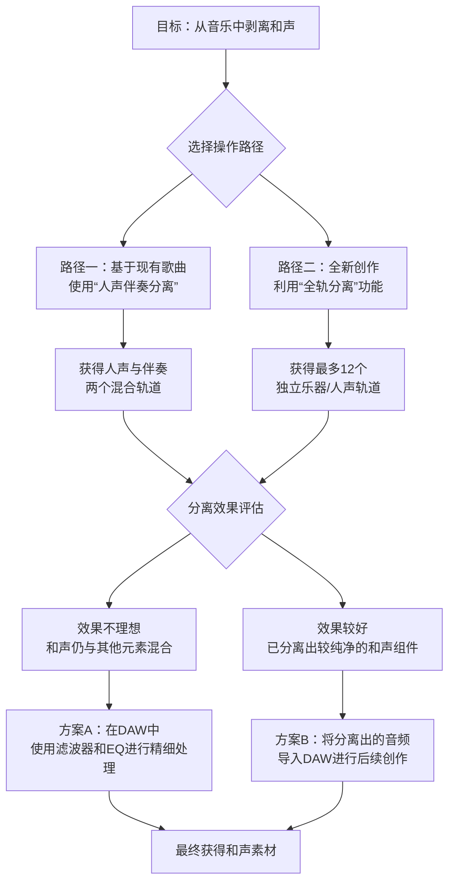

# 和声的定义与构成

> 来源: 元宝 (腾讯元宝) · 001-音乐电影文学

### **AI**

想用 Suno 从音乐中剥离出和声部分，这确实是一个深入音乐制作的需求。虽然 Suno 本身的核心功能是生成音乐，但其先进的音轨分离技术可以为你提供强大的支持。下面这个流程图梳理了实现这一目标的完整思路和操作路径：

下面我们来详细解读一下流程图中提到的两种核心方法。

### 🎼 利用“人声伴奏分离”处理现有歌曲

如果你已经有一首完整的歌曲，并希望将其中的和声剥离出来，可以尝试 Suno 的“人声伴奏分离”功能。

*   **功能原理**：这个功能主要是将一首歌曲大致分离成**人声（Vocal）** 和**伴奏（Instrumental）** 两个部分[citation:1][citation:2]。和声（Backing Vocals）在大多数情况下会被归入“人声”轨道中，与主唱的人声混合在一起。
*   **操作流程**：你需要将本地的音频文件上传至 Suno，系统会进行处理，最终返回两个独立的 MP3 文件[citation:1][citation:2]。
*   **局限性**：这种方法得到的“人声”轨道是主唱和和声的混合体，无法直接得到纯粹的和声部分。你需要后续在音频编辑软件中，利用均衡（EQ）等工具尝试削弱主唱频率来突出和声，但这取决于原始混音情况，效果不一定理想。

### 🎹 利用“全轨分离”进行全新创作

这是目前利用 Suno 获取独立和声轨道**更有效、更具潜力的方法**。Suno 的高级版本支持“全轨分离”（Stems Separation），能够将 AI 生成的音乐一次性分离成多达 **12 个独立轨道**[citation:3]。

*   **核心优势**：如果 AI 在生成音乐时，将和声作为一个独立的声部进行处理，那么通过全轨分离，你**有可能会直接获得一个独立的、纯净的“和声”音轨**，或者至少是“背景人声”组（可能包含多条和声轨道的混合）[citation:3]。
*   **操作流程**：首先，你需要使用 Suno 生成一首完整的歌曲。然后，对生成的歌曲使用“全轨分离”功能。在分离结果中，仔细查找可能被标记为 `Backing Vocals`、`Harmony` 或类似名称的独立音频文件[citation:3]。

### 💡 进阶技巧：导出MIDI进行深度编辑

除了直接处理音频，Suno 还提供了一项极为强大的功能——**导出 MIDI 文件**[citation:3]。这对于和声的再创作具有革命性意义。

*   **MIDI 的优势**：MIDI 文件记录的并非声音，而是**音符、音高、时长、力度等音乐信息**[citation:3]。这意味着，如果你从分离出的和声音轨成功导出了 MIDI 文件，你就可以在 Logic Pro、Ableton Live、FL Studio 等任何数字音频工作站（DAW）中，自由地修改每一个音符，调整节奏，甚至完全替换成其他乐器或虚拟歌手的音色[citation:3]。
*   **如何操作**：在全轨分离成功后，你可以找到导出 MIDI 文件的选项。将 MIDI 文件导入到你熟悉的 DAW 中，即可进行无限可能的二次创作[citation:3]。

### 🔍 实用建议

1.  **提示词是关键**：在让 Suno 生成音乐时，在提示词中明确要求**复杂的和声（Rich Harmonies）** 或**背景人声（Backing Vocals）**，这能提高 AI 生成独立和声轨道的概率。
2.  **管理心理预期**：音轨分离的质量取决于原始音频的制作方式。对于复杂的、所有声部混合在一起的成品音乐，完美剥离和声颇具挑战。而对于由 Suno AI 生成且内部结构清晰的音乐，成功分离的可能性会大很多。
3.  **尝试纯音乐**：如果主要目的是研究和声进行，可以先让 Suno 生成**不带主唱的纯器乐版本**，这样和声会体现在各种乐器（如钢琴、弦乐）中，更容易分析。

希望这些信息能帮助你更好地利用 Suno 探索音乐中的和声奥秘！如果你在尝试过程中遇到更具体的问题，比如如何编写有效的提示词，欢迎随时再来交流。

---
### **User**

如何用suno从音乐中剥离出和声部分

---
### **AI**

和声是音乐的重要组成部分，它让声音从单一的线条变为丰富的织体。下面这个表格能帮你快速抓住它的核心要点。

| 方面 | 和声的核心概念 |
| :--- | :--- |
| **基本定义** | 两个或两个以上不同的音，按照一定的法则同时发声，构成的音响组合。[citation:3][citation:6] |
| **核心构成** | 包含 **纵向** 的**和弦**（多个音同时结合）和 **横向** 的**和声进行**（和弦的先后连接）。[citation:3][citation:6] |
| **主要作用** | 1. **声部组合**：将多个声部组织成协调的整体。[citation:1][citation:3][citation:4] 2. **结构框架**：通过和声进行、终止式等，为音乐构建曲式结构。[citation:1][citation:3][citation:4] 3. **内容表现**：通过色彩的变化，塑造音乐形象、表现情感和意境。[citation:1][citation:3][citation:4] |
| **基本属性** | 1. **结构功能**：在形式上组织音高、确立或瓦解调性、控制音乐段落的发展与终止。[citation:1][citation:3] 2. **色彩功能**：各种和弦结构、进行方式所带来的明暗、浓淡等音响效果，直接影响音乐的表现力。[citation:1][citation:3] |

### 🎼 和声的演变历程
和声并非一成不变，它在西方音乐史上经历了漫长而有趣的演变，不同时期有着鲜明的风格特点[citation:1][citation:3]：

*   **10-16世纪（调式和声时期）**：以复调音乐为主，和声建立在教会调式上，追求协和音程，风格庄重古朴。
*   **17世纪（巴罗克早期）**：主调音乐开始发展，数字低音的出现标志着和声地位提升，大小调体系逐步确立。
*   **18世纪后半叶（古典主义时期）**：和声手法趋向简朴明晰，强调主、下属、属三大和弦的功能性，结构清晰规整，是调性和声的典范时期。
*   **19世纪（浪漫主义时期）**：为表达更丰富的情感与画面感，和声的**色彩性**被极大强调。半音化、远关系转调、高叠和弦（如九和弦、十一和弦）被大量使用，将传统和声推向极限。
*   **20世纪以后**：作曲家们大胆突破，探索无调性、多调性、四度叠置和弦等新手法，和声变得高度自由、复杂和多样化。

### 💡 如何开始感受和声？
如果你想更直观地理解与感受和声，可以尝试以下方法：
- **多听辨**：有意识地聆听不同风格的音乐（如古典、爵士、流行），关注伴奏部分是如何支撑和丰富主旋律的。
- **学乐器**：通过键盘或吉他等和声性乐器，亲自弹奏不同的和弦与进行，是体会和声色彩与功能最直接的方式。
- **尝试创作**：即便使用简单的音乐制作软件，尝试为一条旋律搭配不同的和弦，你会发现不同的和声选择会彻底改变音乐的情绪。

希望这些信息能帮助你建立起对和声的基本认识。如果你对某个特定的音乐时期（比如古典乐或爵士乐）的和声特点特别感兴趣，我很乐意和你进行更深入的探讨。

---
### **User**

什么是和声

---

*Auto-extracted via API from yuanbao.tencent.com*
