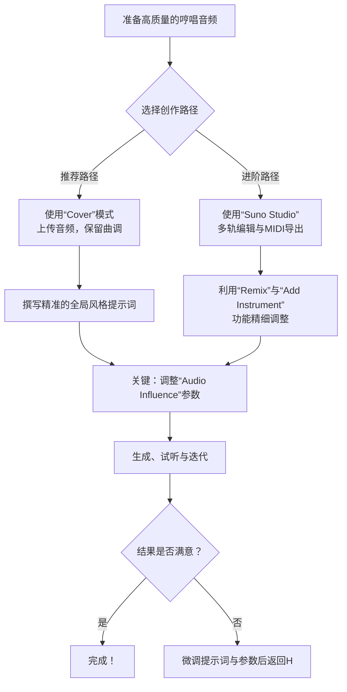
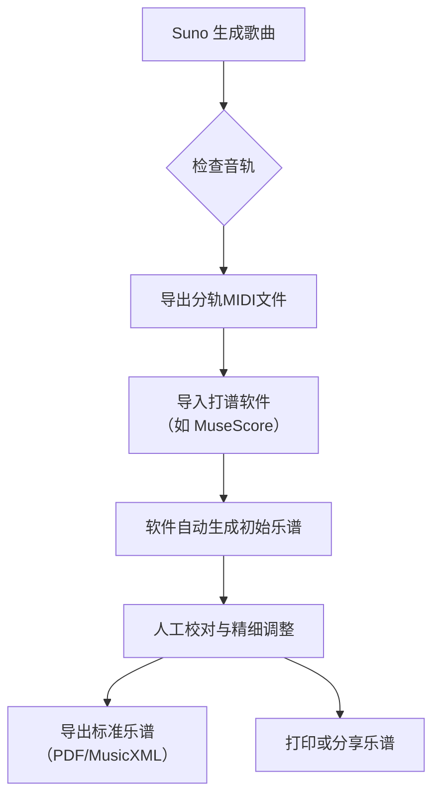
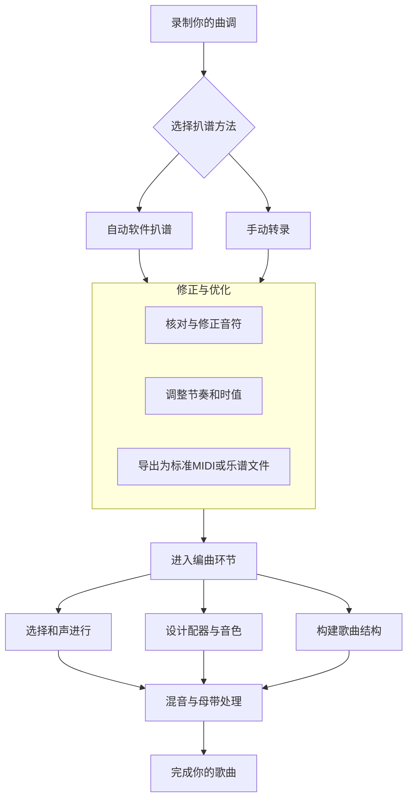

# 录制曲调提取曲谱编曲

> 来源: 元宝 (腾讯元宝) · 001-音乐电影文学

### **AI**

在音乐制作中，“和声”和“和旋”是两个非常重要但截然不同的概念。简单来说，**和声是“纵向”的音响色彩与结构，而旋律是“横向”的线条与主线**。下面这个表格可以帮助你快速把握它们的核心区别。

| 对比维度 | **和声** | **旋律** |
| :--- | :--- | :--- |
| **运动方向** | **纵向**：多个音同时发声，构成色彩性的音响组合 | **横向**：一系列音高按时间先后有序出现，形成线条感 |
| **核心功能** | **烘托与渲染**：为旋律提供背景、支撑氛围和情绪 | **陈述与记忆**：承载音乐的主要主题，是最容易被人记住的部分 |
| **基本单位** | **和弦**（如C大三和弦、G7属七和弦） | **乐句**或**动机** |
| **感知特点** | 感受整体色彩、紧张度与松弛感 | 跟随音高起伏、节奏变化，感知一条完整的“故事线” |

### 🎵 和声：音乐的色彩与骨架

和声指的是**多个不同的音高同时发声所产生的音响效果** [citation:1][citation:3]。它就像是音乐的背景色和骨架，虽然不总是站在最前面，但深刻地影响着音乐的色彩、情绪和结构。

-   **构建基础：和弦**：和声的基本单位是**和弦**，通常由三个或三个以上的音按三度或其他规则叠置而成 [citation:7]。最常见的是三和弦，例如一个大三和弦（如C-E-G）听起来**明亮、开朗**，而一个小三和弦（如C-降E-G）则听起来**柔和、忧郁** [citation:7]。
-   **两大功能**：和声主要发挥两大作用 [citation:3]：
    1.  **结构功能**：通过一系列和弦的连接（和声进行），来**建立调性、划分乐句，并构建完整的乐曲形式**。比如，流行音乐中经典的V-I（属-主）终止式，能给人强烈的结束感。
    2.  **色彩功能**：不同的和弦和连接方式会产生不同的音响色彩，直接参与音乐情绪的表达。一个不协和的和弦可以制造紧张感，而随后解决的协和和弦则带来释放和稳定。

### 🎶 旋律：音乐的故事线与灵魂

旋律，通常被称为“曲调”，是指**一连串具有固定音高和节奏的音符，在时间上先后出现，所形成的有机序列** [citation:10]。它是音乐中最突出、最容易被辨识和记忆的部分，是音乐讲述的“故事”本身。

-   **核心要素**：一条动人的旋律通常由**音高关系、节奏组织、调性感和内在的情感动力**共同构成。
-   **与和声的关系**：旋律与和声是密不可分的合作伙伴。一条旋律通常会**内在地暗示出它所适合的和声进行**。反之，一段给定的和声进行也为旋律的创作划定了大致的音高范围和情绪基调。它们相互依存，共同塑造完整的音乐形象。

### 💡 协同工作：以流行歌曲为例

你可以这样理解它们在一个典型场景中的协作：
在一首流行歌曲中，**人声演唱的主歌和副歌部分就是旋律**，它负责讲述情感，成为歌曲的记忆点。而**钢琴或吉他演奏的伴奏部分就是在构建和声**，它为歌声提供和谐的支持，奠定歌曲是快乐还是悲伤的基调。

### 💎 简单总结

你可以把音乐想象成一篇演讲稿：
-   **旋律**是演讲者**讲述的故事情节**，有起承转合，是内容的主线。
-   **和声**是现场的**背景音乐和灯光**，随着故事情节的变化，时而紧张、时而舒缓，烘托氛围，强化情绪。

希望这些解释能帮助你更清晰地理解这两个核心概念！如果你对和弦的具体类型或是如何为旋律配置和声感兴趣，我们可以继续深入探讨。

---
### **User**

什么是和声，和旋

---
### **AI**

在流行音乐中，人声与器乐旋律的配合，就像一场精妙的对话与合作。下面这个表格概括了它们相互配合的几个核心维度，可以帮助你快速抓住要点。

| 配合维度 | 人声旋律 (主角) | 器乐旋律 (配角/环境) | 配合要点 |
| :--- | :--- | :--- | :--- |
| **主次关系** | 承载歌词与主旋律，是表达情感与主题的核心。 | 通过和声、节奏、音色等为**人声铺垫、衬托、呼应**，丰富音乐层次。 | **主次分明**，器乐为人声“让路”，确保人声清晰突出[citation:2][citation:4][citation:8]。 |
| **节奏与律动** | 拥有自身的旋律线条和呼吸感。 | 提供稳定的节奏骨架，与人声的韵律紧密契合，增强歌曲的动感与统一性。 | **节奏统一**，确保人声与器乐在同一个律动框架内[citation:2][citation:8]。 |
| **和声进行** | 旋律的进行需要建立在和谐的和声基础之上。 | 通过和弦的进行为人声构建和谐的**和声背景**，奠定音乐的情绪色彩[citation:6][citation:8]。 | **和声清晰**，器乐的和声编排需支持人声旋律[citation:6][citation:8]。 |
| **音色与织体** | 人声本身的音色（如清澈、沙哑）是重要表现力。 | 不同乐器的音色可以与人声形成**对比或融合**，创造丰富的听感。音乐织体（配器浓淡）随情绪变化。 | **音色互补**，根据歌曲情绪需要搭配和变化织体[citation:1][citation:2]。 |
| **情感表达** | 直接通过歌词、语气、唱腔传递具体情感。 | 通过旋律线条、速度、力度等**营造氛围**，烘托和强化人声表达的情绪[citation:3][citation:4]。 | **情感统一**，二者共同服务于歌曲的整体情感表达[citation:3][citation:4]。 |

### 💡 如何欣赏与实践

了解这些配合方式后，无论是欣赏音乐还是尝试创作，你都可以有更清晰的方向：

-   **作为听众**：下次听歌时，可以有意识地关注伴奏部分。试着分辨除了人声主旋律外，背景中有哪些乐器在演奏，它们是在什么时候进入和退出的，是如何通过节奏、音色和旋律的变化来烘托人声和推动情绪的。例如，在副歌部分，注意鼓组、贝斯和铺底弦乐是如何共同发力将情绪推向高潮的[citation:3][citation:8]。

-   **作为创作者**：如果你尝试用Suno这类工具进行创作，可以运用这些原则。在为主歌段落编配时，选择简洁的、织体较薄的器乐伴奏（如单一的钢琴或吉他分解和弦）来突出人声的叙事感；当进入副歌时，再逐步加入鼓、贝斯、弦乐pad等元素，加厚织体，以支撑人声的情感爆发[citation:2][citation:7]。同时，可以在间奏或段落衔接处，设计一段器乐的旋律（比如一段吉他solo或小提琴旋律）与人声形成呼应或对话，增加音乐的趣味性和连贯性[citation:3]。

希望这些信息能帮助你更深入地理解和创作音乐！如果你对某个特定的音乐风格或者配合技巧特别感兴趣，我很乐意和你继续探讨。

---
### **User**

在流行音乐中，人声和器乐旋律是如何相互配合的？

---
### **AI**

音乐中的“曲调”和“旋律”在大多数情况下指的是同一个概念，它们是音乐的灵魂。我们可以通过下面的表格快速了解它们的核心要点以及人声与器乐表达的主要区别。

| 对比维度 | **曲调 / 旋律** | **人声哼唱表达** | **吉他等器乐表达** |
| :--- | :--- | :--- | :--- |
| **核心定义** | 若干乐音经过艺术构思形成的、有组织、有节奏的序列，是音乐的首要要素和基础[citation:1][citation:4][citation:5]。 | 用人声（通常是无歌词的哼鸣）来演绎旋律。 | 通过乐器（如吉他）的物理特性发声来演绎旋律。 |
| **本质** | 音高、节奏等因素横向进行的线条，是音乐表达情感的主要手段[citation:1][citation:5]。 | **“言之乐”**，直接与人的情感和身体共鸣相连，最具亲和力与直接感染力[citation:6][citation:7]。 | **“无言之乐”**，通过乐器技巧实现，更注重抽象的情感氛围烘托和技巧展现[citation:6]。 |
| **音色特质** | - | **温暖、柔和、富于变化的人情味**。音色由歌者的生理条件和个人风格决定。 | **多样且独特**。例如，吉他的音色清澈或浑厚，可通过效果器塑造各种音色。 |
| **音高与音域** | 通过旋律线的起伏（级进、跳进等）和节奏变化来表现[citation:5]。 | **音域相对有限**，受限于人的生理条件，但表现力极强，尤其擅长滑音、颤音等细微变化。 | **音域更宽广**。吉他音域覆盖广，可以演奏人声难以企及的高音和低音，和声也更丰富。 |
| **呼吸与乐句** | 旋律的进行有赖于分句和气息的运用[citation:7][citation:8]。 | **乐句划分与歌唱者呼吸直接相关**，换气是音乐表达的自然组成部分。 | **乐句划分相对自由**。吉他演奏不受肺部呼吸的生理限制，乐句可以非常长，主要通过技巧创造“气息感”。 |
| **歌词/语意** | 纯音乐旋律本身是抽象的。 | **可携带明确的语义信息**。当加入歌词时，音乐的表达变得具体。哼唱虽无词，但依然有语言般的韵律感[citation:5][citation:6]。 | **纯器乐表达是抽象的**，不直接传达具体语言信息，更侧重于营造意境和情绪[citation:6]。 |

### 💡 创作与欣赏小贴士

理解这些区别，能帮助你在创作和欣赏音乐时获得更多灵感：

-   **创作中的相互借鉴**：在创作器乐旋律时，可以尝试“歌唱性”的思维，让旋律线条像说话或歌唱一样流畅自然。反之，为人声写旋律时，也可以适当借鉴器乐的音程跳跃和节奏复杂性，增加新意。
-   **欣赏时的不同角度**：欣赏人声演唱时，可以关注歌者如何运用嗓音、气息和咬字来诠释情感。欣赏器乐演奏时，则可以聚焦于演奏者的技巧、音色控制以及对乐曲结构的把握。
-   **尝试“人声化”的器乐演奏**：如果你在练习吉他等乐器，可以试着模仿人声的起伏和呼吸感，这能让你的演奏更具表现力和感染力。

希望这些解释能帮助你更深入地理解音乐的奇妙之处。如果你对某个特定的音乐风格或者某种乐器的表达特点特别感兴趣，我很乐意和你继续探讨。

---
### **User**

什么是音乐的曲调和旋律，用人声哼唱表达和用吉他等器乐表达有何区别

---
### **AI**

Suno 提供了多种创意模式，让你能以不同方式生成音乐。下面这个表格汇总了除 Cover 模式外的主要模式及其核心用途，方便你快速了解。

| 模式名称 | 核心功能 | 一句话适用场景 |
| :--- | :--- | :--- |
| **基础模式 (Basic Mode)** | 用文字描述想法，AI 自动生成完整歌曲（含歌词和演唱）。 | 想要快速将灵感变为音乐，不想自己写歌词。 |
| **自定义模式 (Custom Mode)** | 用户自行输入歌词，并精确控制音乐风格、乐器等元素。 | 已有完整歌词，希望 AI 严格按照意图进行编曲。 |
| **器乐模式 (Instrumental)** | 生成没有歌词和人声的纯音乐。 | 需要背景音乐、视频配乐或环境音乐。 |
| **Scenes 模式** | 上传图片或视频，AI 根据画面内容生成一段匹配的音乐。 | 为特定的视觉内容（如照片、视频片段）定制配乐。 |
| **Persona 模式** | 复用之前某首成功作品的人声特征来生成新歌。 | 希望多首作品保持统一的人声风格，打造系列感。 |
| **Remaster 功能** | 使用更新的模型重新处理旧作品，提升音质和清晰度。 | 优化早期生成的、对当前质量不满意的歌曲。 |

### 🎹 各模式详解与技巧

以下是关于这些模式的更多细节和实用技巧，希望能帮助你更好地使用它们。

-   **基础模式：灵感速成**
    这是最直接的模式。你只需要在提示框（Prompt）里用文字描述你想要的音乐，例如“一首轻快的电子流行乐，讲述夏日海边的邂逅，女声演唱”。Suno 会根据你的描述自动生成歌词、旋律和人声[citation:3][citation:6]。**技巧**：使用英文撰写提示词，并尽可能具体地描述风格、情绪、乐器等元素，生成结果通常会更精准[citation:6][citation:7]。

-   **自定义模式：精准控制**
    当你开启自定义模式后，就可以亲自操刀歌词和风格的设定[citation:3][citation:7]。**核心技巧**在于使用“元标签”来构建歌曲结构。你可以在歌词中通过方括号 `[]` 插入诸如 `[Intro]`（前奏）、`[Verse]`（主歌）、`[Chorus]`（副歌）、`[Bridge]`（桥段）等标签，这能指导 AI 生成结构更专业、起伏更明显的音乐[citation:3][citation:7]。

-   **器乐模式：纯音之境**
    这个模式非常适合为视频、播客、游戏或特定场景创作背景音乐。你只需要在描述中聚焦于音乐的风格、情绪和乐器编排即可[citation:4]。

-   **Scenes 模式：图生音乐**
    这个功能让音乐创作变得非常直观。你可以上传一张照片或一段短视频，Suno 会尝试理解画面的内容、色彩和氛围，并据此生成一段大约30秒的配乐[citation:5]。**技巧**：如果在上传文件的同时，再附加一些文字描述（如图中的人物、正在发生的事或你想要的音乐风格），能显著提高生成音乐的贴合度[citation:5]。

-   **Persona 模式：声线延续**
    如果你用 Suno 生成了一首特别满意、尤其喜欢其中“AI歌手”音色和演唱风格的歌曲，Persona 模式可以让你“克隆”这个声音来创作新歌[citation:5]。**需要注意的是**，该功能通常仅适用于由 Suno AI 自己生成的歌曲，并且一般需要订阅 Pro 或 Premier 套餐才能使用[citation:5]。

-   **Remaster 功能：音质翻新**
    随着 Suno 模型迭代（例如从 v3 升级到 v4），新模型在音质和人声清晰度上通常有较大提升。Remaster 功能允许你选择一首旧作，用最新的模型重新生成，从而获得音质更好、杂音更少的版本，让老歌焕发新生[citation:5]。

### 💡 如何选择与搭配使用

-   **新手入门**：建议从**基础模式**开始，感受 AI 音乐创作的魔力。
-   **追求个性化创作**：当你有明确的歌词或具体的编曲想法时，**自定义模式**是你的不二之选。
-   **内容创作者**：如果你是视频博主，**Scenes 模式**和**器乐模式**将成为你的得力助手。
-   **打造系列作品**：如果你计划发布多首歌曲，可以尝试用**Persona 模式**来维持人声的一致性，形成独特标识。

希望这些介绍能帮助你更全面地探索 Suno 的精彩世界。如果你对某个特定模式的具体操作有更深入的兴趣，我很乐意与你继续探讨。

---
### **User**

介绍下suno除了cover以外其他模式

---
### **AI**

简单来说，Suno的Cover模式在保留你哼唱的**核心旋律轮廓**方面表现相当出色，但在**人声的个性化细节**上会进行大幅重塑，将其替换为AI生成的、符合指定风格的专业演唱[citation:1][citation:2][citation:5]。

为了让你快速抓住重点，我用一个表格来概括不同方面的保留程度。

| 保留程度较高的方面 | 保留程度较低或会发生改变的方面 |
| :--- | :--- | :--- |
| **核心旋律线条**：你哼唱的音高走向和基本轮廓[citation:1][citation:5] | **原始音色**：你的人声将被新的AI歌手音色取代[citation:1] |
| **歌词或基本结构**：如果提供了歌词，歌曲的结构会以其为蓝本[citation:5] | **演唱细节**：如呼吸声、个性化的咬字等会被AI的演唱技巧（如颤音）覆盖[citation:1] |
| - | **节奏与编曲**：会根据你指定的新风格（如摇滚、爵士）彻底改变[citation:2][citation:5] |

### 🎶 细节保留的机制

Cover模式的工作原理可以理解为“骨架提取”与“皮肤更换”[citation:1]。
1.  **骨架提取**：当你上传哼唱音频后，Suno的AI模型会首先分析并提取其中的“骨架”，也就是**旋律特征、节奏重音和乐句的呼吸感**[citation:1]。它会努力理解你哼唱的核心音高变化，并将其作为新版本的基础。
2.  **皮肤更换（风格迁移）**：接下来，AI会根据你在提示词（Prompt）中描述的音乐风格（例如“90年代另类摇滚”或“电影管弦乐”），为这个旋律骨架披上全新的“皮肤”[citation:1]。这包括了全新的乐器编配、节奏型，以及最关键的一环——由AI生成的**专业歌手音色**。

特别值得一提的是，如果你使用的是最新的Suno v5模型，它生成的人声在**情感表现力和专业度**上有了巨大飞跃。它能够模拟诸如颤音（Vibrato）、气声（Breathiness）等微观演唱技巧，使其听起来更接近受过训练的歌手，而非简单地、机械地复述旋律[citation:1]。

### 💡 如何优化效果以获得更佳体验

为了让Cover模式生成的结果更贴合你的预期，可以尝试以下几点：
-   **保证哼唱质量**：尽量在安静的环境中录制，确保哼唱的**旋律清晰、音准稳定**。一个干净、高质量的输入是获得理想输出的首要条件[citation:1][citation:5]。
-   **善用纯旋律**：如果你的哼唱不包含具体歌词，目标是想获得一条器乐旋律（比如一段小提琴旋律），那么明确提示为“**Instrumental**”或指定乐器（如“**Cello Solo**”）可能会得到更专注的效果[citation:1]。
-   **理解创作本质**：最重要的是调整心态。Cover模式的强大之处在于其**创意延展能力**，而非精确复制。它更像一位极具天赋的编曲家，根据你的灵感动机发展出一首完整的、具有专业水准的新作品[citation:2][citation:5]。

希望这些信息能帮助你更好地理解Suno Cover模式的能力边界，从而更有效地利用它进行创作。如果你在具体尝试中遇到了其他问题，我很乐意继续与你探讨。

---
### **User**

Suno的Cover模式能保留多少哼唱的细节？

---
### **AI**

要让 Suno 根据你哼唱的曲调生成一首完全贴合的音乐，核心在于充分利用它的“Cover”功能和细致的参数调整。下面这个流程图展示了一条清晰高效的路径，你可以参照它来操作：

### 🎙️ 打好基础：准备你的哼唱音频

这是最关键的第一步，高质量的输入是高质量输出的保证。

*   **确保音频干净**：在安静的环境中录制，尽量减少背景噪音。你可以用手机自带的录音功能，但尽量靠近声源，避免爆音和喷麦[citation:3]。
*   **旋律尽量清晰**：哼唱时，尽量保持音准和节奏的稳定。如果方便，可以打着拍子或者用简单的乐器（如键盘）先确定一下核心旋律，这样生成的曲调会更准确[citation:2]。
*   **考虑“无歌词”清唱**：如果你的哼唱不包含具体歌词，那么生成纯音乐（Instrumental）或使用“啦啦啦”等衬词可能会获得更好的效果。你可以在Suno的Lyrics（歌词）框内注明这是纯音乐旋律[citation:3][citation:4]。

### 🎹 核心步骤：在Suno中的关键操作

准备好音频后，就可以按照下图所示的决策流程，在Suno中开始创作了。这里的核心是使用 **Cover模式**。

1.  **进入创作界面**：在Suno中，进入 `Custom` 模式[citation:2][citation:3]。
2.  **上传音频**：点击 `+ Audio` 或 `Upload Audio` 按钮，上传你准备好的哼唱音频文件[citation:2][citation:3]。
3.  **选择“Cover”模式**：上传后，关键的一步是选择 **Cover**（覆盖/重新演绎）选项。这告诉Suno：**请保留我上传音频的主要旋律和调性，但按照我指定的新风格重新编曲和演唱**。这是让曲调保持一致的核心[citation:2]。
4.  **撰写风格提示词**：在 `Style` 或 `Style of Music` 输入框中，用英文清晰描述你想要的音乐风格、情绪和乐器。越具体越好，例如："Emotional piano and string ballad, slow tempo, warm female vocal"（感性的钢琴弦乐 ballad，慢速，温暖的女声）[citation:2][citation:4]。
5.  **填写歌词（可选）**：如果你希望生成带人声的歌曲，可以在 `Lyrics` 框中填入歌词。Suno会自动将歌词与你哼唱的旋律相匹配。如果不需要人声，可以留空或注明是纯音乐[citation:3][citation:4]。
6.  **调整关键参数**：
    *   **Audio Influence（音频影响度）**：这个参数至关重要！它决定了Suno在多大程度上遵循你原始音频的曲调。**建议将其调低（例如30%-50%）**。这样Suno会以你的旋律为蓝本，但拥有更大的自由度来生成节奏、和声都更自然丰富的音乐，避免生硬模仿[citation:2]。
    *   **Weirdness（怪异值）**：如果你希望音乐更符合主流听感，可以先将此值设低一些[citation:2]。

### 💡 进阶玩法：使用Suno Studio进行精细控制

如果你订阅了Suno的Premier计划，可以使用功能更强大的 **Suno Studio**。它提供了一个类似专业音乐制作软件的多轨编辑界面，让你对生成结果有前所未有的控制力[citation:6]。

*   **多轨编辑与独立调节**：你的哼唱和Suno生成的每一种乐器（如鼓、贝斯、钢琴）都会在独立的音轨上显示。你可以单独调整每条音轨的音量、静音或独奏，甚至重新生成某一轨而不影响其他部分[citation:6]。
*   **Remix功能**：这是一个革命性的功能。你可以直接右键点击你上传的哼唱音频片段，选择 `Remix`，然后输入指令（如“转化为激昂的小号独奏”），Suno会基于你的旋律生成一段全新的器乐旋律，极大地丰富了创作可能性[citation:6]。
*   **MIDI导出**：Suno Studio支持将生成的任何乐器音轨（如钢琴旋律、鼓点）导出为标准MIDI文件。这意味着你可以将Suno生成的“音乐草稿”导入到如FL Studio、Cubase等专业软件中，用更优质音源替换，或精细修改每一个音符，彻底解决AI音乐“不可编辑”的痛点[citation:6][citation:7]。

### 🎶 生成与优化

完成设置后，点击生成即可。Suno通常会生成两个版本供你选择。如果第一次的效果不完美，这是完全正常的，可以尝试以下方法进行优化[citation:3]：

*   **迭代生成**：微调你的风格提示词，或者稍微调整`Audio Influence`参数，再次生成。
*   **继续创作**：如果对生成的片段的一部分满意，可以使用 `Continue from this song` 功能，让Suno基于这个片段延长歌曲[citation:4]。

希望这份详细的指南能帮助你顺利地将独特的哼唱变成一首完整的音乐作品！如果你在尝试某个具体步骤时遇到问题，可以随时再来问我。

---
### **User**

我自己哼唱了一首歌，用suno制作音乐，如何让生成的音乐曲调完全和我哼唱的一致

---
### **AI**

关于“BPM 66”，它最常见的意思是指音乐的速度，也就是 **每分钟66拍**。不过，BPM这个缩写在不同领域有不同含义，为了让你一目了然，我用一个表格来汇总：

| 领域 | BPM 含义 | “66” 的含义解释 |
| :--- | :--- | :--- |
| **🎵 音乐制作** | **B**eats **P**er **M**inute（每分钟节拍数） | 表示歌曲速度为**每分钟66拍**，属于**偏慢**的节奏，常见于 ballad（民谣）、一些古典乐或舒缓的歌曲中。 |
| **❤️ 医疗健康** | 心率单位（**B**eats **P**er **M**inute） | 指**心率每分钟跳动66次**。对于安静状态下的成年人来说，这通常在正常范围内（一般正常静息心率为60-100次/分）[citation:1][citation:2][citation:3]。 |

### 💡 如何判断具体指代哪个？

你可以根据获取这个信息的**上下文场景**来判断：

*   **如果场景与音乐相关**：比如你在音乐软件、音频编辑软件（如DAW）、乐谱上，或者在与音乐人、编曲师交流时看到“BPM 66”，那么它几乎肯定指的是**音乐速度**。这个速度下的音乐通常会给人一种平静、悠扬或忧伤的感觉。

*   **如果场景与健康相关**：比如你在体检报告、心率手环/手表读数、或是医疗相关的讨论中看到“BPM 66”，那么它指的就是**心率**。对于大多数人而言，静息心率66次/分是一个**非常理想和健康**的数值[citation:3]。

### 🎶 补充一点音乐知识

在音乐制作中，BPM是构建节奏框架的基石。除了判断歌曲风格，它还有一些非常实用的功能：
*   **DJ混音**：DJ们需要将两首歌曲的BPM对齐（通常通过加速或减速其中一首），才能实现平滑无缝的过渡混音。
*   **音频剪辑**：在视频剪辑或音乐制作软件中，设定正确的工程文件BPM，可以非常方便地让音频片段自动对齐节拍，大大提高工作效率。

希望这些信息能帮你解开疑惑。如果你是在特定软件或特定情况下看到这个信息，并且能提供更多背景，我也许能给出更具体的分析。

---
### **User**

BPM66是什么意思

---
### **AI**

在音乐歌曲制作领域，**“Extend”**（通常指加长版或扩展版）主要是指对一首已有的歌曲进行**时长上的延长或结构上的扩充**，以呈现比原始版本更完整或更丰富的听觉体验[citation:4][citation:6]。

为了让你快速抓住核心，下表概括了其主要特点和常见形式。

| 维度 | 说明 |
| :--- | :--- |
| **核心目的** | 呈现更完整的音乐构思，通常面向专业场景（如DJ打碟）或深度乐迷 |
| **常见操作** | 增加前奏/尾奏、扩展段落、加入器乐solo或过渡桥段 |
| **典型后缀** | Extended Mix / Extended Version / Extended |
| **应用场景** | 电子舞曲、俱乐部音乐、AI音乐片段扩展 |

### 🎧 扩展音乐的表现形式

“Extend”在音乐制作中主要有以下表现形式：

-   **结构性扩展**：这是最常见的形式，尤其是在电子音乐领域。**Extended Mix**（加长混音版）通常会比**Radio Edit**（电台编辑版）或标准版本包含更长的**前奏和尾奏**。这种设计是为了方便DJ在俱乐部或音乐节上进行平滑的混音和过渡，让舞曲的节奏和氛围能够持续更长时间[citation:4][citation:6]。
-   **AI音乐生成中的扩展**：在一些AI音乐工具（例如Udio）中，“Extend”是一项核心功能。它允许用户对AI生成的短音乐片段进行向前或向后的扩写，比如**添加前奏或尾奏**，从而将多个短片段拼接成一首结构完整的歌曲[citation:1]。

### 🎶 相关术语辨析

了解“Extend”后，区分以下几个容易混淆的常见术语会更有帮助：

-   **Extended Mix vs. Remix**：这是两个完全不同的概念。**Remix** 侧重于对原曲进行**重新编曲和混音**，可能会改变风格、节奏或加入新元素，创造出一个新版本[citation:2][citation:4]。而 **Extended Mix** 通常**保留原曲的核心风貌**，主要目的是**延长播放时间**以适应不同的播放需求[citation:6]。
-   **Extended Mix vs. Original Mix**：**Original Mix** 通常指歌曲最初发行、最具代表性的“原版”混音[citation:4]。而 **Extended Mix** 可以理解为是基于 Original Mix 在时长和结构上进行扩展的版本。

希望这些解释能帮助你更清晰地理解音乐制作中的“Extend”。如果你对某个特定的音乐风格或扩展技巧特别感兴趣，我们可以继续深入探讨。

---
### **User**

音乐歌曲制作领域Extend是指

---
### **AI**

在音乐歌曲制作领域，**"Cover"**（翻唱）指的是对一首已经公开发表并由他人演唱的歌曲，进行重新演绎的行为[citation:1][citation:5]。它既是对原作的致敬，也是二次创作的一种形式。

为了让你快速抓住核心，下表对比了“Cover”与一些易混淆概念的主要区别。

| 概念 | **Cover（翻唱）** | **Original（原唱）** | **Remix（混音）** |
| :--- | :--- | :--- | :--- |
| **核心基础** | 基于已有的成熟歌曲 | 全新的词曲创作 | 通常基于原曲的**分轨素材**（如人声、乐器干声） |
| **创作重点** | **重新演绎**，侧重演唱风格、编曲的改变 | 从无到有的**完整创作** | **重新编曲与混合**，侧重节奏、音效、结构的电子化再造 |
| **创作者** | 通常为**歌手或乐队** | 词曲作者及原唱歌手 | 通常为**DJ或音乐制作人** |
| **与原作关系** | 保留核心旋律和歌词，呈现不同风格 | 是作品的**最初版本** | 可能大量使用原曲素材，但听感上变化极大，甚至面目全非[citation:5] |

### 🎤 翻唱的两种取向
翻唱并非简单的模仿，根据对原作的改动程度，主要可以分为两种取向：
-   **忠实还原型**：这种取向旨在尽可能精确地**复制（Copy）** 原版的编曲、演唱风格和神韵，以求再现原作的精髓，因此有时也被直接称为“Copy”[citation:6]。
-   **创意改编型**：这是更为常见和富有艺术性的做法。翻唱者会将自己的音乐风格和理解融入其中，可能会改变**速度、节奏、编曲结构**，甚至**曲风**（例如用Bossa Nova风格演绎朋克歌曲），从而赋予经典作品全新的生命力[citation:6]。这种深刻的再创作，也常被视为对原作的 **“致敬”（Tribute）**[citation:6]。

### 🎵 从翻唱到原创
对于许多音乐人而言，翻唱是成长道路上重要的练习和展示方式。
-   **新晋歌手的试金石**：翻唱知名作品可以帮助新人快速获得关注，同时也是在形成自身独特风格前的一种摸索[citation:7]。
-   **成熟歌手的致敬与挑战**：有实力的创作者会通过翻唱那些对自己有深远影响的歌曲，向经典致敬，并借机展现自己对音乐的独特见解，并不畏惧与原作比较[citation:7]。

### 💡 重要的版权须知
需要特别注意的是，如果你想正式发行一首翻唱作品（而非仅在现场表演），**通常需要获得原作品词曲版权方（OP）的授权**[citation:4][citation:7]。这是对原创者劳动成果的尊重，也是音乐行业的基本规则。未经授权录制并发行翻唱内容可能会引发版权纠纷。

希望这些信息能帮助你更深入地理解“Cover”在音乐制作中的丰富含义。如果你对某个特定类型的翻唱或者版权授权的具体流程有更进一步的兴趣，我很乐意与你继续交流。

---
### **User**

音乐歌曲制作领域cover是指

---
### **AI**

Suno Studio 本身并不直接生成传统意义上的五线谱或简谱图片，但它提供了强大的 **MIDI导出功能**[citation:1]。你可以将AI生成的音乐导出为MIDI文件，然后利用其他专业软件将其转换为可视化的乐谱。

下面这个流程图清晰地展示了从Suno生成音乐到获得最终乐谱的完整工作流：

### 🎼 从MIDI到乐谱的实战步骤

要实现上述流程，关键在于用好Suno的元标签（Metatags）和后续的打谱软件。

**1. 在Suno中优化音乐结构**
为了让生成的MIDI文件更容易被转换为清晰的乐谱，在Suno创作时使用**元标签**来明确歌曲结构非常重要[citation:1][citation:5]。这能帮助AI生成结构更规整的音乐，为后续转换打下好基础。常用的结构标签包括：
*   `[Intro]`：前奏
*   `[Verse]`：主歌
*   `[Chorus]`：副歌
*   `[Bridge]`：桥段
*   `[Guitar Solo]`：吉他独奏
*   `[Outro]`：尾奏

**2. 导出MIDI文件**
在Suno Studio中完成歌曲生成后，你可以进入其多轨编辑界面。在这里，音乐被分离为**人声、鼓、贝斯、钢琴**等多个独立音轨[citation:1]。你可以选择导出整首歌曲的MIDI文件，也可以选中某个或某几个乐器的音轨，单独导出它们的MIDI数据[citation:1]。

**3. 在打谱软件中转换与编辑**
将MIDI文件导入打谱软件（如 **MuseScore**、Sibelius、Finale等）后，软件会自动将其转换为五线谱[citation:1]。
*   **校对与调整**：自动生成的乐谱通常需要人工校对和调整，例如修正音符时值、调整谱号、添加演奏符号等，以确保乐谱的准确性和可读性。
*   **分声部编辑**：由于你拥有分轨MIDI文件，可以在打谱软件中单独编辑每个乐器的声部，并分别生成各自的乐谱。

### 💡 提升乐谱质量的小技巧

*   **从简开始**：在Suno中尝试生成结构相对简单、配器不过于复杂的音乐，这样转换出的乐谱会更清晰，易于修改。
*   **善用纯音乐**：如果主要目标是获得器乐谱，可以在Suno中开启 **Instrumental** 模式生成纯音乐，避免人声部分对乐谱结构造成干扰[citation:3][citation:5]。
*   **理解局限性**：目前通过此方法获得的乐谱更接近于一份“音乐草图”，它在记录和弦、主旋律方面非常有效，但对于一些复杂的演奏技巧、细腻的表情变化等，可能无法完美呈现，仍需人工进行精细化的音乐编排。

希望这些信息能帮助你顺利地将Suno的AI音乐灵感转化为可阅读、可演奏的乐谱！如果你在具体的操作步骤中遇到任何问题，我很乐意与你继续探讨。

---
### **User**

Suno Studio的乐谱生成功能如何使用？

---
### **AI**

MIDI文件和乐谱可以说是音乐在两种不同维度的“蓝图”，它们关系非常紧密，一个精要的对比可以先看下面这个表格：

| 对比维度 | **乐谱** | **MIDI文件** |
| :--- | :--- | :--- |
| **本质** | **人类可读的视觉化符号** | **机器可读的数字化指令集** |
| **核心内容** | 音符的音高、时值、节拍、调号等 | 音符开关、音高、力度、音色号、控制信号 |
| **记录方式** | 五线谱上的符号 | 时间戳形式的二进制指令 |
| **可读性** | 供音乐家阅读和理解 | 供电脑、合成器等设备解析和执行 |
| **文件大小** | 较小（纯符号信息） | 极小（通常只有几十KB）[citation:1][citation:3] |
| **灵活性** | 固定，依赖演奏者二次创作 | 极高，可轻松修改所有参数并替换音色 |

### 🔄 相互转换与协同工作

乐谱和MIDI文件之间可以相互转换，并在现代音乐制作中协同工作：

- **从乐谱到MIDI**：你可以使用打谱软件（如MuseScore、Sibelius）输入乐谱，然后将其导出为MIDI文件。这样，乐谱就变成了电脑可以播放的音频数据。
- **从MIDI到乐谱**：反之，在数字音频工作站（DAW）中，你可以将录制或编辑好的MIDI信息“乐谱化”，即在软件的乐谱编辑器里显示为标准的五线谱，方便打印或用于现场演奏[citation:1][citation:3]。
- **在现代音乐制作中的协作**：通常的创作流程可能是：作曲家先写出乐谱（或直接在主控键盘上演奏生成MIDI数据），然后通过MIDI协议驱动音源或软音源发出声音。编曲师可以精细调整每个音符的力度、长短，为其选择不同的乐器音色，并添加各种自动化控制信息。在这个过程中，乐谱提供了结构和旋律的骨架，而MIDI则赋予了音乐丰富的音色、动态和细节，是音乐制作的“灵魂执行者”[citation:1][citation:2][citation:3]。

### 💎 简单来说

你可以把**乐谱**看作一份建筑图纸，它规定了建筑的宏观结构和美学要求，但具体用什么砖瓦、如何施工，存在一定的解读空间。而**MIDI文件**则更像一套精确的工业指令，它直接控制机器如何砌砖、哪里刷漆，甚至可以随时替换整个建筑的装修风格。

希望这些解释能帮助你更清晰地理解它们之间的关系！如果你对音乐制作中的某个具体环节（比如如何将手写乐谱高效转为MIDI，或如何更好地利用MIDI编辑功能）特别感兴趣，我们可以继续深入探讨。

---
### **User**

MIDI文件和乐谱是什么关系

---
### **AI**

简单来说，音乐领域的 **Remix（中文常译为“再混音”或“重混音”）** 是指对一首已有的音乐作品进行重新编曲和混音，从而创作出一个新版本的音乐制作方式[citation:1][citation:2][citation:7]。

为了让你快速抓住核心，下表概括了它的主要维度和常见形式：

| 维度 | 说明 |
| :--- | :--- |
| **核心本质** | 二次创作，基于原作元素的再创造[citation:1][citation:7] |
| **常见形式** | 改变曲风/节奏、添加新元素（如人声、音效）、调整歌曲结构[citation:1][citation:9] |
| **制作工具** | DAW（数字音频工作站），如 FL Studio, Ableton Live, Adobe Audition 等[citation:1][citation:6][citation:7] |
| **关键素材** | 理想情况是官方提供的“分轨”文件；也可通过技术手段从成品中提取所需部分[citation:8] |

### 🎶 从原作到新声

一个成功的Remix并不是简单地将原曲加速或调大鼓点，而更像是一次富有创意的“重塑”。它通常包含以下一个或多个方面：

-   **风格转变**：这是Remix最常见的目的之一。例如，将一首舒缓的抒情歌曲通过加快速度、加入强劲的电子节拍和合成器音色，转变为可以在俱乐部播放的舞曲版本[citation:1][citation:9]。反之，也可以将一首快歌改编成慵懒的爵士或纯净的民谣版本。
-   **结构重组**：Remix制作人可能会完全打破原曲的结构（前奏-主歌-副歌-间奏-尾奏），进行重新编排。他们可能会延长引子部分以营造氛围，将副歌重复以加强记忆点，或者加入全新的桥段来讲述不同的故事[citation:6]。
-   **元素强化或引入新元素**：Remix可以突出原曲中某个不明显的声部，比如一段优美的吉他旋律线。更常见的是，为歌曲加入**说唱（Rap）** 段落，或者通过切片、反转、改变音高等效果对人声进行创意处理，使其成为一种新的节奏或旋律元素[citation:6][citation:9]。

### 🛠️ 制作的基本流程

如果你对尝试制作Remix感兴趣，一般的创作流程可以概括为以下几个步骤[citation:6][citation:8]：

1.  **获取素材**：最理想的情况是能从原艺术家或唱片公司获得官方授权的 **“分轨”** 或 **“词干”** 文件。这些是独立的人声、鼓组、贝斯、吉他等音轨，能让你对每个元素进行最自由的处理。如果无法获得分轨，则需要利用音频编辑软件和技术，从完整的歌曲中尽可能分离出你需要的人声或乐器部分。
2.  **解构与分析**：在数字音频工作站（DAW）中导入素材后，需要仔细聆听原曲，分析其**调性、速度、和弦进行**以及各个声部的特点，思考哪些部分可以保留，哪些可以替换[citation:6]。
3.  **重建与创新**：这是发挥创意的核心。你可以重新编写鼓点和贝斯线条，更换音色，添加新的合成器铺底或特效。关键在于构建一个全新的音乐框架，同时又能让人辨认出原作的影子[citation:6][citation:8]。
4.  **混音与母带**：当所有新元素安排妥当后，需要像处理任何一首原创歌曲一样，对各个音轨进行均衡、压缩、混响等效果处理，确保它们和谐地融合在一起，最后进行母带处理使作品达到商业发行的响度和音质标准[citation:6]。

### 💡 从欣赏到尝试

-   **作为听众**：下次在听歌时，如果看到歌曲名后面带有 `(Remix)` 字样，或者标注了某位DJ/制作人的名字，不妨留意一下这个版本与原作在风格、节奏、结构上有何不同，体会二次创作的独特魅力。
-   **作为创作者**：如果你想动手尝试，可以从一些提供免费分轨素材的网站或混音比赛开始。使用像FL Studio、Ableton Live等DAW软件，即使没有深厚的乐器演奏功底，也可以通过剪切、拼贴、循环和添加效果来开启你的Remix之旅[citation:2][citation:6]。

希望这些信息能帮助你更好地理解Remix这一充满活力的音乐形式。如果你对某个特定类型或制作技巧特别感兴趣，我们可以继续深入探讨。

---
### **User**

什么是Remix

---
### **AI**

在音乐制作中，"分轨"是一个核心概念，简单来说，它指的是**将一首完整音乐作品中的各个声音元素（如人声、鼓、贝斯、吉他、钢琴等）分别录制或导出为独立的音频文件**。[citation:1][citation:2][citation:3]

这就像厨师在做一道大餐前，会把每一种食材单独准备好，而不是把所有东西混在一起下锅。下面这个表格能帮你快速抓住分轨的核心要点：

| 对比维度 | 分轨 | 与之相对的“整轨” |
| :--- | :--- | :--- |
| **文件形态** | 多个独立的音频文件，每个文件通常只包含一种乐器或人声 | 一个包含了所有声音的单一音频文件 |
| **核心目的** | **精细化后期处理**与**多方协作** | **最终成品的播放与存储** |
| **适用场景** | 混音、母带、Remix改编、视频配乐 | 音乐播放器聆听、专辑发行 |

### 🎛️ 分轨的核心价值

分轨之所以重要，主要是因为它为音乐制作的后期阶段提供了无与伦比的灵活性和控制力。

-   **实现精细化混音**：混音师可以单独对每一轨进行处理，比如只为人声进行降噪、只为鼓声调整均衡（EQ）、只为吉他添加混响效果，而不会影响到其他乐器。这使得每个声音元素都能达到最佳状态，并和谐地融合在一起[citation:1][citation:3]。
-   **保障跨软件协作**：编曲师和混音师可能使用不同的数字音频工作站（DAW）软件。导出分轨文件（通常是WAV等标准无损格式）可以确保在不同软件之间交换作品时，所有的声音和设置都能被正确识别，是实现专业协作的基础[citation:1][citation:6]。
-   **方便二次创作与适配**：对于Remix制作人或视频剪辑师来说，拥有分轨文件意味着可以轻松地移除或单独处理某一样乐器。例如，在视频配乐时，如果觉得某段吉他旋律干扰了旁白，可以单独将吉他音轨的音量拉低，而不影响整体伴奏[citation:4]。

### 🎹 分轨（Tracks）与Stems的区别

这是一个非常关键且常被混淆的概念[citation:5]：
-   **分轨**：指的是最精细的独立音轨。如果一首歌有40个声音元素，那么导出分轨就会得到40个独立的音频文件，每一轨都对应一个最原始的声音素材[citation:5]。
-   **Stems（音组）**：则是将分轨按类别合并后的组。例如，所有的鼓组乐器（底鼓、军鼓、踩镲等）可能会被合并导出为一个“鼓组Stem”；所有的背景合声人声会合并为一个“和声Stem”。它更像是已经初步混合好的“半成品”，通常在授权他人进行Remix或简化交付物时使用[citation:5]。

简单理解：**分轨是“食材”，Stems是“预制的菜码”**。专业的混音通常需要拿到最原始的分轨文件，以便进行最底层的调整[citation:5]。

### 💡 如何获取与使用分轨

-   **在DAW中导出**：在FL Studio、Cubase等数字音频工作站中完成编曲后，可以在导出设置中选择“拆分混音器轨道”或类似选项，将工程导出为多个分轨文件[citation:1][citation:6]。
-   **商用音乐平台**：一些专业的商用音乐平台（如曲多多）会直接提供带有分轨的音乐素材，方便视频和多媒体创作者使用[citation:4]。

希望这些解释能帮助你更好地理解音乐制作中的“分轨”概念。如果你对具体的操作步骤或者某个应用场景特别感兴趣，我们可以继续深入探讨。

---
### **User**

音乐制作中的分轨是什么意思

---
### **AI**

Suno Studio 的 MIDI 导出功能是其从“音乐生成器”升级为“专业创作工具”的关键一步，极大地提升了AI音乐在专业工作流中的实用性[citation:7]。

下面这个表格清晰地展示了其MIDI功能的核心要点、带来的优势以及需要注意的地方。

| 功能特性 | 说明与影响 | 注意事项与最佳实践 |
| :--- | :--- | :--- |
| **支持的MIDI格式** | 标准的 `.mid` (MIDI) 文件[citation:2][citation:6]。 | 这是一种通用格式，所有主流DAW都能识别。 |
| **同步机制** | 通过保留**速度（BPM）**、**音高** 和**音符时序** 信息，确保导入DAW后能自动对齐拍点[citation:6][citation:7]。 | 同步的准确性很高，普遍反馈在90%以上，但复杂节奏或装饰音可能存在细微偏差[citation:7]。 |
| **在DAW中的价值** | 解决了AI音乐“黑盒”不可编辑的痛点，使其成为可自由编辑、替换音色的“音乐草稿”[citation:7][citation:8]。 | 为专业制作提供了高质量的起点，将创作重心从“从零开始”转向“审美决策”[citation:7]。 |
| **提升同步可靠性** | 在Suno Studio中开始创作前，先设定好统一的**BPM（速度）**[citation:6]。 | 从简单的编曲开始，有助于生成更清晰、易于同步的MIDI信息[citation:6]。 |

### 💡 如何获得最佳同步效果

为了确保从Suno Studio到你的DAW的过渡尽可能顺畅，你可以参考以下步骤：

1.  **规划始于开头**：在Suno Studio中生成音乐前，如果项目有明确的节奏要求，最好先设定好统一的BPM值。这为所有生成的音轨建立一个稳定的时间基准[citation:6]。
2.  **利用分轨导出**：Suno Studio支持**一次性分离并导出多达12个音轨**的独立MIDI文件（如鼓、贝斯、主音吉他、和声等）[citation:2]。分别导出每个音轨的MIDI文件，然后在你的DAW中为每个MIDI文件加载对应的优质音源，这能极大提升作品的最终质感[citation:7]。
3.  **导入后先行校对**：将MIDI文件导入DAW后，先播放一遍，用耳朵仔细聆听各音轨之间是否同步，特别是注意鼓点、贝斯节奏线等基础声部是否对齐。尽管同步准确性很高，但快速进行一次检查总是个好习惯[citation:7]。

希望这些信息能帮助你更好地将Suno Studio的AI灵感融入你的专业工作流程。如果你在尝试中遇到更具体的问题，比如针对特定DAW的操作，我很乐意与你继续探讨。

---
### **User**

Suno Studio的MIDI导出功能支持哪些格式？导入到其他DAW后能保持同步吗？

---
### **AI**

[citation:3]。是的，Suno Studio 的核心能力之一就是根据您提供的曲调或灵感，快速生成包含多种乐器的完整编曲。它极大地降低了音乐制作的门槛，将传统的复杂编曲过程转变为一种更直观、高效的互动。

下面这个表格清晰地展示了Suno Studio实现这一功能的主要方式：

| 功能方式 | 核心操作 | 最适合的场景 |
| :--- | :--- | :--- |
| **Custom模式（原创）** | 输入风格描述、歌词，AI从零生成全新歌曲 | 有完整歌词和明确风格构想的原创作品 |
| **Cover模式（改编）** | 上传音频参考，AI识别旋律后按新风格重新编曲 | 为现有旋律（如哼唱、歌曲片段）更换风格 |
| **Add Instrumental** | 上传清唱人声，AI自动匹配伴奏 | 为录制好的清唱小样快速配乐 |
| **Suno Studio（专业编辑）** | 提供多轨编辑界面，可精细调整每个音轨 | 需要对AI生成的编曲进行深度修改和混音 |

### 🎹 从曲调到编曲的实战路径

了解了基本功能后，您可以参考以下路径将您的旋律变为成熟的作品：

-   **路径一：纯原创（从歌词和想法开始）**
    如果您有完整的歌词和明确的音乐风格想法，可以使用 **Custom模式**。在此模式下，您可以通过精炼的“提示词”来“指挥”AI。例如，不只是说“一首流行歌曲”，而是描述为“**一首以原声吉他为主导的民谣歌曲，节奏舒缓，带有忧郁的冬季氛围，并加入大提琴作为和声乐器**”。更具体的描述能引导AI生成更符合您预期的编曲[citation:6]。

-   **路径二：风格改编（为现有旋律换新衣）**
    如果您想为自己哼唱的旋律或某首现有歌曲进行不同风格的改编，**Cover模式**是理想选择。您只需上传音频，然后像提供“改编brief”一样，用提示词指明新方向，比如“**将这段旋律改编成充满活力的电子舞曲风格，加入强烈的合成器贝斯线和节奏感强的鼓点**”。Suno AI会保留原旋律的骨架，但用全新的配器和节奏为其换装[citation:5][citation:6]。

-   **路径三：快速配乐（为人声清唱添加伴奏）**
    如果您手上已经有一段无伴奏的清唱录音，**Add Instrumental** 功能可以直接为其生成匹配的伴奏。AI会自动分析您人声的调性、节奏和情绪，生成与之和谐搭配的鼓、贝斯、吉他等所有伴奏声部，瞬间将清唱小样升级为完整的音乐作品[citation:2]。

-   **路径四：深度精修（进入专业工作站）**
    以上任何方式生成的音乐，都可以导入到 **Suno Studio** 中进行深度编辑。这是Suno区别于简单音乐生成器的关键一步。在这里，音乐会被分离成**人声、鼓、贝斯、吉他等多个独立音轨**。您可以像专业制作人一样，对每一轨进行单独调整，例如调节音量、声像，甚至针对有问题的段落重新生成，或者导出为MIDI文件在其他专业软件中继续打磨[citation:1][citation:7]。

### 💡 使用建议与注意事项

为了让您的创作过程更顺畅，这里有一些小建议：

-   **提示词是关键**：尽量使用具体、专业的音乐术语来描述您的需求，这能显著提升生成结果的质量[citation:6]。
-   **迭代是常态**：AI编曲很少能一步到位。可以将第一次生成的结果作为基础，不断提出更精确的修改指令，通过多次迭代接近理想效果[citation:5]。
-   **关注版权问题**：直接使用受版权保护的原版歌曲进行改编可能存在风险。建议使用自己演唱或创作的原始素材，以避免潜在的版权纠纷[citation:3][citation:6]。

希望这些信息能帮助您更好地利用Suno Studio的强大能力！如果您对某种具体的创作路径有更深入的疑问，我很乐意提供进一步的探讨。

---
### **User**

Suno Studio能否根据曲调生成编曲？

---
### **AI**

Suno Studio 是一款引人注目的 AI 音乐创作工具，它巧妙地将人工智能的强大生成能力与类似传统数字音频工作站（DAW）的编辑界面结合了起来，显著降低了音乐创作的门槛。

为了让你快速抓住核心，下表整理了它的主要功能特点：

| 功能维度 | 核心特点说明 |
| :--- | :--- |
| **🎵 核心创作模式** | 支持通过**文本描述**（如“一首轻快的流行摇滚歌曲”）或**音频输入**（如哼唱的旋律）生成完整音乐。 |
| **🎛️ 专业编辑环境** | 提供**多轨编辑界面**，可对人声、鼓、贝斯等不同音轨进行独奏、静音、音量调节等操作。 |
| **🔗 卓越的协同性** | 支持将生成的任意音轨（如钢琴旋律、鼓点）导出为**MIDI文件**，便于在其他专业DAW中精修。 |
| **🎯 精准的音频匹配** | 可以“听懂”你上传的音频（如一段清唱），并自动生成与之在调性、节奏上完美匹配的伴奏。 |
| **👥 主要服务人群** | 面向**普通爱好者**、**内容创作者**（如视频博主）以及寻求灵感的**专业音乐人**。 |

### 核心功能详解

基于上表的概括，以下是这些功能如何具体助力创作的更多细节：

*   **让灵感瞬间落地**：你只需要在创建界面输入关于风格、情绪或乐器的描述词，Suno Studio 就能在短时间内生成一个包含前奏、主歌、副歌的完整音乐片段，甚至自带AI人声和歌词[citation:1][citation:5]。这对于快速获取创作灵感或为视频项目定制背景音乐来说，效率是革命性的。

*   **从“黑盒”到“透明”编辑**：这是 Suno Studio 超越简单“音乐生成器”的关键一步。生成音乐后，你可以进入其多轨编辑视图（DAW View）。在这里，音乐被分离成多个音轨，你可以像在专业软件中一样，对每一轨进行细致的调整，比如单独处理人声音准、调节鼓声大小，或者重新编排段落结构，真正实现了对AI生成内容的深度控制和再创作[citation:1][citation:6]。

*   **打通专业工作链**：MIDI导出功能解决了AI音乐“生成后不可编辑”的终极痛点。如果你对AI生成的钢琴旋律很满意，但觉得音色质感不够好，可以直接将该旋律导出为MIDI文件，然后导入到FL Studio、Cubase等软件中，换上你钟爱的高品质音源，从而轻松地将AI的创意与专业制作技术结合[citation:1]。

### 💁 如何使用与注意事项

- **使用方式与成本**：Suno Studio 目前是一个基于网页的应用程序，需要订阅其最高档的 **Premier Plan**（据称为25美元/月）才能使用[citation:1][citation:4]。
- **关注版权动态**：需要注意的是，Suno公司正面临主要唱片公司关于训练数据版权的诉讼[citation:3][citation:4]。虽然个人用户目前使用生成功能风险较低，但如果你有商业发行的计划，务必密切关注其版权政策的后续发展。

希望这些信息能帮助你全面了解Suno Studio。如果你对某个特定功能或者创作流程有更具体的问题，我很乐意提供进一步的探讨。

---
### **User**

介绍下suno studio功能

---
### **AI**

当然可以。Suno 不仅是一款简单的音乐生成工具，更是一个强大的 AI 编曲助手。它核心解决的就是“编曲”问题——即将一个简单的想法（比如一段描述或旋律）丰富成一首拥有完整伴奏、人声和段落结构的歌曲。

与传统编曲软件相比，Suno 的工作流程是颠覆性的。为了让你快速了解其核心能力，下面这个表格对比了 Suno 的 AI 编曲模式与传统编曲软件的主要区别。

| 对比维度 | **Suno 的 AI 编曲模式** | **传统编曲软件 (如 FL Studio, Logic Pro)** |
| :--- | :--- | :--- |
| **入门门槛** | **极低**，通过文字描述或哼唱即可生成音乐，无需乐理知识或乐器演奏技能[citation:1][citation:5] | **高**，需要系统学习乐理、和声、配器法及软件本身复杂的操作界面[citation:5] |
| **核心流程** | **描述灵感 → AI 生成 → 聆听/调整** | **构思 → 编写音符/MIDI → 录制音频 → 混音/母带** |
| **编曲效率** | **极高**，输入提示词后通常在几十秒到几分钟内即可生成带人声和伴奏的完整歌曲[citation:5][citation:6] | **较低**，从零开始制作一首完整的歌曲通常需要数小时至数天[citation:5] |
| **创意控制** | 侧重于**风格引导和快速灵感激发**，对乐器、和弦等细节的精确控制力较弱 | **控制精度极高**，可以细致调整每一个音符、效果器参数，但过程繁琐[citation:5][citation:8] |
| **代表性功能** | 文本/哼唱生成歌曲、人声替换 (Swap Vocals)、伴奏风格反转 (Flip Instrumentals)[citation:2][citation:4] | 多轨音频/MIDI 编辑、丰富的虚拟乐器和效果器插件、自动化控制 |

### ✨ Suno 的编曲特色功能

除了基础的文本生成音乐，Suno 还提供了一些非常有趣的创意工具，极大地拓展了编曲的可能性：

-   **人声替换**：你可以将任何一首生成歌曲中的人声，替换成其他 AI 音色，甚至可以通过上传一段自己的录音，让 AI 模仿你的声音来演唱。这为翻唱、Demo 制作和内容创作带来了极大便利[citation:2][citation:4]。
-   **伴奏风格反转**：如果你喜欢某首歌曲的旋律但想尝试不同的风格（比如把一首流行歌变成爵士乐或电子乐），这个功能可以智能地对伴奏进行重新编排，一键改变歌曲的整体风格[citation:4][citation:8]。
-   **从播放列表生成灵感**：你可以提供一个播放列表链接，Suno 会分析列表中海量作品的“音乐 DNA”（如节奏、和声、情绪），并据此生成一首风格相似但完全原创的新歌，是寻找创作灵感的利器[citation:2][citation:4]。

### 💡 如何使用 Suno 进行编曲创作

1.  **访问与注册**：Suno 主要提供在线服务，访问其官网即可开始使用。通常会有免费额度供用户体验，如需更强大的功能和更多的生成次数，则需要订阅付费计划[citation:1][citation:7]。
2.  **核心创作步骤**：
    -   **输入你的灵感**：在创作框中，用文字尽可能详细地描述你想要的音乐。例如：“一首轻快的流行摇滚歌曲，以电吉他和有力的鼓点为特色，表达夏日旅行的快乐。” 你还可以输入具体的歌词[citation:5][citation:7]。
    -   **选择模式**：Suno 通常提供“简易模式”和“自定义模式”。新手可以从简易模式开始，熟练后使用自定义模式添加更多细节控制[citation:7]。
    -   **生成与迭代**：点击生成后，耐心等待一两分钟，Suno 会为你生成多个版本。不满意可以基于结果调整描述词再次生成，或者使用“继续创作”功能来扩展歌曲段落[citation:7]。
3.  **导出与进一步加工**：对于订阅用户，Suno 支持将生成的歌曲以 **MP3 格式导出，甚至可以分离出最多 12 条分轨（如人声、鼓、贝斯等）**。这意味着你可以将 Suno 生成的“编曲草图”导出，再导入到传统的数字音频工作站中进行更精细的混音和母带处理[citation:8]。

### ⚠️ 需要注意的方面

-   **控制精度**：Suno 的编曲结果是“生成式”的，带有一定的随机性。你无法像在传统软件中那样精确控制每一个音符的时值和力度[citation:5]。
-   **版权考量**：由于训练数据来源复杂，由 AI 生成的音乐在商业使用时需特别注意版权问题。Suno 本身也正因版权问题与各大唱片公司进行诉讼和谈判[citation:1][citation:8]。
-   **情感表达**：尽管 Suno 的人声合成技术已非常先进，但在表达复杂、深刻的情感方面，与优秀的人类歌手相比可能仍有差距[citation:5]。

希望这些信息能帮助你全面了解 Suno 的编曲能力！如果你对某个特定功能或者如何开始有更多疑问，我很乐意提供更具体的探讨。

---
### **User**

suno可以做编曲吗

---
### **AI**

是的，字节跳动确实推出了音乐编曲相关的软件，主要是面向不同使用场景的两款产品：**“海绵音乐”** 和 **“海绵乐队”**。它们都旨在降低音乐创作的门槛，但在核心功能和定位上有所区别[citation:2][citation:3][citation:5]。

下面这个表格可以让你快速了解它们的核心区别：

| 特性 | **海绵音乐** | **海绵乐队** |
| :--- | :--- | :--- |
| **核心定位** | **AI音乐生成平台** | **音频编辑与智能创作工具** |
| **主要功能** | 输入歌词/灵感，AI一键生成完整歌曲 | 多轨录音、弹唱优化、一键Remix、自动Mashup |
| **突出特点** | **“零基础”创作**，支持多种曲风和情感 | 引入AI**辅助音频处理**，移动端便携创作 |
| **更适合** | 快速将想法变为完整音乐demo的用户 | 喜欢动手录制、剪辑、混音和玩转音乐片段的用户 |

### 💡 如何选择适合你的工具

选择哪款工具，完全取决于你的创作习惯和目标：

-   如果你**没有任何乐理基础**，但有一个音乐灵感（比如一段歌词或一个主题），希望**最快速、最简单地将它变成一首完整的歌曲**，那么 **“海绵音乐”** 会是你的首选[citation:2][citation:4]。它的工作流程非常直接：输入文字，选择风格，AI生成，试听导出。

-   如果你喜欢**自己弹奏、演唱或录制音频**，并希望有一个强大的手机端工具来帮你进行**录音、优化人声、为弹唱伴奏，或者对已有的音乐进行混音和二次创作**，那么 **“海绵乐队”** 更能满足你的需求[citation:3]。它更像一个配备了智能功能的便携音频工作站。

值得一提的是，这两款工具都体现了字节跳动在降低音乐创作门槛上的思路，即深度整合AI能力，让普通人也能享受创作的乐趣[citation:5][citation:7]。

希望这些信息能帮你找到最适合自己的那款工具。如果你对其中某一种创作方式更感兴趣，我可以为你提供更详细的介绍。

---
### **User**

字节跳动有音乐编曲软件么

---
### **AI**

为你挑选“最好用”的编曲软件，关键在于找到最契合你需求和经验水平的那一款。下面这个表格汇总了不同场景下的主流选择，可以帮助你快速定位[citation:1][citation:2][citation:3][citation:5]。

| **软件名称** | **核心特点与优势** | **最适合的人群** | **参考价格** |
| :--- | :--- | :--- | :--- |
| **FL Studio** | 界面友好，操作逻辑直观，尤其适合制作电子音乐和循环乐段。强大的钢琴卷帘窗备受好评[citation:3][citation:5]。 | 初学者、电子音乐制作人[citation:3][citation:5]。 | 提供免费版及付费完整版[citation:4]。 |
| **Band in a Box** | 强大的自动伴奏功能，输入旋律或和弦后，选择风格即可快速生成伴奏[citation:3][citation:8]。 | 希望快速获得编曲灵感、乐理基础薄弱的用户[citation:3]。 | 商业软件 |
| **Cubase** | 功能全面强大的专业级数字音频工作站(DAW)，在编曲、录音、混音各方面表现均衡[citation:3][citation:4]。 | 专业音乐制作人、作曲家[citation:3][citation:5]。 | 商业软件 |
| **Logic Pro** | 苹果生态系统内的专业选择，拥有海量的高质量内置音色库和循环素材[citation:5]。 | 苹果电脑用户、流行及电子音乐制作人[citation:5]。 | 商业软件 |
| **Ableton Live** | 以灵活、非线性的工作流程著称，非常适合现场演出、即兴创作和电子音乐制作[citation:4][citation:5]。 | 电子音乐人、现场表演者[citation:4][citation:5]。 | 商业软件 |

### 💡 如何挑选适合你的软件

除了上面表格中的推荐，你可以根据以下思路进一步筛选：

*   **如果你是零基础新手**：优先考虑 **FL Studio** 或 **Band in a Box**。FL Studio 能让你平滑地学习编曲全流程[citation:3][citation:5]，而 Band in a Box 则可以让你快速体验到创作的成就感[citation:3]。
*   **关注你的电脑系统**：如果你使用 **macOS**，**Logic Pro** 是原生成品且性能优化的极致选择[citation:5]。大多数其他软件（如 FL Studio, Cubase, Ableton Live）则同时支持 Windows 和 Mac。
*   **试试免费版本或移动端应用**：在决定购买前，很多软件提供功能受限的免费版试用，例如 **FL Studio**[citation:4]。你也可以先用手机上的应用找找感觉，例如《随身乐队》支持多音轨录音和多种乐器弹奏[citation:6]，《音乐制作工坊》是一款手机平台的专业音乐制作软件[citation:6]。
*   **明确你的主要创作方向**：虽然现代DAW功能都很全面，但各有侧重点。比如，专注于现场弹奏和录音可能更看重音频编辑能力，而习惯在钢琴卷帘窗里“画”音符可能更看重MIDI编辑体验。

### 🎵 免费软件与手机应用推荐

如果你的预算有限，或者只是想先轻松地入门试试水，下面这些免费的电脑软件和手机应用值得一试：

*   **电脑免费软件**：
    *   **LMMS**：一款全功能的免费编曲软件，支持多种乐器音色，适合制作各种风格的音乐[citation:7]。
    *   **MuseScore**：如果你更侧重于乐谱的创作与编辑，这款软件是绝佳选择，它可以绘制出美观准确的乐谱[citation:8]。
    *   **Ardour**：一款专业级别的开源软件，更侧重于多轨录音和混音，适合有录音需求的用户[citation:7]。

*   **手机应用（App）**：
    *   《**随身乐队**》：一个便携的移动音乐工作室，内置键盘、吉他、鼓机等多种乐器，支持多音轨录音，可以随时随地记录灵感[citation:6]。
    *   《**来音制谱**》：专注于乐谱制作，可以通过键盘输入或AI拍照识别的方式快速生成乐谱，适合需要记录和打印乐谱的用户[citation:6]。
    *   《**音乐制作工坊**》：一款手机上的专业音乐制作软件，拥有全面的编曲模块，甚至可以导出MIDI等专业格式[citation:6]。

最好的软件永远是能激发你创作热情、让你用起来顺手的那一款。建议先观看一些软件的入门教程视频，直观感受其操作界面和工作流程，这能帮你做出最不后悔的决定。

希望这些信息能帮你缩小范围！如果你对某种特定音乐风格或工作方式有特别偏好，我很乐意提供更具体的参考。

---
### **User**

最好用的编曲软件

---
### **AI**

当然可以！你想将自己的哼唱或演奏的曲调转换成曲谱，再进行专业编曲，这是一个非常棒的创作思路。整个过程可以清晰地分为两大步：**第一步是“扒谱”**，也就是将音频转换为乐谱；**第二步是“编曲”**，即在旋律基础上丰富音乐。下面的流程图展示了完整的操作路径：

下面我将为你详细解析每个环节需要用到的工具和方法。

### 🎵 从曲调到乐谱：扒谱实战指南

首先，我们需要将你录制的旋律（MP3、WAV等格式）转换成机器可识别的乐谱或MIDI数据。主要有自动和手动两种方式。

*   **利用软件自动扒谱**
    这是相对快捷的方式，特别适合初学者。其核心原理是让软件分析音频文件中的音高和节奏，自动生成对应的乐谱。不过，转换的**准确度很大程度上取决于音频质量**。纯乐器演奏、旋律清晰、背景噪音小的音频效果最好[citation:1][citation:2][citation:10]。
    *   **推荐工具**：
        *   **AnthemScore**：一款桌面软件，界面直观，能够将MP3、WAV等音频文件转换为MIDI，并支持在软件内直接编辑音符[citation:2][citation:10]。
        *   **Melody Scanner**：在线工具，操作简便，适合处理旋律简单的曲调[citation:1]。
        *   **MuseScore**：这款免费的乐谱软件不仅功能强大，其最新版本也整合了音频转乐谱的功能，可以直接打开音频文件进行粗略转换，然后再精细编辑[citation:1][citation:7]。
    *   **工作流程**：导入音频 → 软件自动分析生成初始乐谱 → 人工核对并修正音符、节奏 → 导出为MIDI或PDF乐谱[citation:10]。

*   **手动转录：更高精度与控制力**
    如果你对音乐有一定了解，或者自动识别的结果不理想，手动转录是更可靠的选择。这种方式要求你通过耳朵辨别，将音符一个一个地输入到打谱软件或数字音频工作站（DAW）中[citation:3][citation:10]。
    *   **推荐工具**：
        *   **MuseScore**：免费的乐谱制作软件，非常适合手动精确输入音符，生成标准、美观的五线谱[citation:1][citation:7]。
        *   **Overture**：另一款专业的打谱软件，功能全面，适合对乐谱排版有较高要求的用户[citation:9]。
        *   **FL Studio, Cubase**：这些都是功能强大的DAW，它们的钢琴卷帘窗非常适合手动输入和编辑MIDI音符[citation:3][citation:5]。

### 🎹 从旋律到编曲：激发音乐潜能

当你得到准确的旋律乐谱或MIDI文件后，就进入了充满创造力的编曲环节。

1.  **奠定和声基础：为旋律配和弦**
    这是编曲的骨架。你可以根据旋律的情绪和走向，为它配上合适的和弦进行。即使你不熟悉乐理，也可以借助一些工具，比如**YAMAHA的Chord Tracker App**，它能帮助分析旋律可能的和弦[citation:1]。在DAW中，你可以轻松尝试不同的和弦组合，直到找到最贴合情绪的色彩。

2.  **设计配器与音色：选择“虚拟乐手”**
    想象一下你的歌曲由哪些乐器演奏。常见的配置包括节奏部分（鼓、贝斯）、和声部分（钢琴、吉他）以及主旋律部分。在DAW中，你可以加载不同的虚拟乐器（VSTi）来扮演这些角色[citation:5][citation:9]。

3.  **构建歌曲结构：安排起承转合**
    将旋律和编曲元素组织成一个完整的结构，比如经典的前奏-主歌-副歌-间奏-尾奏模式。在DAW的时间线上，你可以轻松地复制、移动和调整各个段落[citation:5]。

4.  **混音与母带处理：让作品更专业**
    这是最后的美化阶段。**混音**是调整各个音轨的音量、声像（左右位置）、均衡（高低音）和效果（如混响、延迟），让所有乐器和谐共存[citation:5][citation:9]。**母带处理**则是最终的整体优化，让歌曲在不同设备上播放都有良好的听感。大多数DAW都内置了这些强大的音频处理工具。

### 💡 给新手的实用建议

*   **从简入手**：刚开始可以尝试为一条简单的旋律编配两三个基本和弦（如C、G、Am），使用一两种音色，感受编曲的乐趣。
*   **善用免费资源**：**MuseScore**（打谱）和**Cakewalk by BandLab**（DAW）等都是完全免费且功能强大的软件，非常适合入门[citation:1][citation:7]。
*   **耐心是关键**：无论是纠正自动扒谱的误差，还是手动调整编曲细节，都需要耐心。多听、多试、多修改是必经之路[citation:10]。

希望这份指南能帮你理清思路，勇敢地迈出第一步。如果你能分享一下你录制的曲调是什么乐器或风格，或许我可以提供更具体的工具选择建议。祝你创作顺利！

---
### **User**

能不能用我录制的曲调 不用AI的曲 把我的曲调提取曲谱 然后编曲录歌

---

*Auto-extracted via API from yuanbao.tencent.com*
