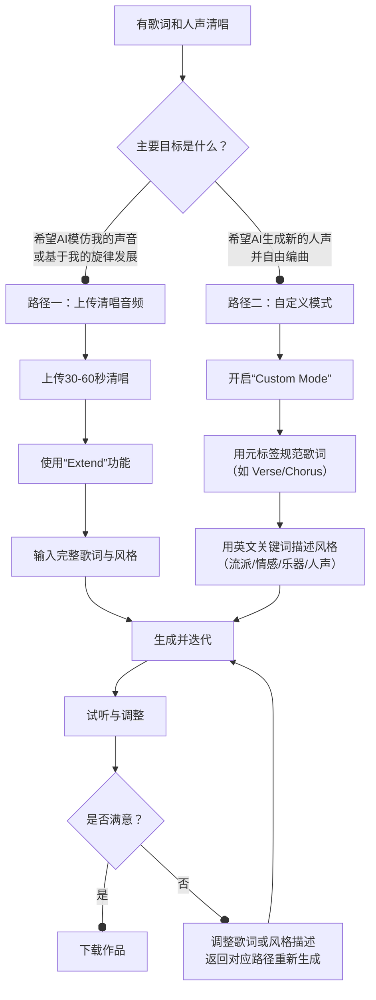

# 用Suno制作带词曲歌曲的方法

> 来源: 元宝 (腾讯元宝) · 001-音乐电影文学

### **AI**

对于在国内订阅 Suno，除了 PayPal，主要通过支持国际支付的**虚拟信用卡**和**数字商品代充平台**来实现。下面这个表格汇总了主要的支付渠道类型和特点。

| 支付渠道类型 | 代表性工具/平台 | 核心机制/说明 |
| :--- | :--- | :--- |
| **虚拟信用卡平台** | WildCard（野卡）[citation:6][citation:8]、PIX60[citation:7] 等 | 提供专用于国际支付的虚拟信用卡（通常是Visa或Mastercard）。您需要先向虚拟卡充值，然后在Suno的支付页面绑定此卡进行订阅[citation:6][citation:8]。 |
| **数字商品代充平台** | Ka-cheap, HelloChongzhi[citation:7] 等 | 在这些平台直接购买“Suno会员”商品，提供您的Suno账号邮箱，由卖家代为完成订阅充值[citation:7]。 |
| **电商平台代充** | 淘宝等[citation:6] | 在电商平台搜索“Suno 代充”或“Suno 会员”，寻找提供代付或账号升级服务的商家[citation:6]。 |

### 💳 虚拟信用卡使用详解

虚拟信用卡是当前较为常见和直接的方式[citation:6][citation:8]。

-   **工作原理**：您在这些平台的官网注册并开通一张虚拟卡，然后充值相应金额（例如Suno Pro套餐为10美元/月）。之后在Suno的支付页面，像使用普通信用卡一样输入这张虚拟卡的卡号、有效期和安全码即可完成支付[citation:6][citation:8]。
-   **推荐理由**：这种方式让您直接管理自己的Suno账号和支付，相对独立。一些平台（如WildCard）还提供“一键升级”等简化流程的服务[citation:8]。

### ⚠️ 注意事项与建议

无论选择哪种方式，以下几点需要特别留意：

-   **支付成功率**：使用虚拟信用卡支付时，确保网络环境稳定。部分平台提示，支付成功率与网络IP地址的“纯净度”（例如，是否被Suno的风控系统标记)可能有关[citation:8]。
-   **账户安全**：如果选择代充服务，请务必通过可靠渠道，并注意账号安全。优先选择只要求提供Suno注册邮箱（而非账号密码）的服务，以降低风险[citation:7]。
-   **价格与信誉**：不同服务商的价格和信誉可能有所不同。建议在选择前仔细比较，并查看其他用户的评价。
-   **官方政策**：请注意，Suno的官方条款可能随时更新。使用第三方支付工具不影响您需要遵守Suno自身的用户协议。

希望这些信息能帮助您顺利解锁Suno的完整创作功能！如果您对某个特定工具的操作细节还有疑问，我可以尝试提供更具体的分析。

---
### **User**

除了PayPal，还有哪些第三方支付工具可以用于Suno？

---
### **AI**

目前，根据我查到的信息，没有找到关于在Suno平台上直接添加中国银行卡的具体操作指南。不过，这通常涉及到国际在线支付，我可以为您提供一些通用的思路和需要注意的环节。

### 💳 理解支付环境

像Suno这样的国际数字平台，其支付系统通常对接的是国际支付网关，支持的付款方式以常见的国际信用卡组织为主，例如**Visa**、**Mastercard**、**American Express**，以及一些国际通用的第三方支付工具如**PayPal**。

中国银行发行的银行卡种类繁多，其支付权限有所不同：
*   **双币/多币种信用卡**：这类卡片通常同时具有银联（UnionPay）和Visa/Mastercard等标识，是**最有可能**成功用于此类国际支付的卡片。支付流程会通过其国际通道完成[citation:7][citation:8]。
*   **单标识银联卡**：由于Suno的平台大概率未直接接入中国的银联在线支付系统，因此纯银联卡（卡面仅有UnionPay标识）直接支付成功的可能性相对较低[citation:6][citation:7]。

### 🔍 尝试绑定步骤与备选方案

尽管没有确切的Suno平台绑定指引，但这类操作通常遵循标准流程，您可以按以下思路尝试：

1.  **在平台内寻找支付入口**：登录Suno账户后，请仔细查看“账户设置”（Account Settings）、“账单信息”（Billing）或“订阅”（Subscription）等板块，那里通常会有添加支付方式（Add Payment Method）的选项。
2.  **输入卡片信息**：如果支持，您需要准确填写银行卡号、有效期、卡面上的姓名（需用拼音/英文）以及卡背面的CVV安全码。
3.  **考虑备选支付渠道**：
    *   **使用PayPal**：如果平台支持PayPal，这通常是更优选择。您可以先将中国银行卡（即使是银联卡，部分也支持）关联到您的PayPal国际账户，然后通过PayPal向Suno付款。PayPal在跨境支付方面兼容性更好。
    *   **咨询发卡银行**：在尝试支付前，致电中国银行的客服（卡片背面有电话号码），确认您的卡片**已开通在线支付功能**、**支持美元等外币交易**，并且了解是否有单笔或单日的交易限额需要调整。
    *   **咨询Suno客服**：最直接的方式是联系Suno平台的官方客服，询问他们是否接受中国发行的银行卡，以及具体的操作方法和可能遇到的问题。

### ⚠️ 重要注意事项

在进行操作时，以下几点需要特别留意：
*   **支付权限与限额**：确保您的银行卡已开通在线支付和国际支付功能。中国银行App或客服热线可以办理。同时，注意卡片的外币支付额度是否足够，以及银行设置的单日/单笔交易限额[citation:8]。
*   **货币转换费**：即使Suno显示美元金额，您的发卡行在结算时可能会将美元转换为人民币，并收取一定的货币转换费（通常是交易金额的1%到2%）。具体费率可咨询中国银行。
*   **用卡安全**：确保仅在Suno的官方平台（官网或官方App）输入支付信息，警惕仿冒网站。妥善保管您的CVV码，不要透露给任何人[citation:7]。

希望这些信息能帮助您理清思路！如果您在Suno平台的支付页面看到了具体的选项或提示，可以告诉我，或许我能提供更进一步的分析。

---
### **User**

suno如何添加中国银行卡

---
### **AI**

毛不易的音乐编曲风格以“东方意境与现代流行融合”为核心，兼具民族性与实验性，其特点可概括为以下五个维度：

---

### 一、**传统乐器与现代音色的辩证融合**  
1. **民族乐器的符号化运用**  
   在《东北民谣[](@replace=10014)》中，唢呐与管子的欢快音色与电吉他、合成器的苍凉感碰撞，既保留东北民谣的乡土气息，又注入现代都市的疏离感[citation:1]。而《项羽虞姬[](@replace=10015)》以二胡、古筝构建古战场悲怆基调，却在副歌引入大提琴与摇滚编曲，实现“传统叙事”与“现代情绪”的对话[citation:1][citation:6]。  
2. **去乐器化的东方表达**  
   如《水乡[](@replace=10016)》仅用吉他与贝斯，通过大鼓低频震动和弦乐空间延展，模拟水墨画般的纵深感，证明“中国风”无需依赖民族乐器符号[citation:1]。

---

### 二、**编曲结构服务于情感层次**  
1. **动态情绪推进**  
   《不染[](@replace=10017)》的编曲设计堪称教科书：主歌A段钢琴与古筝泛音营造“出世”孤寂，主歌B段二胡滑音铺垫矛盾，副歌唢呐爆发式撕裂柔美声场，象征红尘羁绊的不可逃避[citation:6]。  
2. **人声与器乐的互文**  
   《一荤一素[](@replace=10018)》中口哨吹奏的《摇篮曲》旋律与童声合唱叠加，形成“母亲叮咛”与“儿女思念”的时空对话，编曲成为情感载体的延伸[citation:1]。

---

### 三、**空间声场的创新构建**  
1. **虚实相生的听觉美学**  
   《一程山路[](@replace=10019)》用琵琶轮指模拟溪水叮咚，竖琴拨弦制造日光碎片洒落的朦胧感，电子音效（如《不染[](@replace=10020)》中的水滴声）则强化禅意氛围，形成“听觉通感”[citation:1][citation:6]。  
2. **极简主义的留白艺术**  
   《胡同[](@replace=10021)》以单簧管solo搭配大提琴长音，辅以童声吟唱，用稀疏配器激活听众对老北京胡同的记忆投射[citation:1]。

---

### 四、**调式创新的现代转译**  
1. **五声音阶的破格处理**  
   虽大量采用五声音阶（如《南一道街[](@replace=10022)》《水乡[](@replace=10023)》），但常在关键句注入半音制造张力。例如《一荤一素[](@replace=10024)》在“风儿轻”加入7音，打破大调平静，暗藏丧母之痛[citation:1]。  
2. **跨文化节奏实验**  
   《芬芳一生[](@replace=10025)》采用华尔兹三拍子（¾拍），罕见地将古典舞曲节奏植入流行情歌，营造时光旋转的流动感[citation:3]。

---

### 五、**风格跨界与自我突破**  
1. **从民谣基底到多元探索**  
   早期《消愁[](@replace=10026)》以社会民谣为核，融入慢摇滚与迷幻电子[citation:2][citation:5]；三专《幼鸟指南》转向暗黑哥特风，证明其拒绝风格固化[citation:3]。  
2. **OST创作的禅意革新**  
   影视主题曲如《不染[](@replace=10027)》开创“禅意流行”亚类型，将道教“无为”与佛教“空性”哲学转化为“一壶清酒，一身尘灰”的都市青年精神图腾[citation:6]。

---

### 编曲哲学：**“器为情用，形随意动”**  
毛不易践行“传统乐器非国潮唯一标准”的理念[citation:1]，其编曲本质是**东方美学精神的当代转译**：  
- **去符号化**：民族乐器非装饰品，而是情绪催化剂（如唢呐在《东北民谣[](@replace=10028)》中的悲喜双重性）；  
- **时空折叠**：将童声（《胡同[](@replace=10029)》）、口哨（《一荤一素[](@replace=10030)》）等元素作为“记忆媒介”，激活集体情感共鸣；  
- **矛盾美学**：冰冷电子音效与温暖人声并存（如《不染[](@replace=10031)》），呼应现代人“抽离与沉浸”的精神困境[citation:1][citation:6]。

---
### **User**

毛不易的音乐是什么编曲风格

---
### **AI**

拥有歌词和人声清唱素材，想通过 Suno 将其制作成完整的音乐作品，这个想法非常棒。Suno 不仅能根据文字生成音乐，也支持基于您上传的音频进行再创作。下面为您梳理具体的方法和关键要点。

### 🎙️ 利用清唱音频进行创作

如果希望 Suno 生成的人声能模仿您清唱的嗓音特点，或者希望用您清唱的旋律作为新歌的基础，可以尝试以下流程：

1.  **准备与上传音频**：进入 Suno 的创作界面后，寻找上传音频的入口（通常在歌词或风格设置附近）。上传您清唱的音频文件，Suno 支持上传纯音乐或带人声的音频[citation:2]。建议人声清唱长度控制在30秒到60秒为宜[citation:2]。
2.  **使用续写功能**：音频上传完成后，通常会有一个“Extend”（续写）或类似选项[citation:2]。点击后，系统会提示您为续写部分添加新的歌词和音乐风格描述。此时，将您完整的歌词粘贴进去，并描述期望的整体风格（例如：" upbeat pop, electronic synth, female vocals"）。
3.  **理解生成逻辑**：Suno 会分析您上传的清唱音频。对于人声，它会尝试学习其音色特质（可理解为一定程度的声音克隆训练），并运用这种声音来演唱您新填入的歌词[citation:2]。同时，它也会参考您清唱的旋律特点，结合您指定的风格，生成具有相似旋律走向但配器全新的伴奏[citation:2]。

### ✍️ 通过自定义模式精细控制

如果您更倾向于保留清唱中的旋律灵感，但希望 Suno 生成一个全新的、更专业的人声，并完全自主编曲，“自定义模式”（Custom Mode）是核心工具。

1.  **开启自定义模式**：在 Suno 的创作界面，找到并打开 **“Custom Mode”** 开关[citation:1][citation:5]。
2.  **规范输入歌词**：
    *   **标注歌曲结构**：使用 `[Verse]`（主歌）、`[Chorus]`（副歌）、`[Bridge]`（桥段）、`[Outro]`（尾奏）等元标签（Metatags）来明确段落，这能极大提升生成作品的专业性和结构感[citation:4]。例如：
        ```
        [Verse]
        这是主歌部分的歌词
        描述了故事的开端

        [Chorus]
        这是副歌部分，记忆点要强
        情感在此处升华
        ```
    *   **优化歌词格式**：每行歌词不宜过长，通常控制在4-8行左右效果较好[citation:4]。行末最好避免使用标点符号，以免影响AI对断句和旋律的判断[citation:4]。
3.  **精准描述音乐风格**：在“Style of Music”或类似输入框中，用简洁的英文关键词描述您想要的风格。一个好的描述应包含**音乐流派、情感氛围、主要乐器、节奏和人声类型**等要素[citation:4][citation:7]。例如："melancholic folk piano ballad, slow tempo, clear female vocals"（忧郁的民谣钢琴叙事曲，慢速，清晰的女声）[citation:4]。**请注意，Suno 不识别特定艺术家名字（如“周杰伦”），但可以指定歌手的性别（如 male voice）**[citation:4]。
4.  **生成与迭代**：填写完毕后点击创建，Suno 会生成两个版本供试听。不满意可调整风格描述或微调歌词后重新生成。对于满意的片段，可以使用“Continue from this song”（从此处继续）功能来扩展歌曲长度[citation:4]。

### 💡 提升效果的关键技巧

*   **人声与伴奏的平衡**：在自定义模式下，如果您清唱的旋律非常完整且不希望被大幅改动，可以在风格描述中强调“忠于人声旋律”或参考某种演唱风格。但需知 Suno 的再创作自由度较高，精确还原已有旋律具有一定挑战性。
*   **参考您的清唱**：在音乐风格描述中，可以尝试加入对清唱特点的指引，例如 "in the style of my uploaded vocal recording" 或 "melody similar to the uploaded demo"，这可能会帮助 AI 更好地捕捉您清唱的特点。
*   **注意版权问题**：请确保上传的清唱音频是您的原创内容或已获得授权，避免使用受版权保护的素材[citation:2]。Suno 生成内容的版权条款需仔细阅读，若计划商用务必了解相关规定。

### 方法选择建议

为了帮助您更直观地选择，可以参考以下流程来决策：


希望这些信息能帮助您更好地利用手中的创作素材！如果您对特定音乐风格的描述词有疑问，或者需要更具体的歌词结构建议，都可以随时提出。

[](@replace=0)

---
### **User**

有歌词和人声清唱的曲子，如何用suno制作音乐

---
### **AI**

有了歌词和曲调想法后，将其制作成完整的音乐作品，现在确实比以往任何时候都更容易实现。下面我为你梳理了两种主流的制作路径，以及一些实用的建议，希望能帮你把创意变成现实。

下表简要对比了这两种方式的核心特点，方便你快速了解。

| 特点 | **传统数字音频工作站（DAW）路径** | **AI辅助音乐生成路径** |
| :--- | :--- | :--- |
| **核心过程** | 在专业软件中手动完成编曲、录音、混音等所有环节。 | 向AI描述你的想法，由AI生成音乐草稿，你再进行微调。 |
| **控制精度** | ⭐⭐⭐⭐⭐ (**极高**) | ⭐⭐☆ (**较低，但可快速出demo**) |
| **学习成本** | ⭐⭐⭐⭐⭐ (**较高，需学习软件操作**) | ⭐☆ (**很低，上手快**) |
| **所需技能** | 基础的乐理知识、软件操作能力。 | 清晰的描述和提示（Prompt）能力。 |
| **适合人群** | 希望深度控制每个细节，并有意长期学习音乐制作的人。 | 希望快速将想法变为可听的歌曲小样（Demo）的初学者。 |

### 🎹 路径一：使用专业音乐制作软件（DAW）

这是一条更为专业和自主的路径。你需要在一款DAW软件中，通过虚拟乐器、录音和音频编辑，一步步构建你的歌曲[citation:1][citation:2][citation:4]。

*   **核心步骤**
    1.  **创建Demo**：首先，你需要将你的曲调想法记录下来。最直接的方法是用手机或录音设备清唱你的旋律，这被称为制作“小样”（Demo），它是后续所有工作的基础[citation:1]。
    2.  **编曲**：这是为你旋律添加伴奏的过程。你需要在DAW软件中，通过鼠标编辑或连接MIDI键盘，为歌曲添加鼓点、贝斯、钢琴、吉他等乐器声部，丰富音乐的层次[citation:1][citation:3]。
    3.  **录音**：如果歌曲需要真人演唱，接下来就是录制人声。你需要一个相对安静的环境和一个不错的麦克风，在软件中录制下你的歌声[citation:2][citation:3]。
    4.  **混音**：混音是将所有录制好的乐器和人声音轨进行混合调试的过程。目的是让各个声音清晰、平衡、融合，并添加空间感等效果[citation:1][citation:2]。
    5.  **母带处理**：这是音乐制作的最后一步，可以看作是整体优化，让歌曲在不同设备上播放时都能有较好的听感[citation:1]。

*   **常用工具**
    *   **FL Studio**：一款非常受欢迎且功能全面的软件，适合制作电子音乐等多种风格[citation:1]。
    *   **Cubase**：一款专业的音乐制作软件，提供了强大的MIDI编辑和音频处理功能[citation:3]。

### 🤖 路径二：利用AI音乐生成工具

对于没有乐理和软件操作基础的朋友来说，AI工具大大降低了音乐制作的门槛，可以让你**快速获得一个听起来很不错的歌曲草稿**[citation:5][citation:7]。

*   **核心步骤**
    1.  **生成歌词与旋律**：在AI工具中，直接输入或粘贴你准备好的歌词。然后，通过文字描述你想要的**音乐风格**（如：流行、摇滚、国风）、**情感氛围**（如：欢快、悲伤）等。AI会根据你的描述，自动为歌词生成匹配的旋律和伴奏[citation:5][citation:7]。
    2.  **生成与迭代**：点击生成后，稍等片刻，AI就会创造出包含伴奏和人声的完整音乐片段。你可以不断调整风格描述词，或者换用不同的AI歌手声线，多次生成直到找到满意的版本[citation:5][citation:7]。
    3.  **微调与导出**：一些高级的AI工具还允许你对生成的结果进行微调，例如修改部分旋律、调整节拍或人声参数等。满意后，即可将作品导出为音频文件[citation:7]。

*   **常用工具**
    *   **Suno**：被誉为“音乐界的ChatGPT”，只需输入歌词和风格描述，就能快速生成带人声的完整歌曲，非常强大[citation:7]。
    *   **Udio**：另一款先进的AI音乐生成器，同样支持通过文本生成音乐，在捕捉音乐情感方面表现出色[citation:7]。
    *   **网易天音**：国内网易推出的一站式AI音乐制作工具，支持AI辅助完成词、曲、编、唱[citation:7]。
    *   **ACE Studio**：特色在于AI歌声合成，虚拟歌姬的演唱真实度很高，适合需要高质量AI人声的作品[citation:7]。

### 💡 起步实用建议

无论选择哪条路，以下几点都能帮你更好地开始：

*   **准备好你的歌词**：确保歌词段落结构清晰，最好能明确标出**主歌、副歌、桥段**等部分，这有助于AI或你自己在编曲时把握歌曲结构[citation:4]。
*   **具体化你的曲风想法**：在向AI描述或在脑中构思时，尽量具体。比如，不仅仅是“流行”，可以尝试是“节奏轻快的Synthwave流行乐”或“抒情钢琴民谣”。参考你喜欢的特定歌手或歌曲风格也会很有帮助[citation:5]。
*   **从Demo开始，循序渐进**：你的第一个作品不一定要尽善尽美。首要目标是做出一个完整的“小样”（Demo），体验整个流程。之后可以再慢慢学习混音等进阶技巧[citation:1][citation:4]。
*   **注意版权**：如果使用AI生成音乐，需要注意其生成内容的版权条款。若计划将作品用于商业发行，务必仔细阅读并遵守平台的相关规定[citation:7]。

希望这些信息能帮助你清晰地迈出音乐制作的第一步！如果你对特定类型的AI工具（比如更适合国风风格的）或者某款DAW软件有更深入的兴趣，我可以提供更多信息。

[](@replace=0)

---
### **User**

有歌词和曲，如何制作音乐

---
### **AI**

拥有现成的歌词和曲调想法，想通过 Suno 将它们变成一首完整的歌曲，这个想法非常棒。下面我为你梳理了详细的操作步骤和一些提升效果的小技巧。

### 🎵 从歌词和曲调到歌曲

核心的操作在于使用 Suno 的 **“自定义模式”（Custom Mode）**。这个模式允许你输入自己的歌词，并通过文字描述来定义音乐风格，从而将你的创作意图转化为音乐[citation:2][citation:6]。

1.  **准备工作：注册与登录**
    首先，你需要访问 Suno 的官方网站 (`suno.com`) 并注册一个账号。通常可以使用谷歌、微软邮箱或 Discord 账号快速登录[citation:2][citation:7]。新注册的免费用户每天会获得一定的积分（通常是50积分），用于生成歌曲[citation:2][citation:5]。

2.  **核心操作：使用自定义模式**
    登录后，点击页面上的 `Create` 按钮进入创作界面，**务必找到并打开右上角或明显位置的 “Custom Mode” 开关**[citation:2][citation:6]。
    *   **填入歌词 (Lyrics)**：将你准备好的歌词粘贴到 `Lyrics` 文本框中。为了让 Suno 更好地理解歌曲结构，建议你为歌词的不同段落加上结构标签，例如 `[Verse]`（主歌）、`[Chorus]`（副歌）、`[Bridge]`（桥段）等[citation:2][citation:4][citation:6]。
    *   **描述音乐风格 (Style of Music)**：这是将你的“曲调”想法传递给 Suno 的关键一步。在 `Style of Music` 或类似的输入框中，用简洁的文字描述你想要的风格。**建议使用英文关键词进行描述，效果通常更稳定**[citation:6][citation:7]。一个好的风格描述可以包含以下几个要素：
        *   **音乐类型**：如 Pop（流行）、Rock（摇滚）、Folk（民谣）、R&B、Electronic（电子）等[citation:4][citation:6]。
        *   **情感氛围**：如 Happy（欢快）、Sad（悲伤）、Romantic（浪漫）、Epic（宏大）等[citation:4][citation:6]。
        *   **主要乐器**：如 Piano（钢琴）、Guitar（吉他）、Violin（小提琴）、Synthesizer（合成器）等[citation:4][citation:6]。
        *   **节奏或人声**：如 fast-paced（快节奏）、male vocal（男声）、female vocal（女声）等[citation:6][citation:7]。

3.  **生成与完善**
    填写好歌词和风格后，点击 `Create` 按钮，Suno 通常会开始生成两首不同编曲版本的歌曲，这个过程需要稍等片刻[citation:2][citation:3]。生成完成后，务必试听效果。如果对某个版本大致满意但觉得长度不够，可以点击歌曲旁的 `Extend`（延长）或 `Continue from this song`（从此歌曲继续）功能，在原有基础上扩展歌曲时长[citation:3][citation:6]。如果对结果不满意，可以调整风格描述或微调歌词后重新生成[citation:7]。

### 💡 提升效果的小技巧

*   **让风格描述更精准**：如果你脑海中的曲调有具体的参考对象，比如某位歌手的风格或某首知名歌曲的调性，可以在风格描述中尝试加入，例如 "in the style of [艺术家或歌曲名]"[citation:7]。此外，如果你了解具体的节奏（BPM）和调性（Key），将其作为提示词的一部分，可以帮助 Suno 生成更符合你预期的音乐[citation:6]。
*   **利用其他AI辅助作词**：如果你的歌词还需要润色，或者你想根据曲风调整歌词，可以借助其他AI工具（如 DeepSeek、ChatGPT 等）来帮忙优化，只需给它清晰的指令即可[citation:2][citation:7]。
*   **注意版权与下载选项**：免费用户生成的歌曲通常**不可用于商业用途**，并且只能下载 MP3 格式的音频文件[citation:2][citation:7]。如果需要商用或更高音质的格式，需要考虑订阅 Suno 的付费版本[citation:7]。

### 💎 总结
总的来说，用 Suno 将你的歌词和曲调想法变为现实，关键就在于 **“自定义模式”** 下的两步：**填入带结构标签的歌词** + **用精准的关键词描述音乐风格**。多尝试、多调整，你会越来越得心应手。

希望这些信息能帮助你踏出音乐创作的第一步！如果你对歌曲风格的描述词没有头绪，或者需要更具体的歌词结构建议，都可以再问我。

[](@replace=0)

---
### **User**

有歌词和曲，如何用suno制作音乐

---

*Auto-extracted via API from yuanbao.tencent.com*
