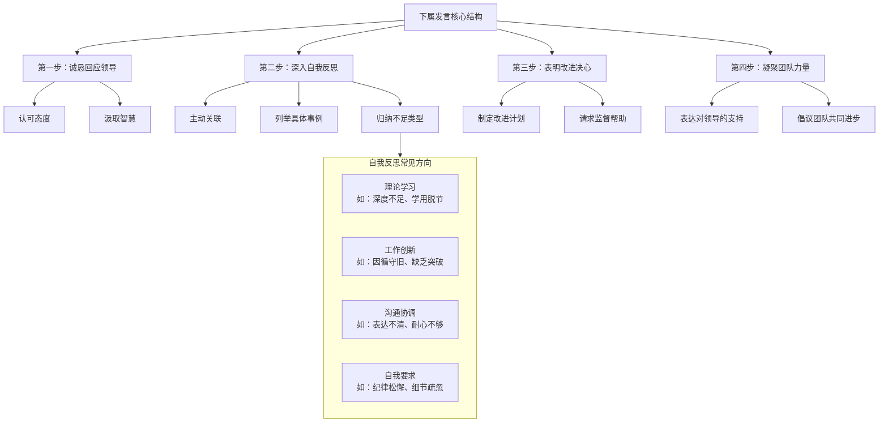

# 领导自我批评会发言建议

> 来源: 元宝 (腾讯元宝) · 002-表达与管理

### **AI**

在部门大会上向领导提管理改进建议，确实需要一些技巧和准备。下面我为你梳理了关键原则、具体话术和注意事项，希望能帮到你。

### 🤔 一、核心原则与准备工作

在开口之前，充分的准备和正确的心态至关重要。

1.  **肯定与尊重先行**：无论建议如何，首先要尊重领导的权威和之前的决策。**先肯定后建议**是非常有效的方法[citation:1]。你可以先真诚地称赞现有方案或工作的优点，再用“补充”或“优化”的姿态提出自己的想法。
2.  **准备扎实的数据与案例**：**空泛的意见缺乏说服力**。用数据、事实或具体的案例来支撑你的观点[citation:2][citation:3]。例如，如果能说明某个流程问题导致了多少时间的浪费或增加了多少成本，你的建议会更有力量。
3.  **问题与解决方案捆绑**：**不要只抛问题，要让领导做选择题而非填空题**[citation:1]。提出问题的同时，最好能给出1-2个具体的、经过思考的解决方案，并简要分析各自的利弊[citation:2][citation:6]。
4.  **寻求团队共识**：如果你的建议关乎团队，提前和关系好的同事沟通，**争取一定的内部支持**。在大会上，有时可以默契地用“我们最近讨论发现...”或“一些同事反馈...”来引入，增强说服力，也避免显得是个人抱怨[citation:2]。
5.  **换位思考，站在全局角度**：**阐述建议时，尽量从部门或公司的整体利益出发**，例如如何提升效率、节省成本、促进协作、规避风险等，而不是单纯强调个人或自己小团队的不便[citation:1]。这让领导觉得你是有大局观的。

### 📝 二、大会上的表达技巧与话术模板

到了具体表达时，方式方法很重要。

1.  **使用“请教”或“探讨”的语气**：采用**请教式建议**，能更好地保住领导面子，例如：“领导，关于这个问题我有个不成熟的想法，不知道是否可行，想请教一下您的意见...”[citation:1] 或者 “我想就XX问题提一点自己的看法，希望能和大家一起探讨。”
2.  **结构化清晰表达**：**清晰的表达至关重要**[citation:2]。可以采用这样的结构：
    *   **背景/肯定** (Situation)：简要描述现状，并先给予肯定。
    *   **挑战/担忧** (Complication)：指出具体遇到的问题或潜在风险。
    *   **建议/方案** (Action)：提出你的核心建议或备选方案。
    *   **价值/展望** (Result)：说明采纳建议后可能带来的积极变化。
3.  **话术模板参考**：
    *   **优化流程时**：“领导，目前我们使用的**（某系统/某流程）** 在**（报表/某功能）** 上确实非常高效，帮助很大。不过，我们最近在处理**（某项具体业务）** 时，发现**（某个环节）** 偶尔会出现**（具体问题或数据）**，导致效率有些损耗。我在想，我们是不是可以尝试**（你的具体建议）**，这样或许能进一步**（提升的效率或节省的成本）**。当然，这只是一个初步想法，想听听您的指导。”[citation:1][citation:5]
    *   **加强协同时**：“我特别认同领导刚才强调的部门协作目标。在实际推进中，我们发现如果**（某个信息或流程）** 能更早地同步给相关部门，比如**（举具体例子）**，或许能减少重复沟通，更快地拿到结果。我们是不是可以**（你的具体建议，如建立简单同步机制或定期会议）** 来试试？”[citation:5]

### ⚠️ 三、需要注意的时机与场合

即使准备充分，时机和场合不对，效果也会大打折扣。

*   **察言观色，选择时机**：**时机和场合很重要**[citation:1][citation:4]。如果领导在会上明显心情不佳或正集中处理棘手问题，可酌情暂缓提出非紧急建议。最好在会议议题相关或领导征询意见时顺势提出。
*   **态度诚恳，避免比较**：**切忌通过贬低其他部门或同事来抬高自己建议的价值**。聚焦于解决问题本身，而非指责。
*   **保持开放心态**：你的建议不一定完全正确或被全盘接受。**如果领导有疑问或提出不同意见，耐心倾听**，并表示会根据领导的指导再思考和完善[citation:7]。这展现了你的弹性和合作精神。

### 💎 四、总结与提醒

在部门大会上给领导提建议，是一次展示你**责任心、思考力和团队精神**的机会。核心在于：
*   **姿态要低**：尊重与肯定先行。
*   **准备要足**：用数据说话，带方案讨论。
*   **站位要高**：从团队和公司利益出发。
*   **时机要对**：观察氛围，顺势而为。

掌握这些，你不仅能更有效地传递想法，还能在领导心中留下“有想法、懂沟通、靠得住”的好印象[citation:1]。

希望这些建议对你有帮助，祝你在大会上顺利表达！

---
### **User**

在部门大会上，如何给领导提管理改进建议

---
### **AI**

在领导自我批评会上把握好批评与建议的平衡，确实需要一些思考和技巧。这既是对工作负责，也是维护良好工作关系的关键。下面我为你梳理了一些核心原则和具体方法，希望能帮到你。

### ⚖️ 把握平衡的核心原则

1.  **对事不对人**：这是最重要的原则。批评应聚焦于**具体的工作行为或事项**，而非领导的个人能力或性格。例如，相较于“您太独断了”，说“这个决策如果能提前征集一下基层意见，执行时会更顺畅”会更合适[citation:1]。
2.  **建设性是内核**：批评的终极目的是推动进步。因此，提出的问题最好能附带**可行的改进建议**或**潜在的解决方向**，表明你是希望问题得到解决，而不仅仅是指出问题[citation:1]。
3.  **真诚与尊重是基石**：态度要诚恳，避免给人感觉是在发泄情绪或刻意挑刺。尊重领导的权威和感受，语气上保持平和客观[citation:6]。

### 🗣️ 掌握表达技巧的话术

1.  **运用“三明治”法则**：这是一种非常实用的沟通结构。
    *   **肯定与赞赏开头**：首先认可领导的某些优点或成绩，建立积极的沟通氛围。例如：“非常敬佩您对项目大局的把握能力……”
    *   **中间提出批评建议**：然后委婉地提出具体的问题和建议。例如：“……如果在项目推进初期，能更早地明确各环节的负责人和时间节点，或许能进一步减少协调内耗。”
    *   **结尾表达信心与支持**：最后再次表达对领导的信任和团队的支持。例如：“……相信在您的带领下，我们下次一定能完成得更加高效。”[citation:1][citation:5]
2.  **巧用比喻，让批评更易接受**：通过恰当的比喻，可以柔和地传递观点。
    *   **“头雁效应”法**：肯定其引领作用，同时希望其能更多带领团队研讨，将政策转化为具体行动指南[citation:1]。
    *   **“木桶短板”法**：指出团队整体不错，但个别流程（如标准化）存在短板，建议加强[citation:1]。
3.  **从问题到建议的闭环表达**：确保你的发言有始有终。
    *   指出问题（需具体）→ 阐述该问题可能带来的影响 → 提出建设性建议或解决方案[citation:1]。例如：“关于XX政策的落地（**问题**），目前各部门理解不一，容易导致执行偏差（**影响**）。建议是否可以先在小范围试点，形成统一解读和操作模板后再全面推广（**建议**）？”

### 📌 注意场合与方式

1.  **公开场合 V.S. 私下沟通**：
    *   **公开场合**（如组织生活会）：**措辞务必谨慎**，严格遵循“对事不对人”，采用上述话术进行包装，维护领导的尊严和权威[citation:1]。
    *   **私下沟通**：如果条件允许且关系不错，可以相对更直接地提出问题，但**同样要搭配解决方案**，并注意语气[citation:1]。
2.  **自我批评先行**：若会议氛围允许，在给领导提建议前，不妨先进行**自我反思**。这能营造一种平等、坦诚的氛围，表明我们都在为团队进步努力，从而降低对方的防御心理[citation:5]。例如：“其实我自己在项目中也存在XX不足……由此也在想，我们在XX方面是不是可以……”

### 💬 实用表达范例

这里有一些例子，你可以参考它们的思路和角度：

*   **关于决策调研**：“您决策很果断，我们执行起来方向很清晰。**建议**以后在制定一些涉及多部门的政策前，如果能组织一次跨部门的座谈会，听听一线同事的声音，或许能让方案落地更顺畅。”[citation:1]
*   **关于压力传导**：“您对工作标准要求高，我们都希望能达到您的预期。**有时**感觉任务时间紧、压力大，**建议**能否在下达重要任务时，同步明确关键的考核节点和所需资源，方便我们更精准地发力。”[citation:3]
*   **关于创新鼓励**：“你一直鼓励我们大胆创新，给了我们很多空间。**同时感觉**，对于一些尝试中可能出现的风险，如果能有更清晰的预案容错机制，大家攻坚克难时底气会更足。”[citation:7]

### ⚠️ 务必避开的雷区

*   **忌泛泛而谈**：避免“领导艺术有待提升”、“工作不够深入”等空话，要**结合具体事例**[citation:1]。
*   **忌人身攻击**：绝对不要批评领导的性格或人品，始终**聚焦工作行为**[citation:1]。
*   **忌越界评价**：不要评价与工作无关的私人生活或超越你认知范围的公司战略[citation:1]。
*   **忌公开挑战权威**：切忌在公开场合让领导下不来台，这无助于解决问题，还会破坏关系。

> 总之，在领导自我批评会上提出批评和建议，本质上是一次**支持性沟通**。核心目的在于帮助领导和团队更好地发展。抱着**真诚助益的心态**，运用恰当的方法，你就能更好地把握其中的平衡。

希望这些建议能帮你在会议上更有建设性地表达观点。如果你在具体情境中拿捏不准，或者有更特殊的情况，我很乐意陪你一起探讨。

---
### **User**

在领导自我批评会上，如何把握批评与建议的平衡？

---
### **AI**

在领导自我批评的会议上，下属的发言需要格外注意分寸、态度和方式。这既是表达尊重、维护团结的机会，也是展现自己格局和担当的时刻。下面我为你梳理了核心原则、发言结构和需要注意的雷区。

### 📌 一、核心原则

1.  **态度真诚，尊重权威**：全程保持**严肃认真**的表情[citation:1]。维护领导的尊严和权威是底线，绝对避免任何形式的顶撞、反驳或流露出幸灾乐祸的神情[citation:1]。
2.  **对事不对人**：无论是谈及自身还是回应领导，都应聚焦于具体的工作问题、现象或流程，而非针对个人品质进行评判[citation:5]。
3.  **自我反思为先**：将发言的重点放在**结合领导的自我批评，进行深刻的自我剖析**上[citation:1]。这展示了你的责任心和与领导共同承担责任的意识[citation:3]。
4.  **定位协作与发展**：最终目标是促进团队协作和个人成长，因此发言应落脚到**未来的改进措施和共同努力的方向**上。

### 📝 二、发言结构与话术建议

你可以参考下面的结构来组织语言，这张图谱展示了核心的发言逻辑：


以下是一些可供你参考的具体话术：

**（一）回应领导的话术（切忌简单附和）**
*   “刚才听了领导的自我批评，我深受触动。这种深刻反思、严于律己的态度，为我们做出了表率，也让我意识到了自身存在的差距。”
*   “感谢领导的坦诚分享。您提到关于[某个具体问题]的反思，让我认识到这个问题不仅存在于领导层面，我们下属在执行中也负有责任，更需要共同改进。”

**（二）自我批评的话术（关键部分）**
*   **理论学习方面**：“我在理论学习上存在惰性，缺乏主动性和系统性，导致对某些政策的理解不够深入，影响了工作视野和格局。”[citation:7]
*   **工作创新方面**：“我在工作中有时过于保守，习惯于按部就班，缺乏创新意识和敢于尝试的勇气，面对新挑战时思考不够深入。”[citation:7]
*   **沟通协调方面**：“我有时在团队协作中沟通不够主动、不够充分，更多关注自己的任务，忽略了信息的及时共享和同步，这影响了团队效率。”[citation:8]
*   **细节与责任心方面**：“我对自己的一些工作细节要求不高，有时满足于‘差不多’，缺乏精益求精的劲头，责任心有待进一步加强。”

**（三）提出改进措施的话术（要具体）**
*   “针对理论学习的不足，我计划接下来每周固定投入X小时进行系统学习，并注重在实践中运用，定期向领导和同事汇报学习心得。”
*   “为了提升创新意识，我打算在下一阶段的XX项目中，主动尝试一种新的工作方法，也希望领导和同事们能给予支持和指点。”
*   “我将加强时间管理，利用工具规划工作，确保任务按时保质完成，并加强过程中的主动沟通。”

**（四）凝聚团队的话术**
*   “希望领导能继续严格督促我们，时常提点。我也相信，在领导的带领下，只要我们团队心往一处想、劲往一处使，一定能克服眼前的困难，把工作做得更好。”
*   “我提议我们团队可以建立更定期的沟通机制，比如每周开一个简短的复盘会，让信息更透明，协作更顺畅。”

### ⚠️ 三、务必避免的“雷区”

1.  **❌ 公开质疑与反驳**：绝对不要当面质疑领导自我批评的真实性或深度，例如说“您这不算什么，我问题更严重”这种看似谦虚实则让领导难堪的话。
2.  **❌ 撇清责任，甩锅他人**：切勿利用此机会将自己的问题归咎于领导或同事，这会被视为缺乏担当。
3.  **❌ 泛泛而谈，敷衍了事**：避免说“我也有不足，以后会改进”这种空话。自我批评必须具体，才有诚意。
4.  **❌ 借机献媚，过度吹捧**：例如“领导您太自律了，这点小问题根本不影响您的伟大”，这会让你显得虚伪，令其他同事反感。
5.  **❌ 保持沉默，毫无反应**：如果所有人都发言，唯独你一言不发，可能会被解读为心有不满或漠不关心[citation:1]。

### 💡 四、不同场景的细微差别

*   **如果领导性格开朗、会议氛围较轻松**：可以在严肃的自我批评后，表达对领导带领团队改进的信心，语气可以稍显真诚和积极。
*   **如果会议氛围非常严肃正式**：严格遵循“反思-批评-改进”的结构，保持语气正式、措辞严谨。
*   **如果你是新员工**：自我批评可以更侧重于“学习适应、经验不足”，同时表达积极学习和融入团队的愿望。
*   **如果你是资深骨干**：自我批评应更具深度，更多地反思自己在团队引领、业务攻坚方面的不足，体现更高的自我要求。

总之，**真诚的态度、具体的反思以及积极的改进意向**是打动人的关键。希望这些建议能帮到你。

---
### **User**

领导自我批判会上，下属该如何发言

---
### **AI**

在领导自我批评会上发言，确实需要诚恳与策略并存。下面我为你准备了一个结构化发言框架、具体范例和关键技巧，希望能帮助你更好地进行准备。

# 📋 领导自我批评发言指南

## 一、发言框架与核心要素

| 阶段         | 核心要素                                  | 关键要点                                                                 |
| :----------- | :---------------------------------------- | :----------------------------------------------------------------------- |
| **会前准备**   | 深入反思，梳理问题                          | 结合工作实际，避免空泛；选择1-2个关键问题，避免全面否定；准备具体事例        |
| **现场发言结构** | 开场白→简要成绩→**重点：自我批评**→根源剖析→整改措施→结束语 | 态度诚恳，对事不对人；剖析思想根源；措施具体可行；接受监督                  |
| **会后落实**   | 知行合一，持续改进                          | 列出整改清单；定期汇报进展；真正将措施落到实处                              |

## 二、发言结构与内容要点

### （1）开场白与背景介绍
首先需要简要说明发言的目的，表明自己诚恳接受批评和改进的态度。例如：
> “尊敬的各位领导、同事们：大家好！借此民主生活会的机会，我对自己在过去一年中的工作、思想、作风等方面进行深入剖析，同时也诚恳地接受大家的批评与建议，共同推动我们的工作再上新台阶。”[citation:1]

### （2）简要肯定团队与回顾成绩（可选）
简要肯定团队的努力和成绩，体现客观性和团队意识，但不宜过长。例如：
> “过去一年，我们共同完成了多项重要任务……这些成绩的取得，离不开大家的共同努力和辛勤付出。在此，我对大家的辛勤工作表示衷心的感谢！”[citation:1]

### （3）自我批评与问题查摆（核心部分）
这是发言的核心，需要实事求是地列举具体问题，最好能结合实例。

-   **工作思路与创新能力方面**：
    > “我意识到自己在面对新问题时，往往习惯于沿用旧有的方法和思路，缺乏创新意识，这在一定程度上限制了我们的工作效率和成果质量。”[citation:1]
-   **决策效率与团队管理方面**：
    > “我反思自己在决策时有时过于谨慎，缺乏果断，导致决策效率不高；在团队管理上，对个别成员的关注和了解不足，未能充分发挥他们的潜力。”[citation:1][citation:2]
-   **理论学习与理想信念方面**：
    > “回顾过去一年，我发现自己的理论学习还不够系统、深入，理论素养和实践能力有待提升。面对复杂环境，理想信念有时不够坚定。”[citation:1]
-   **密切联系群众与深入基层方面**：
    > “我反思由于事务繁忙，有时未能及时深入基层倾听群众声音，未能充分了解和回应群众的关切与需求。”[citation:1][citation:4]
-   **工作标准与精细化管理方面**：
    > “有时忙于事务性工作，对工作的精细化程度把握不够，‘钉钉子’精神有所欠缺，在一些细节上抓得不够紧、不够实。”[citation:8]

### （4）问题根源剖析
对上述问题产生的原因进行深入分析，展示思考的深度。

-   **思想解放不够**：“受传统观念和惯性思维影响，缺乏足够的创新意识和冒险精神。”[citation:1]
-   **学习动力不足**：“面对繁忙工作，有时产生懈怠情绪，学习动力下降。”[citation:1]
-   **群众观念有所淡化**：“与群众的直接联系减少，导致对基层实际情况的把握不够精准。”[citation:1]
-   **自我要求不够严格**：“有时过于追求效率和成绩，对一些流程细节和自我修养要求有所放松。”[citation:1][citation:4]

### （5）提出整改措施与努力方向
针对问题和根源，提出具体、可行的改进方案。

-   **加强学习与创新**：“深入学习党的创新理论，增强政治敏锐性。鼓励团队提出创新性建议，勇于尝试新方法新思路。”[citation:1]
-   **改进决策与管理**：“提高决策效率，充分听取团队意见。加强对团队成员的关注和培养，了解其特长和需求。”[citation:1][citation:2]
-   **深入基层与群众**：“建立定期基层调研机制，深入了解群众实际需求和问题，建立有效反馈机制。”[citation:1]
-   **强化自我要求与反思**：“定期开展自我反思和批评与自我批评，加强党性锻炼和修养，保持清正廉洁的作风。”[citation:1]

### （6）结束语
再次表达接受批评、努力改进的态度，以及团结向前的愿望。
> “我真诚地希望大家能够对我提出宝贵的批评和建议，帮助我更好地认识自己、改进不足。让我们携手共进，为实现我们的共同目标而努力奋斗！”[citation:1]

## 三、自我批评的实用话术技巧

在组织生活会上进行自我批评，采用合适的话术既能点明问题，又显得诚恳、易于接受，能起到“软着陆”的效果[citation:3]。

1.  **运用“三明治法则”包装批评**：
    -   先**肯定成绩**：“您主导的XX项目成效显著，团队凝聚力明显提升。”
    -   再**提出建议**：“若能在跨部门协作中提前沟通资源分配，进度延误风险会进一步降低。”
    -   **表达信心**：“相信以您的统筹能力，下一阶段目标一定能高效达成。”[citation:3]

2.  **巧用比喻，让批评“柔中带刚”**：
    -   **“头雁效应”法**：“您在理论学习上的引领作用显著，但若能像‘头雁’一样带动团队深入研讨，将政策转化为具体行动指南，效果会更上一层楼。”[citation:3]
    -   **“木桶短板”法**：“目前团队执行力强，但像木桶的短板一样，个别流程缺乏标准化，导致效率波动，建议加强制度落地的动态跟踪。”[citation:3]

3.  **从“问题”到“建议”的闭环表达**：
    -   对于“决策调研不足”：批评——“政策制定前若能像‘解剖麻雀’一样深入一线，基层执行的困惑会大幅减少。” 建议——“增加蹲点调研频次”。[citation:3]
    -   对于“创新意识待提升”：批评——“传统方法稳妥高效，但面对新挑战时，若能开辟‘试验田’探索新模式，会更具前瞻性。” 建议——“设立创新试点项目”。[citation:3]

## 四、需要避免的误区

1.  **避免泛泛而谈**：切忌使用“学习不够”、“作风不实”等空话，要结合具体工作实例[citation:3]。
2.  **避免过度否定或轻描淡写**：自我批评应当基于实际情况，避免对自己过度苛刻或轻描淡写错误[citation:7]。
3.  **避免推卸责任或归咎外因**：要聚焦自身可控制和改进的方面，体现担当。
4.  **避免“言行不一”**：说了整改措施，会后就要真正落实，列出清单、明确时限[citation:6]。

## 五、范例参考

```
尊敬的各位领导、同志们：

大家好！根据本次会议安排，下面我作个人对照检查，剖析自身存在的问题和不足，恳请大家批评指正。

过去一年，在大家的共同努力和支持下，部门工作取得了一些进展……（此处可简要提及1-2项整体成绩，体现团队性）。但对照组织要求和大家期望，我深刻认识到自身仍存在不少问题：

一是理论学习和创新应用结合不够紧密。虽然参加了各类学习，但有时满足于“学过了”，如何将新理论、新政策创造性地转化为我们部门的具体工作思路和举措，办法还不多、效果还不显。例如，在推动XX项目时，我的思维还是偏重于传统路径，对新技术、新模式的敏感性和应用主动性不足，导致项目亮点不突出。

二是调查研究深度和频次有待加强。忙于日常事务多，“沉浸式”深入基层一线“解剖麻雀”少。有时调研也存在“走线路、看样板”的情况，与普通群众面对面倾听心声、了解真实需求不够，导致对一些潜在问题的预见性不足。比如对XX环节的流程梗阻，未能第一时间察觉并解决。

三是团队潜能激发和精细化管理尚有差距。在任务分解和压力传导上，有时要求多、指导细，但对于如何更好地调动每一位同志的积极性、创造性，用心用情不够。对过程中遇到的细节难点，跟踪督促、闭环管理的“钉钉子”精神还不足。

深刻反思，这些问题根源在于：首先是我的思想观念有时趋于保守，求稳怕错的心态依然存在；其次是宗旨意识和群众观点树得不够牢固；再次是自我要求不够严格，缺乏“挤”和“钻”的韧劲。

针对以上问题，我将努力从以下方面整改：
第一，强化学习转化能力。制定个人学习计划，每季度至少牵头开展一次结合业务的创新务虚会，主动研究应用新知识、新工具。
第二，建立基层联系点制度。保证每月至少X天深入一线，与群众面对面交流，真正把情况摸清、把问题找准。
第三，改进团队管理方式。多听取大家想法，完善激励机制，同时强化过程管理和细节把控，确保各项任务高质量落实。

我的发言完了。不足之处，请各位领导、同志们直言不讳地批评帮助，我一定虚心接受，认真整改。
```

希望这些建议能帮助你在会上进行一次诚恳、深刻、富有建设性的自我批评发言。记住，**有效的自我批评并非终点，而是迈向更高领导效能的起点**。

---
### **User**

领导自我批判会上，我该如何发言

---

*Auto-extracted via API from yuanbao.tencent.com*
