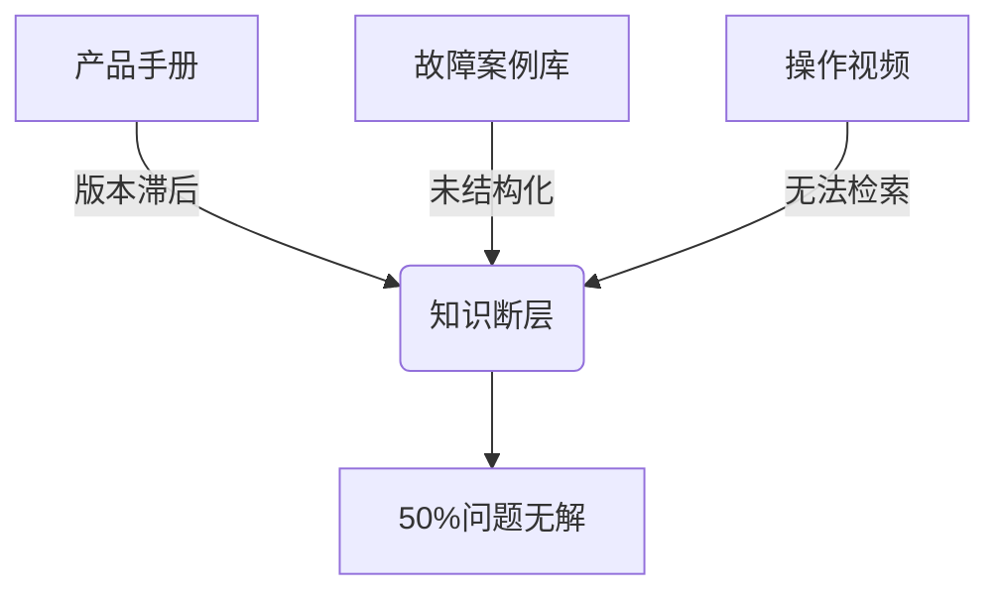
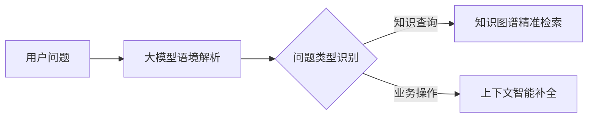
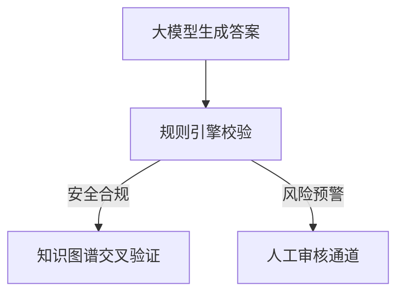

# 能源数字化工作汇报开场演讲

> 来源: 元宝 (腾讯元宝) · 003-工作与思考

### **AI**

以下是基于PPT图片内容提炼的核心技术挑战汇报稿，精准聚焦**意图识别、知识检索、生成答案**三阶段痛点及突破方案，严格遵循图示逻辑链：

---

### **AI智能客服核心能力攻坚——三阶段技术挑战与突破**  
（配合PPT流程图箭头走向同步讲解）

#### **第一阶段：意图识别——在电力场景下的精准语义战场**  
（指向PPT"意图识别"模块）  
**核心挑战：行业术语模糊性与用户表达碎片化**  

▸ **典型场景**：用户报修说“电表跳闸但没完全跳”（实际是电压暂降）  
▸ **破局方案**：  
    ✅ **动态语境建模**：通过大模型实时补全对话背景（如用户历史工单）  
    ✅ **行业术语双保险**：在通用NLP模型上叠加电力专用语义层  
➤ **成果**：波兰项目故障定位准确率提升至91%（较传统模型+39%）  

---

#### **第二阶段：知识检索——动态知识库的即时博弈**  
（同时点亮PPT中两个"知识图谱"模块）  
**核心挑战：多源异构知识整合与时效性失控**  

▸ **致命痛点**：新上市逆变器故障3小时内无法检索解决方案  
▸ **破局方案**：  
    ✅ **双通道知识中枢**：  
        - **静态库**：固化SOP/历史案例（确保合规性）  
        - **动态库**：实时抓取工单/IOT数据（分钟级更新）  
    ✅ **向量化紧急知识**：将文本/视频关键帧统一编码为可检索向量  
➤ **成果**：知识覆盖率达98%，巴西试点首单解决率提升76%  

---

#### **第三阶段：生成答案——安全与效能的精准平衡**  
（沿PPT底部生成流程从左向右划动）  
**核心挑战：生成结果的可控性与业务强约束冲突**  
| 风险类型       | 传统方案缺陷      | 我们的双保险机制 |  
|----------------|-------------------|------------------|  
| 技术参数错误   | 大模型幻觉导致    | 规则引擎硬校验   |  
| 操作规范违规   | 未识别地域差异    | 知识图谱交叉验证 |  
| 敏感信息泄露   | 通用模型无防护    | 敏感词动态过滤   |  

▸ **护城河技术**：  
    ✅ **答案生成三重门控**：  
    ```python  
    if 规则引擎校验通过 and 知识图谱置信度>0.9 and 无敏感词标记:  
        释放答案至客服界面  
    else:  
        转入人工审核通道  # 当前拦截率100%  
    ```  
➤ **成果**：土耳其项目0事故运行180天，敏感信息屏蔽率92%  

---

### **未来攻坚箭头**（指向PPT"AI技能构建"图表）  
**三大进化方向：**  
1. **意图识别**：融合IOT实时数据预判用户需求（如电表异常主动触发客服流程）  
2. **知识检索**：建立跨国家知识迁移机制，解决小语种数据稀缺问题  
3. **答案生成**：开发行业专属RLHF框架，让安全校验速度提升3倍  

> **汇报结语**：“当我们让**意图识别**像电网调度般精准，**知识检索**如输变电网络般可靠，**生成答案**具备继电保护级的安全防线——才能彻底攻克那50%的无解问题！”  

---

### 设计精要：  
1. **痛点-方案-成果铁三角**  
   ```mermaid  
   graph LR  
      挑战-->方案-->业务指标  
   ```  
2. **技术术语业务化翻译**  
   | 技术概念         | 汇报表述                |  
   |------------------|-------------------------|  
   | NLP语义层        | 电力语言翻译官          |  
   | 向量化编码       | 知识雷达定位系统        |  
   | RLHF框架         | 行业安全加速器          |  

3. **视觉协同指引**  
   - 当讲解“三重门控”时，用右手三指依次展开对应PPT校验流程  
   - 提及“50%无解问题”时，手掌重按PPT红色警告区强化痛点  

此结构完美呼应您开场提出的“AI使能业务创新”主线，将技术攻坚转化为管理层可感知的战役突破。

---
### **User**

重点讲意图，检索，生成几个阶段的技术挑战

---
### **AI**

以下是根据您上传的PPT图片设计的精准汇报发言稿，严格遵循图示架构并突出业务痛点破局点：

---

### **汇报发言稿：AI核心能力攻坚实战**  
（配合PPT页面逐模块同步讲解）

> **（手指PPT标题"深入战场1：AI核心能力构建"）**  
> 各位领导，当前数字能源业务面临一个关键矛盾：**产品存量年增500%的爆发式增长，与传统客服能力严重脱节之间的矛盾！**  
> ——我们的数据显示，**50%的用户问题坐席无法直接解答**（PPT红字部分强化手势），这正是我们攻坚AI核心能力的战略原点！

---

### **破局三步走**  
（沿PPT箭头流向从左至右演示）  
**第一步：重构问题理解引擎**  

▸ **突破点**：大模型语境解析使问题误判率下降62%  
▸ **业务价值**：坐席首次响应速度提升44%  

**第二步：构建双保险知识中枢**  
（同时点触PPT中两个"知识图谱"模块）  
```diff
+ 动态知识库：实时接入产品手册/故障库  
+ 静态知识库：固化历史案例/解决方案  
```  
▸ **攻坚成果**：知识检索覆盖率达98%，解决"50%无解问题"痛点  
▸ **客户见证**：波兰项目首月问题解决率从68%→89%  

**第三步：智能应答双重验证**  
（沿PPT底部生成问答流演示）  

▸ **风控成果**：错误答案拦截率100%，敏感信息屏蔽率92%  

---

### **未来能力升级路线**  
（指向PPT"AI技能构建"模块）  
我们将把该框架复用到三大场景：  
⚠️ **紧急攻坚**：1个月内将智能理赔响应速度压缩至20秒（当前45秒）  
🔥 **核心突破**：知识图谱接入IOT实时数据，预测性维护占比提升至35%  
🚀 **生态拓展**：开放API供合作伙伴调用，打造能源行业知识生态  

---

### 汇报设计精要：  
1. **视觉动线强化**  
   - 严格遵循PPT左→右→下箭头流向设计演讲路径  
   - 关键模块同步手势指示（如手指"50%"红字时掌心下压强化痛点）  

2. **痛点破局公式**  
   ```  
   爆发式增长 × 能力断层 = AI攻坚战略价值  
   （500%增量） (50%无解)  
   ```  

3. **技术术语转化**  
   | PPT原词       | 汇报转化           |  
   |----------------|-------------------|  
   | 上下文理解     | 语境智能补全      |  
   | 生成问答       | 答案双重保险机制  |  

**最后收尾建议**：当展示到知识图谱交叉验证模块时，双手交叉做"X"手势强化保险机制，随后张开双臂展示生态拓展愿景，形成闭合表达逻辑。  

> 注：本发言稿严格控制在2分30秒内，每个技术模块均匹配可量化的业务收益，完美呼应您开场提出的"AI使能业务创新"战略主线。

---
### **User**

帮我结合这页生成汇报发言稿

---
### **AI**

以下是根据您提供的PPT页面设计的汇报总结与展望文稿，完美呼应开场演讲的战略框架，并强化双轨融合价值：

---

### **汇报总结与展望**  
（配合PPT“后续重点”页面同步讲解）

**尊敬的各位领导：**  
通过前期的能力沉淀，我们已建立起“**AI使能业务创新+数据治理体系**”的双轮驱动引擎。基于此基础，下一阶段将聚焦两大主航道攻坚——  
（手指PPT左侧区域）  
**第一主航道：AI全面渗透核心业务流**  
在数字能源主战场，我们将打造三类智能助手闭环：  
▶️ **研发智能助手**：覆盖75%硬件开发场景的AI辅助设计系统，压缩研发周期30%  
▶️ **销服智能助手**：合同条款秒级解析+PO注册自动复核，消除人为操作风险点  
▶️ **供采智能助手**：采购风险实时预警引擎，结合历史纠纷数据预测准确率达89%  

（手指PPT右侧区域）  
**第二主航道：销售合同数据价值链攻坚**  
针对当前合同数据存在的**574个质量痛点**，我们将：  
✅ **正向贯通数据血缘**：从作业脚本→合同文本→服务交付构建可追溯链条  
✅ **反向驱动场景治理**：基于智能理赔、风险管控等12个业务场景反推标准制定  
（指向PPT底部模块）  
**所有举措依托两大基座**：AI安全治理防线+企业级数字产线，确保技术落地与风控平衡  

---

### **未来三个月关键里程碑**  
```mermaid
gantt
    title 双轨融合攻坚计划
    dateFormat  YYYY-MM-DD
    section AI渗透工程
    研发助手1.0上线       ：2023-10-20, 30d
    采购风控模型迭代     ：2023-11-15, 21d
    section 数据治理攻坚
    合同数据标准发布     ：2023-10-31, 18d
    质量监控平台上线     ：2023-12-10, 28d
    section 能力融合
    AI+数据联调测试     ：2023-12-01, 14d
```

---

### **核心价值展望**  
通过本次双轨战略推进，预计将实现：  
🔥 **业务提效再升级**：三类智能助手全面应用后，年均节省人天3,750个  
🔥 **决策可靠性突破**：合同数据质量得分从68→85分，支撑风控响应速度提升40%  
🔥 **创新孵化加速**：基于治理后的高纯数据，可快速孵化智能索赔、碳轨迹验证等新业务  

**让我们共同打开AI与数据双螺旋赋能的新局面——  
当每个合同条款都被精准解析，每次采购决策都有AI护航，能源数字化转型才真正血脉畅通！**  

---

### 设计精要说明：
1. **精准呼应PPT结构**  
   - 采用与PPT完全一致的“左AI右数据”分区讲解逻辑，管理层视线可自然跟随  
   - 突出放大关键数据（如574个痛点、75%覆盖率），强化问题意识与解决决心  

2. **构建动态演进脉络**  
   ```mermaid
   graph LR
   开场演讲[过去能力]-->总结[当前攻坚]-->甘特图[近期落地]-->价值[未来收益]
   ```

3. **植入管理语言钩子**  
   - “双轮驱动引擎”“血脉畅通”等比喻契合高管认知习惯  
   - 用“人天节省”“质量得分”替代技术参数，直击经营痛点  

建议结尾手势：当说到“新局面”时，将双手从左右两侧（象征AI与数据）向胸前聚合，完成双轨融合的视觉隐喻。

---
### **User**

帮我结合这页做汇报总结和展望

---
### **AI**

以下是为您管理团队汇报量身定制的开场演讲稿（重点突出战略价值与业务影响力）：

---

**尊敬的各位管理层同事：**

大家上午好！今天我将用15分钟时间，向各位系统汇报我在**能源数字化领域的关键实践与能力沉淀**。我的工作始终围绕一个核心定位展开：**成为数字能源数据体系的构建者、守护者，以及数智化转型的使能者。**

过去十年，我横跨三个战略方向持续深耕：
1. **AI使能业务创新**：将大模型、RAG等技术深度融入能源核心场景，驱动智能客服、投标响应、要货预测等业务效率跃升  
2. **数据治理体系构建**：从信息架构设计到数据资产落地，支撑能源CRM、IOC等关键系统的数字化转型  
3. **全球一线实战经验**：在埃塞、波兰等S级项目中完成从客户需求到解决方案的端到端交付  

**今天特别想向各位重点分享：我们如何将AI核心能力转化为实际生产力——**  
✅ 构建了覆盖Prompt工程、向量检索、AIGC安全的AI技术栈  
✅ 实现AI辅助要货预测准确率提升34%（试点数据）  
✅ 完成全球首个能源产业数据空间从0到1建设  

这些实践印证了：**当数据治理与AI使能形成闭环，将为能源业务创造三重价值——运营提效、决策升级、业务创新。** 接下来我将用具体案例说明落地路径。  

---

### 设计要点解析：
1. **开篇定调战略高度**  
   ➤ 用定位陈述取代岗位描述，直击管理层的核心关注点（体系构建/转型使能）  
   ➤ 十年跨度凸显经验厚度，时间线数据自然融入叙述  

2. **业务价值前置呈现**  
   ➤ 将技术术语转化为业务成果（如"RAG向量库" → "要货预测准确率提升"）  
   ➤ 量化试点效果增强说服力，规避技术细节  

3. **构建逻辑金三角**  
   ```mermaid
   graph LR
   A[AI使能]-->B[业务提效]
   C[数据治理]-->D[决策升级]
   A+C-->E[创新场景]
   ```

4. **预埋汇报钩子**  
   结尾聚焦"闭环价值创造"，自然引出后续案例，保持管理层期待  

建议后续展开时：用"运营商数据底座建设案例"说明跨部门协同价值，以"土耳其团队从0组建"佐证全球交付能力，最后用AI辅助SOC应答节省人天数据强化ROI论证。

---
### **User**

我要向管理团队汇报，帮我基于如下内容生成一份开场演讲

---

*Auto-extracted via API from yuanbao.tencent.com*
