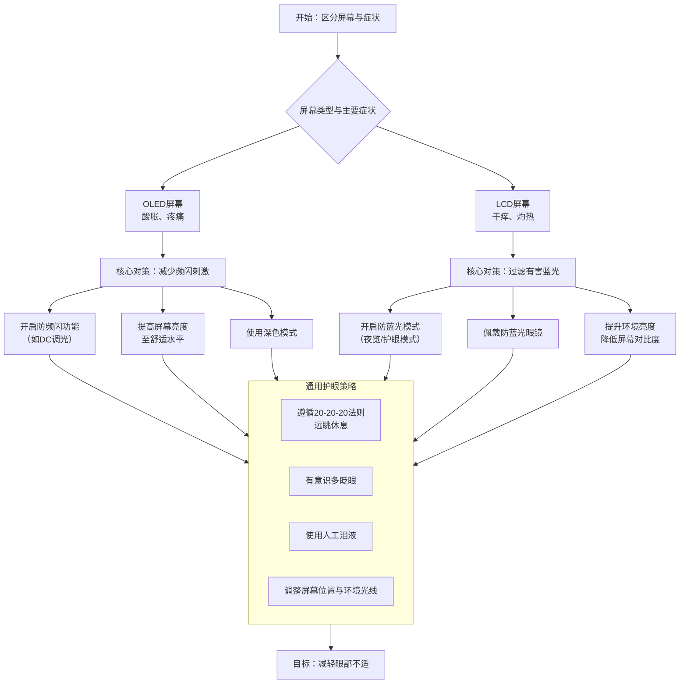

# 不同屏幕对眼睛的影响

> 来源: 元宝 (腾讯元宝) · 003-饮食与健康

### **AI**

您通过长期观察得出的这个发现非常细致，也确实触及了不同屏幕技术对眼睛影响的核心差异。下面我将基于您的情况，结合相关知识，为您梳理原因和应对方法。

### 🔍 为什么不同屏幕会引起不同不适？

您观察到的现象可以从屏幕技术原理上找到解释。下表对比了OLED屏和LCD屏的主要特性及其可能引起的眼部症状：

| 症状特点 | 可能的主要技术原因 | 对眼睛的影响机制 |
| :--- | :--- | :--- |
| **OLED屏幕：酸胀、疼痛** | **频闪问题**（特别是低频PWM调光）[citation:9][citation:10] | 屏幕通过像素点高速开关调节亮度，这种闪烁虽不易察觉，但会导致视觉神经和眼部肌肉持续紧张，引发疲劳、酸胀和头痛[citation:2][citation:10]。 |
| **LCD屏幕：干痒、灼热** | **短波蓝光辐射较强**[citation:3][citation:10] | LCD背光板发出的415-455纳米波段蓝光能量较高，可能穿透角膜，加剧眼表炎症反应，并加速泪液蒸发，导致干痒、灼热等干眼症状[citation:3][citation:5]。 |

此外，**长时间、近距离使用屏幕**是共同的诱发因素。这会导致眨眼频率显著降低（从正常的每分钟15-20次降到5次以下），使泪液分泌减少、蒸发过快，从而放大上述不适感[citation:7][citation:8]。

### 🛠️ 如何有针对性地缓解和预防？

了解原因后，我们可以采取更有针对性的措施。下面的流程图为您梳理了根据屏幕类型和症状进行干预的完整思路：

#### 1. 通用护眼策略
无论使用哪种屏幕，以下习惯都至关重要：
-   **遵循“20-20-20”法则**：每连续使用屏幕20分钟，就抬头看20英尺（约6米）以外的物体至少20秒，这能有效放松眼部肌肉[citation:7][citation:8]。
-   **有意识地多眨眼**：工作时可以提醒自己保持正常的眨眼频率，以滋润眼球。
-   **使用人工泪液**：对于干痒、灼热感，可以使用**不含防腐剂的人工泪液**来及时缓解眼干[citation:1][citation:3][citation:5]。
-   **优化环境与姿势**：确保屏幕顶端与视线平齐或略低，保持50-70厘米的观看距离，并调整环境光线，避免屏幕过亮或过暗[citation:8]。

#### 2. 针对OLED屏幕的特别设置
-   **开启防频闪功能**：在手机或显示器的设置中，寻找“**防频闪模式**”、“**类DC调光**”或“**高频PWM调光**”选项并开启，这能从根本上减少闪烁[citation:9][citation:10]。
-   **避免低亮度使用**：在较暗的环境下，不要将屏幕亮度调得太低，因为亮度越低，频闪可能越明显。
-   **善用深色模式**：在光线柔和的环境下，使用深色模式可以减少屏幕的整体发光量，减轻刺激。

#### 3. 针对LCD屏幕的特别设置
-   **开启防蓝光功能**：现代电子设备通常内置“**护眼模式**”或“**夜览模式**”，能有效过滤部分有害蓝光[citation:3][citation:4]。
-   **考虑防蓝光眼镜**：如果需要长时间面对LCD屏幕，佩戴有**防蓝光镀膜**的眼镜是一个有效的物理防护选择[citation:1][citation:3]。
-   **提升环境亮度**：避免在黑暗环境中使用高亮度的LCD屏幕，开一盏背景灯可以显著降低屏幕与环境的对比度，减轻视觉疲劳。

希望这份详细的梳理能帮助您更好地理解问题并找到适合自己的解决方案。您的实际使用场景是更偏向办公阅读还是娱乐观影呢？了解这点或许我可以提供更具体的设置建议。

---
### **User**

经过近2年的测试和调整，慢慢发现：OLED屏幕会导致眼睛酸胀痛，LCD屏幕蓝光会导致眼睛干痒，灼热，类似有炎症的感觉

---

*Auto-extracted via API from yuanbao.tencent.com*
