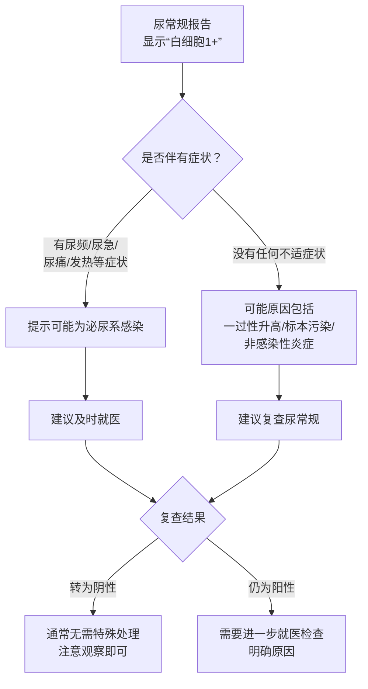
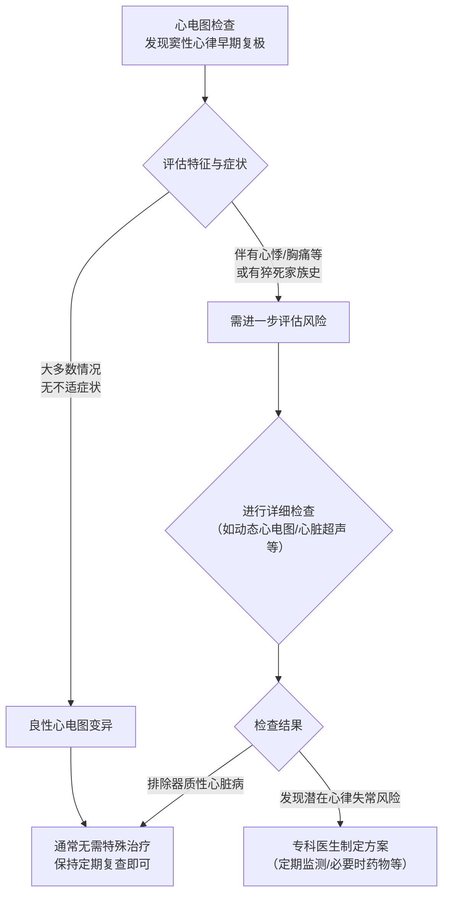

# 窦性心律早期复极解析

> 来源: 元宝 (腾讯元宝) · 003-饮食与健康

### **AI**

写好年度总结，可以按“想清楚—搭好结构—写好开头结尾—润色优化”这几步来做，既省事又有说服力。

---

## 一、先想清楚三件事

在动笔前先回答三个问题，会大幅降低写作难度：

1. **写给谁看？**
   - 上级领导：突出业绩、数据、改进建议；
   - HR/考核：强调成长、目标达成、态度；
   - 团队/同事：突出协作、经验沉淀、共享成果。

2. **这一年最核心的主题是什么？**
   - 关键词可以是：**突破 / 稳定 / 转型 / 优化 / 探索**等。  
   全文围绕一个主题展开，会比流水账更有记忆点。

3. **今年最重要的 3–5 件事是什么？**
   - 选出几件真正有代表性的项目或事件，用来撑起“成绩”和“亮点”。

---

## 二、推荐的标准结构（可直接套用）

### 1. 开头：简明总述

控制在 3–5 句话，把全年的轮廓画出来：

- 说明岗位和时间区间；
- 概述整体表现（可以用一句话概括，如“基本达成全年目标”“在XX方面取得突破”）；
- 点出本年度主线主题。

示例结构：

> 本年度主要负责……，在公司整体经营背景下，围绕“XX主题”（如效率提升/业务创新/成本优化），基本完成了各项既定任务，并在若干关键环节实现了突破。现将一年来的工作情况及思考总结如下。

---

### 2. 主体部分：四大板块

#### （1）年度工作回顾 / 完成情况

围绕年初计划、KPI、OKR来写：

- 按模块写：如“项目管理”“客户维护”“运营支持”“产品迭代”等；
- 每个模块里写清：**做了什么 + 怎么做的 + 结果如何**；
- 尽量用数据说话：金额、百分比、数量、周期缩短等。

示例写法：

- “负责A项目的全生命周期管理，项目按期上线，较原计划提前X天，预算节省约Y%。”
- “负责客户服务响应，平均响应时长由30分钟缩短至15分钟，客户满意度提升Z个百分点。”

#### （2）主要成绩与亮点

挑出 3–5 项最有代表性的成果：

- 可以是：项目成功落地、拿到的奖项、解决的重大难题、流程优化带来的显著收益等；
- 每条成绩最好有“量化结果”，例如：
  - 新增客户数：+35%
  - 成本下降：节约约XX万元
  - 效率提升：处理时间缩短50%

#### （3）存在的问题与不足

体现自我反思能力，但要写得专业、建设性：

- 避免空泛的“学习不够”“努力不够”；
- 建议写成“现状+原因+改进方向”的结构。

示例：

- “在跨部门沟通上仍偏被动，导致部分需求变更沟通滞后。明年拟在项目中前置沟通节点，并建立固定同步机制。”

#### （4）明年工作计划 / 改进方向

建议做到三点：

- 有**总体目标**（如“在现有基础上提升效率30%”）；
- 有**关键举措**（具体要做哪些事情）；
- 有**可衡量指标**（便于明年对照）。

---

### 3. 结尾：感谢与表态

简短有力，一般 2–3 句话即可：

- 对领导和同事的支持表示感谢；
- 表达继续努力的态度和对新一年的信心。

示例：

> 过去一年离不开领导的指导和团队的配合，在此一并致谢。新的一年，我将继续在岗位上深耕细作，围绕既定目标扎实开展工作，力争在XX方面取得新的突破，为团队和公司创造更大价值。

---

## 三、写作时可以用的小技巧

1. **多用动词和数据，少用形容词**
   - 把“做了很多工作”换成“主导了X个项目，完成Y项任务”；
   - 把“效果很好”换成“投诉率下降30%，客户好评率提升至95%”。

2. **善用 STAR 法则写案例**
   - S（情境）：在什么背景下；
   - T（任务）：你要完成什么目标；
   - A（行动）：你采取了哪些具体措施；
   - R（结果）：取得了什么成果、有什么数据支撑。

3. **语言保持正式、简洁**
   - 避免口语化：“基本上、差不多、还行”等；
   - 控制长句，一段只说一件事，读起来更清晰。

---

## 四、一个简单可直接套用的模板

你可以直接复制到文档里再填充内容：

> 一、年度工作回顾  
> 1. ……  
> 2. ……  
>   
> 二、主要成绩与亮点  
> 1. ……  
> 2. ……  
>   
> 三、存在问题与不足  
> 1. ……  
> 2. ……  
>   
> 四、明年工作计划  
> 1. ……  
> 2. ……  

---

如果你愿意告诉我你的岗位（比如销售、研发、运营、行政等）和大概的工作内容，我可以按你的实际情况帮你改写成一份可用的完整年度总结草稿。

---
### **User**

如何写年度总结

---
### **AI**

尿常规中白细胞1+、2+、3+的主要区别在于尿液中的白细胞数量不同，这直接反映了泌尿系统感染的严重程度。下面这个表格能帮你快速抓住核心要点。

| 指标 | 白细胞数量 (每高倍视野) | 感染严重程度 | 临床意义概要 |
| :--- | :--- | :--- | :--- |
| **白细胞 1+** | 1-9个 [citation:7] | 轻度感染 [citation:1][citation:4] | 可能无症状或症状轻微；有时可能为生理性或污染所致 [citation:3][citation:5]。 |
| **白细胞 2+** | 10-19个 [citation:7] | 中度感染 [citation:4][citation:7] | 通常伴有尿频、尿急、尿痛等症状，提示活动性感染 [citation:1][citation:3]。 |
| **白细胞 3+** | 20-29个 [citation:7] | 重度感染 [citation:1][citation:4] | 感染明确，症状往往更明显，可能需要更强效的治疗 [citation:1][citation:2]。 |

### 💊 各等级的处理原则

基于上述不同的临床意义，处理方式也有所差异：

-   **白细胞1+**：如果**没有任何不适症状**（如尿频、尿急、尿痛），医生可能会建议先通过**多饮水、多休息、注意个人卫生**来观察，有时可能会自行恢复 [citation:3][citation:5]。但如果伴有症状，或患者是孕妇等特殊人群，医生也可能建议进行抗感染治疗 [citation:4]。
-   **白细胞2+**：通常意味着需要**积极的抗感染治疗**。医生常会根据情况选择敏感的抗生素，例如二代的头孢类或喹诺酮类抗生素 [citation:1][citation:2][citation:7]。治疗期间务必遵医嘱足量足疗程用药，即使症状好转也不要自行停药，以防复发或产生耐药性 [citation:6]。
-   **白细胞3+**：提示**重度感染**，需要**高度重视并采取强效治疗**。医生往往会选用更强效的抗生素（如三代的喹诺酮类或头孢类）[citation:1][citation:2]。同时，可能需要进行**尿培养+药敏试验**，以明确是哪种细菌感染以及哪种抗生素最有效，实现精准治疗 [citation:7]。

### 💡 重要提醒

1.  **综合判断**：尿常规白细胞加号只是诊断参考之一。医生会**结合你的具体症状、体征以及其他检查结果**（如红细胞、亚硝酸盐、细菌计数、泌尿系统B超等）进行综合判断 [citation:5][citation:6][citation:7]。
2.  **避免自行用药**：**切勿根据加号多少自行购买抗生素服用**。抗生素需在医生指导下使用，滥用可能导致细菌耐药，增加未来治疗难度 [citation:6][citation:7]。
3.  **标本留取要规范**：尤其是女性，留取尿液标本时应留取**中段清洁尿液**，避免阴道分泌物污染导致结果假阳性 [citation:5]。

希望这些信息能帮助你更好地理解尿常规报告。请记住，最终的诊断和治疗方案一定要咨询专业医生。

---
### **User**

尿常规中白细胞1+和白细胞2+、3+在临床意义上有什么区别？

---
### **AI**

小便常规中“白细胞1+”是一个常见的检查结果，它提示你的尿液中白细胞数量轻度超出正常范围。为了帮助你更清晰地理解这个结果以及后续该怎么做，我为你梳理了一个清晰的流程图：

上图展示了发现“白细胞1+”后的核心决策路径。下面我们来详细了解一下图中提到的几个关键点。

### 💊 了解可能的原因

“白细胞1+”通常意味着泌尿系统可能存在**轻度炎症或感染**，这是身体免疫系统正在工作的信号[citation:6][citation:9]。

- **感染性因素**：最常见的原因是**泌尿系统感染**，比如尿道炎、膀胱炎等[citation:1][citation:5]。如果感染比较严重，也可能涉及肾脏，引发肾盂肾炎，这时可能伴有腰痛、发热等症状[citation:2][citation:7]。
- **其他病理因素**：除了感染，**泌尿系统结石**（如肾结石、输尿管结石）可能因局部黏膜损伤引发炎症反应[citation:5]。对于男性，**前列腺炎**也可能导致尿液中白细胞增多[citation:5]。此外，某些肾脏疾病，如间质性膀胱炎、狼疮性肾炎等，也可能出现白细胞尿[citation:5][citation:8]。
- **非病理性因素**：需要提醒的是，这个结果也可能与疾病无关。例如，**女性生理期**、**剧烈运动**后、**发热**或留取尿液标本时操作不当导致污染等，都可能造成一过性的白细胞轻度升高[citation:4][citation:11]。

### 🧪 明确症状与就医检查

正如流程图所示，你是否感到不适是决定下一步行动的关键。

- **如果伴有症状**：当你出现**尿频、尿急、尿痛**等典型的尿路刺激症状，或者伴有**腰痛、发热**时，“白细胞1+”的结果则强烈提示存在泌尿系统感染[citation:1][citation:7]。此时，你应该**及时就医**。医生通常会建议进行**尿培养+药敏试验**来明确是哪种细菌引起的感染以及哪种抗生素最有效[citation:5][citation:10]，也可能建议进行泌尿系统超声检查以排除结石等其他问题[citation:5]。

- **如果没有任何症状**：如果这是在体检中偶然发现，且你本人毫无不适，那么可以采取“**观察等待，定期复查**”的策略[citation:3][citation:11]。首先确保留取尿液标本的方法正确（通常建议留取中段清洁尿液），然后在一到两周后复查尿常规。如果复查结果转为阴性，通常无需担心[citation:11]。

### 💡 日常护理与注意事项

无论是否需要立即就医，以下生活方式的调整都对泌尿系统健康有益：

-   **多饮水、勤排尿**：这是预防和辅助改善泌尿系感染最简单有效的方法，通过尿液的冲刷作用可以减少细菌在尿路的停留[citation:2][citation:7]。
-   **注意个人卫生**：特别是女性，应注意会阴部的清洁，避免细菌侵入尿道[citation:7]。
-   **避免憋尿和久坐**：养成良好的排便习惯[citation:5]。
-   **谨慎用药**：**切勿自行购买和使用抗生素**。抗生素需在医生指导下，根据感染病原体的种类选择敏感的药物，足量足疗程使用，否则易导致耐药或复发[citation:7][citation:10]。

希望这些信息能帮助你更好地理解自己的检查结果，并做出合适的决策。如果你对自身出现的具体症状或检查细节有更多疑问，建议详细记录并及时咨询医生。

---
### **User**

小便常规白细胞1+

---
### **AI**

屈光不正是一类非常常见的眼部问题，简单来说，就是光线进入眼睛后，没有准确地聚焦在视网膜上，导致看东西模糊。下面这个表格能帮你快速抓住核心要点：

| 方面 | 主要内容 |
| :--- | :--- |
| **核心定义** | 眼睛的屈光系统（如角膜、晶状体）无法将外界平行光线精准聚焦在视网膜上[citation:1][citation:5][citation:6]。 |
| **主要类型** | **近视**（光线聚焦在视网膜前）、**远视**（光线聚焦在视网膜后）、**散光**（光线无法聚焦成一个点）[citation:1][citation:5][citation:8]。 |
| **常见症状** | 视力下降、视物模糊（近视看远不清，远视看近吃力，散光看东西有重影）、视疲劳（眼干、酸胀）等[citation:1][citation:7][citation:8]。 |
| **主要原因** | 遗传因素、不良用眼习惯（如长时间近距离用眼）、眼部先天发育异常或某些眼部疾病等[citation:1][citation:6][citation:8]。 |
| **矫正方式** | **非手术**：框架眼镜、角膜接触镜（隐形眼镜）。**手术**：主要适用于度数稳定的成年人，如角膜激光手术（LASIK、SMILE等）[citation:1][citation:4][citation:8][citation:10][citation:11][citation:12]。 |

### 💡 理解屈光不正的视觉体验

为了更直观地理解这三种情况的区别，你可以想象光线就像需要被精准投影在屏幕（视网膜）上的图像：

- **近视**：好比投影仪太靠前，图像焦点落在了屏幕之前，导致**看远模糊，看近相对清晰**[citation:5][citation:8]。
- **远视**：情况相反，像投影仪靠后，焦点落在屏幕之后。为了看清，尤其是近处的物体，眼睛需要持续费力地调节，因此更容易出现**视疲劳**[citation:5][citation:8]。
- **散光**：这好比镜片表面不规则，导致光线散开，无法形成一个清晰的焦点，看物体时可能会出现**重影或变形**[citation:5][citation:9]。

### 👁️ 如何应对屈光不正

1.  **专业诊断是关键**
    如果怀疑有屈光不正，应去正规医院眼科进行检查。检查通常包括视力检查、验光（特别是对于儿童，常需进行**散瞳验光**以获得更准确的度数）等[citation:2][citation:6][citation:8]。

2.  **选择合适的矫正方式**
    *   **框架眼镜**：最常用、最安全的基础矫正方式[citation:4][citation:8]。
    *   **角膜接触镜（隐形眼镜）**：适合对美观或运动便利性有要求的人，但需注意清洁和佩戴时间，预防感染[citation:4][citation:8][citation:12]。
    *   **屈光手术**：如激光手术（LASIK、SMILE等），适用于成年后度数稳定的人群，旨在通过改变角膜形态来矫正视力[citation:1][citation:4][citation:10]。这是一种矫正手段，并非从病因上“治愈”屈光不正。

3.  **养成良好的用眼习惯**
    无论是否矫正，保护眼睛都至关重要：
    *   保持良好用眼距离和姿势，避免长时间近距离用眼，定期休息远眺[citation:8]。
    *   增加户外活动时间，自然光有益眼健康[citation:1][citation:8]。
    *   确保充足的睡眠和均衡的饮食[citation:8]。

### 💎 总结
屈光不正（近视、远视、散光）是常见的视力问题，虽然通常无法彻底“治愈”，但通过规范的验配眼镜、隐形眼镜或手术等方式，完全可以获得清晰舒适的视觉[citation:8][citation:10]。关键在于**科学矫正、定期检查、养成良好的用眼习惯**。

希望这些信息对你有帮助！如果你对某种特定的屈光不正类型或者矫正方式有更具体的疑问，我很乐意提供进一步的信息。

---
### **User**

屈光不正

---
### **AI**

窦性心律早期复极是一种在心电图检查中常见的现象，它本身通常是一种**良性的心电图变异**，而非心脏疾病。下面这个流程图可以帮助你快速理解它的核心特征以及当你拿到这样一份心电图报告时，该如何应对。

如上图所示，你的应对方式主要取决于是否伴有症状或风险因素。接下来，我们详细了解一下这个概念的具体含义和典型特征。

#### 💡 了解早期复极的具体表现
“窦性心律”指的是心脏的正常节律，起源于窦房结，这是完全正常的。“早期复极”则描述了心电图上的一种特定波形改变，主要是指心室肌细胞在电活动过程中，**复极阶段相比常规情况有所提前**。其典型的心电图特征包括 [citation:1][citation:7]：
*   **J点抬高**：J点是QRS波群与ST段的连接点，抬高是早期复极最标志性的特征。
*   **ST段呈凹面向上型抬高**：ST段的形态有特定表现。
*   **T波高耸**：部分人会出现T波振幅增高。

这种现象尤其常见于**年轻男性、运动员**或经常进行高强度体力劳动的人，可能与这类人群**迷走神经张力较高**（常表现为心率偏慢）有关 [citation:5][citation:8]。

#### 🧑‍⚕️ 你的应对步骤
结合开头的流程图，你可以参考以下步骤：
1.  **保持平常心**：最重要的是，如果你是无意中在体检中发现此现象，且本人没有任何不适症状，那么它极有可能属于良性改变，不必过度焦虑 [citation:3][citation:10]。
2.  **提供完整信息给医生**：就医时，主动告知医生你的身体状况，特别是有无出现过心悸、胸痛、胸闷或不明原因的晕厥，以及家族中是否有猝死的病例。这能帮助医生更准确地判断 [citation:1]。
3.  **配合完成检查**：如果医生认为有必要，可能会建议你做**动态心电图**（24小时连续记录心电活动）、**心脏超声**等检查，以排除其他潜在的心脏问题 [citation:1][citation:4]。
4.  **遵循随访建议**：即使无需治疗，医生也可能建议你**定期复查心电图**，比如每年一次，以便长期观察 [citation:1][citation:7]。

希望这些信息能帮助你更好地理解自己的心电图报告。如果你方便分享是否有上述提到的任何症状，或者是在什么情况下发现这个问题的，或许我能提供更具针对性的分析。

如果你想进一步解读报告，可以通过拍照、图片或者微信文件等方式上传医学检查检验报告单。

---
### **User**

窦性心律早期复极是什么

---

*Auto-extracted via API from yuanbao.tencent.com*
