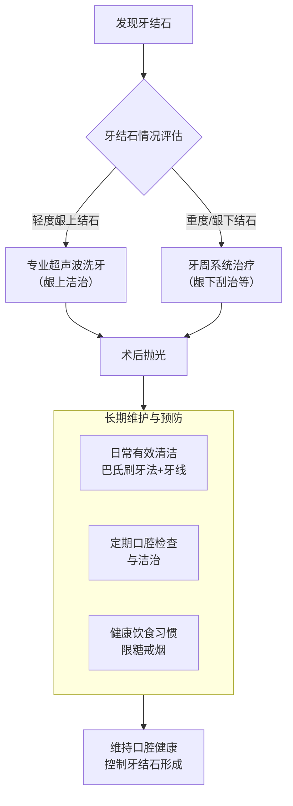

# 清理牙结石的有效方法

> 来源: 元宝 (腾讯元宝) · 003-饮食与健康

### **AI**

清理牙结石最有效的方法是结合**定期的专业口腔治疗**和**日常严格的口腔护理**。下面这张流程图能帮你快速了解核心的应对策略。

接下来，我们详细了解一下图中提到的各种专业治疗方法以及日常的预防措施。

### 🦷 专业治疗方法汇总
当牙结石已经形成，尤其是发展为坚硬的沉积物时，依靠日常刷牙是无法清除的，必须寻求专业帮助[citation:1][citation:3][citation:8]。以下是口腔诊所常用的几种方法：

| 治疗方法 | 主要功能 | 适用情况 | 治疗时长 |
| :--- | :--- | :--- | :--- |
| **超声波洁治**（洗牙） | 利用高频振动将**龈上**的大块牙结石震碎清除[citation:2][citation:4] | 适用于清除牙龈边缘以上的牙结石，是常规保健的基础项目[citation:1][citation:7] | 通常需要 **30-60分钟**[citation:4] |
| **龈下刮治**（深部洗牙） | 使用专业器械手动清除**牙龈下方**、牙根表面的牙结石和病变组织[citation:2][citation:5] | 针对已形成牙周袋、有龈下结石的中重度牙周炎患者[citation:4][citation:10] | 时间较长，常需分次分区进行[citation:4] |
| **喷砂抛光** | 利用高压气流喷射特制粉末，清除牙面细小色素和结石，使牙面更光滑[citation:4][citation:9] | 通常作为洗牙后的抛光步骤，对烟斑、茶渍效果显著[citation:4][citation:9] | - |
| **手工刮治** | 医生使用手动器械进行精细化的刮治[citation:4] | 对某些特殊部位（如牙根分叉）或顽固性沉积效果更好[citation:4] | - |

### 💡 日常有效预防是关键
专业治疗能清除已有的牙结石，但良好的日常护理才能从源头延缓牙结石的再生[citation:5][citation:10]。

*   **正确的刷牙方法**：推荐采用**巴氏刷牙法**，将牙刷与牙齿呈45度角，对准牙齿和牙龈交界处，进行小幅度水平颤动刷牙，保证每个牙面都刷到[citation:1][citation:10]。每天至少刷牙两次，每次不少于3分钟[citation:10]。
*   **善用辅助清洁工具**：单纯刷牙无法清洁牙缝。
    *   **牙线**：每天至少使用一次牙线，有效清除牙齿邻面的牙菌斑和食物残渣[citation:3][citation:5]。
    *   **冲牙器**：可以辅助冲洗食物残渣，但不能替代牙线对牙菌斑的机械清除作用[citation:1]。
*   **调整饮食习惯**：减少高糖、高酸性以及黏性大的食物（如糖果、蛋糕、年糕）的摄入，这些食物容易残留并促进牙菌斑生长。可以增加富含纤维的蔬菜水果，它们在咀嚼过程中有一定自洁作用[citation:5][citation:10]。
*   **定期口腔检查**：建议每**半年到一年**进行一次口腔检查和洗牙。对于吸烟者或牙周病患者，可能需要更频繁的护理[citation:3][citation:4][citation:5]。

### 📌 治疗后的注意事项
洗牙或刮治后，牙齿可能会出现短暂的敏感（对冷热刺激敏感）或牙龈少量出血，这属于正常现象，一般**一周左右会自行缓解**[citation:3][citation:4]。在此期间需注意：
*   治疗后24小时内，避免食用过冷、过热、过酸或辛辣的食物，以免刺激牙齿和牙龈[citation:5]。
*   几天内避免饮用咖啡、浓茶、红酒等深色饮料，并戒烟，以防色素沉着[citation:5][citation:9]。

希望这些信息能帮助你有效应对牙结石问题。如果你的牙结石情况比较严重，或者对某种治疗方法有特别的疑问，建议直接咨询牙科医生，以获得更具针对性的建议。

---
### **User**

如何清理牙结石最有效的方法

---

*Auto-extracted via API from yuanbao.tencent.com*
